# Some ExCap Student Projects

---
 
### Ben Snell (2015) 

Ben Snell created a portable rig for carrying the STUDIO's Hokuyo LIDAR, and developed custom software for compiling and visualizing the data slices he obtained by walking and driving down Pittsburgh streets.

[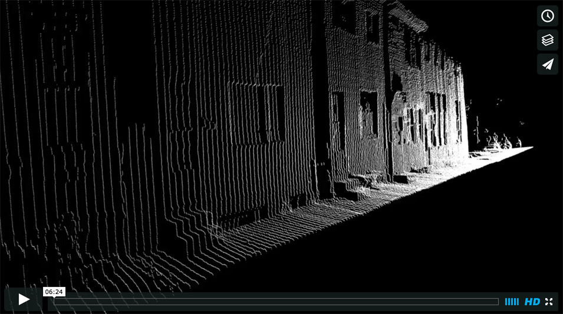](https://vimeo.com/144993841)

Ben also created a custom, motorized, laser-cut rig for producing spherical LIDAR captures of entire environments. 

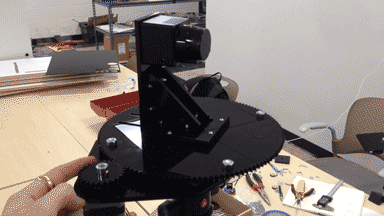

[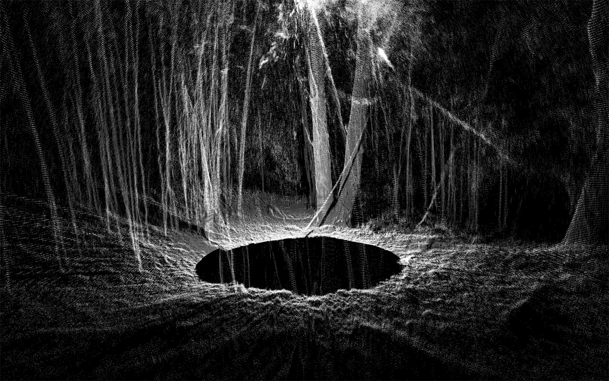](https://vimeo.com/153716848)

---

### Irene Alvarado (2015) 

Piloting a drone, Irene Alvarado captured the main façade of St. Peter and Paul's Church in East Liberty, and then used the drone video and photogrammetry to create a high-resolution 3D scan of the building's facade.

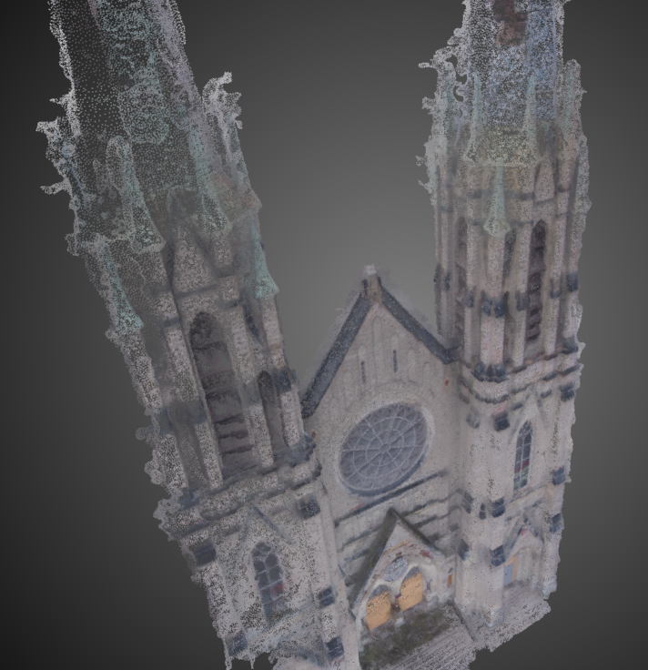

---

### Irene Alvarado & Smokey Dyar (2015)

Using multiple synchronized-flash cameras, Irene and Smokey were able to apply photogrammetry to high-speed photos, in order to develop a 3D capture of a quickly-changing liquid. 

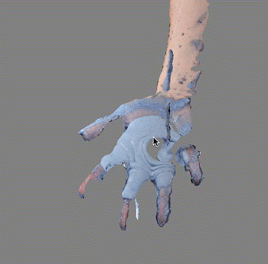

---

### Miles Peyton (2015)

In *Underkey*, Miles Peyton appled panoramic stitching software to numerous images from an inexpensive USB microscope, in order to create a high-resolution recording of the detritus which had accumulated underneath the keys of a public CMU computer cluster keyboard.

[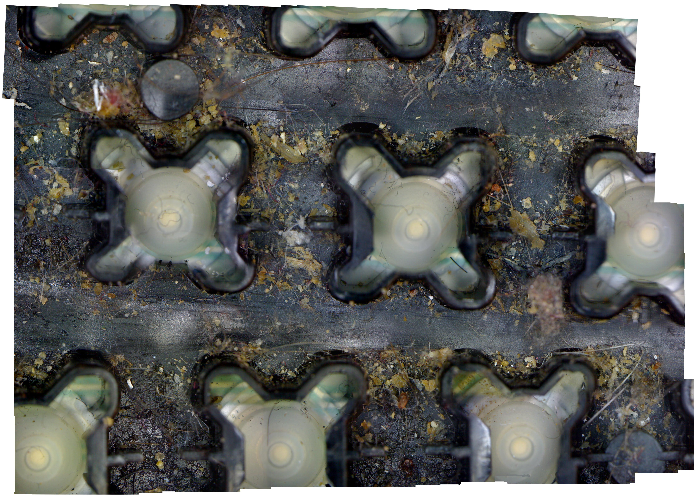](https://raw.githubusercontent.com/golanlevin/ExperimentalCapture/master/docs/images/students/miles_underkey.jpg)

---

### Michelle Ma (2015)

Michelle Ma captured a person using a DSLR camera, fed it into photogrammetry software to develop a 3D model of her subject, and then replaced the photographic textures with her own handdrawn portraits.

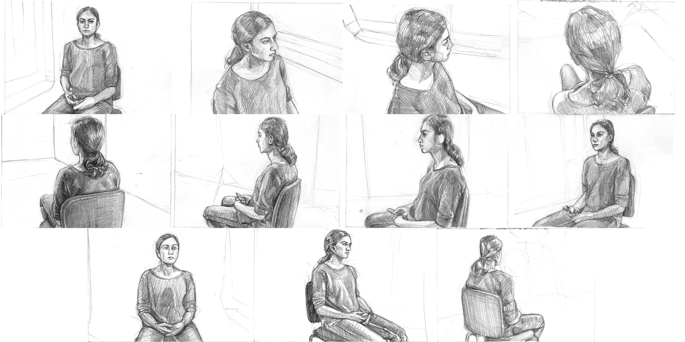

[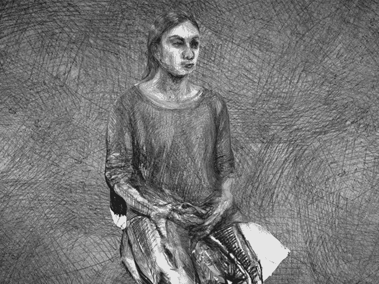](https://vimeo.com/148398718)

---

### Claire Hentschker (2015)

Claire Hentschker developed [*Shining360*](https://www.youtube.com/watch?v=AupAFblRwgY), a 360° video which presents 3D reconstructed scenes from the Shining, and allows the viewer to look around them in real-time, while following the original path the camera took. 

[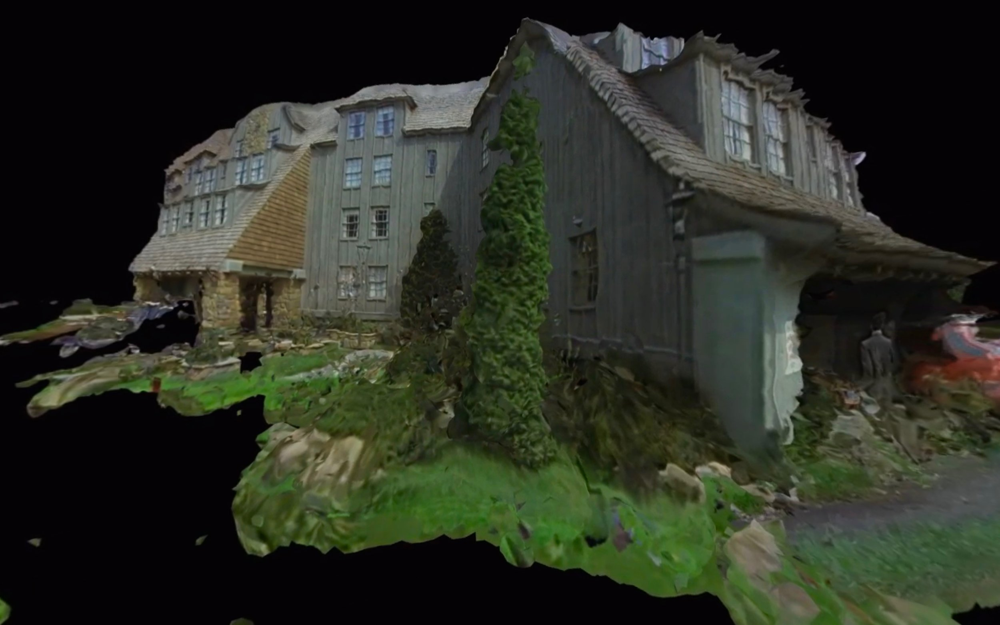](https://www.youtube.com/watch?v=AupAFblRwgY)

---

### Scott Fitzgerald (2016)

Scott Fitzgerald, a workshop student, recorded a drive with a catadioptric 360° lens mounted to the front of his car— and developed custom software in Jitter to compute a 3D slitscan tube from the resulting video. 

[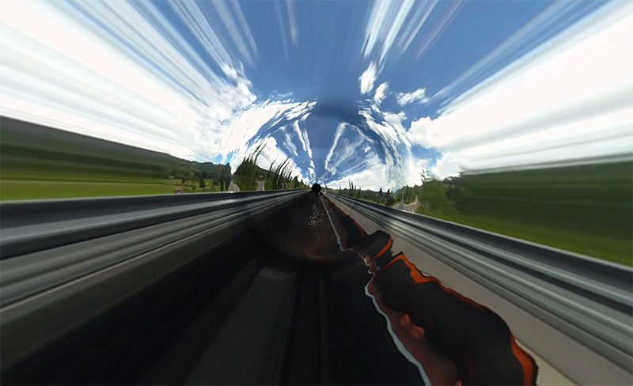](https://youtu.be/RJ9d5VkXzzY)

---

### Faith Kim (2017)

Faith Kim developed a portable, binaural DepthKit rig in order to record the annual Pittonkatonk festival in immersive 3D. 

---

### Chloé Desaulles (2017)

Chloé Desaulles made [high-speed Schlieren recordings](http://golancourses.net/excap17/cdslls/04/13/cdslls-event/) https://vimeo.com/213102188) of air currents distubing candles. 

---

### Hizal Celik (2017)

Using an RC car, a laser line, and custom software, Hizal Celik [made a machine](http://golancourses.net/excap17/hizlik/05/10/hizlik-final/) to create 3D scans of the undersides of cars.

---

### Caroline Hermans (2017)

Caroline Hermans used an ultrasonic proximity sensor and an Arduino to make a custom illumination probe. 

She then made a light-painting video recording of herself exploring an unfamiliar space (a men's restroom), using this device, with a 360° camera, in total darkness. The result is a [navigable video](http://golancourses.net/excap17/caro/03/09/caro-place/).

[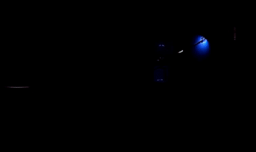](http://golancourses.net/excap17/caro/03/09/caro-place/)

---

### Evi Bernitsas & Soonho Kwon

Using the STUDIO's UR5 arm and computer-conrolled cameras, Evi and Soonho conducted a [number of experiments](http://golancourses.net/excap17/quan/05/11/quan-final/) in robotic cinematography.

---

### Kaitlin Schaer (2017)

In her project [*Skies Worth Seeing*](http://golancourses.net/excap17/gloeilamp/05/10/gloeilamp-final/), Kaitlin Schaer wished to understand: "What are the qualities of the sky that transform it into a moving and even sublime subject for a photograph?" 

Using the Openframeworks add-on ofxFlickr, she scraped thousands of images of skies. She then developed a tool in Processing that allowed her to quickly crop images so that they exlusively contained the sky, and not the horizon or land. Finally, in order to organize the images, she sorted them spatially using t-SNE.

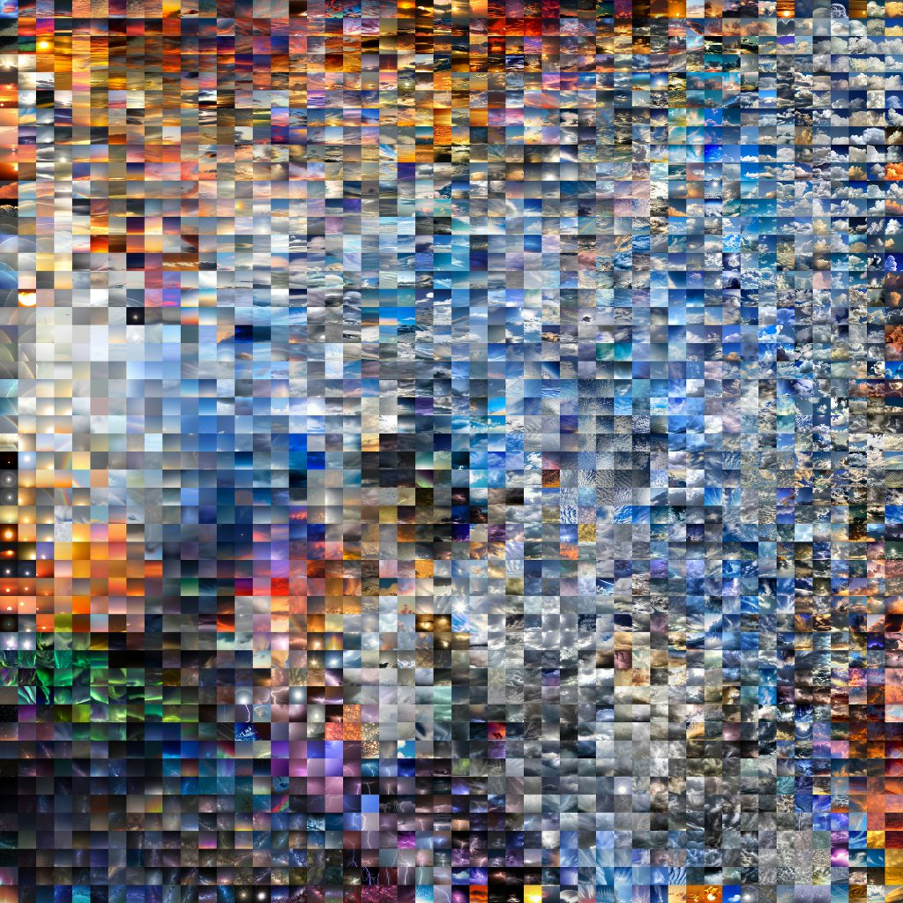

---

### Kristin Yin and Jason Ma (2017)

Kristin Yin used the Sensel Morph pressure sensor, and neural-network machine learning, to create a [Footprint Recognizer](http://golancourses.net/excap17/weija/04/27/kyin-and-weija-final-proposal/). 

[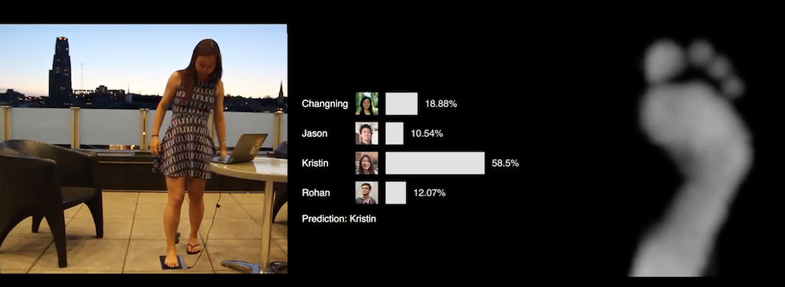](http://golancourses.net/excap17/weija/04/27/kyin-and-weija-final-proposal/)

---

### Geep Warhaftig (2017)

Geep Warhaftig developed [*Sphinct!*](http://golancourses.net/excap17/geep/05/10/geep-final/), a "lifestyle sphinctometer" modeled after personal fitness trackers. With the help of an Arduino, pressure sensors, and a custom rubber cast, *Sphinct!* captures data on pressure, muscular performance, and stress levels in the rectum. *Sphinct!* syncs to your smartphone, "where you can track your progress and take control of your body. Compare your results to friends and even unlock achievements."

[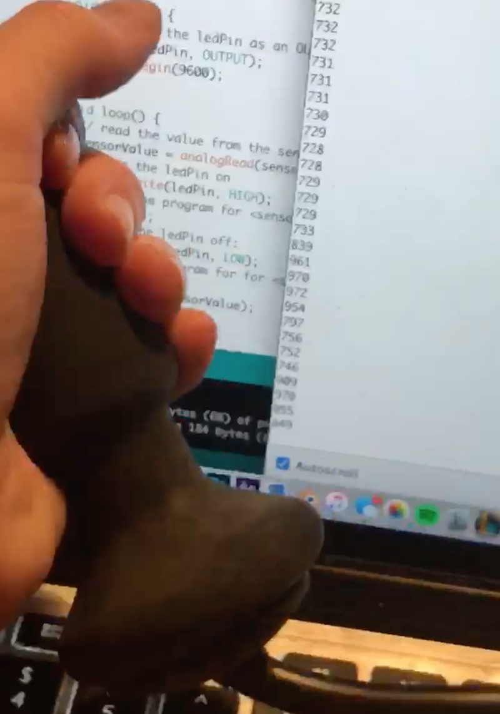](https://www.youtube.com/watch?v=VGW29JOlCsA)

