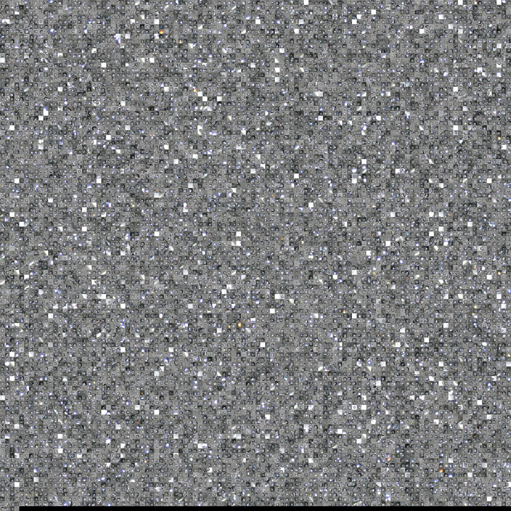
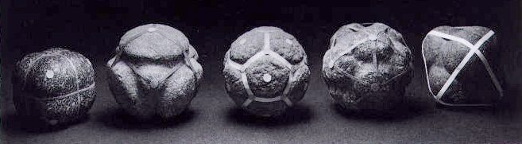

# Typologies and Small Multiples

> ***Nothing is more amazing than the simple truth, nothing is more exotic than our own surroundings, nothing is more fantastic in effect than objective description, and nothing is more remarkable than the time in which we live.*  —Egon Erwin Kish**

In this lecture, we examine *collections* through the related concepts of "small multiples" in information visualization, and "typologies" in photography. 

* [A helpful reading on Typologies](https://www.photopedagogy.com/typologies.html): Exploring photography as a tool for visual classification with August Sander, Bernd and Hilla Becher, Ed Ruscha and others. Adapted from Jon Nicholls, Thomas Tallis School.

---

## Small Multiples

A *small multiple* is a series of similar graphs or charts using the same scale and axes, which allow them to be easily compared. The term was popularized by information designer Edward Tufte, [who wrote](https://en.wikipedia.org/wiki/Small_multiple): 

> At the heart of quantitative reasoning is a single question: *Compared to what?* Small multiple designs, multivariate and data bountiful, answer directly by visually enforcing comparisons of changes, of the differences among objects, of the scope of alternatives. For a wide range of problems in data presentation, small multiples are the best design solution.

Artist Kim Dingle went to high schools in Las Vegas and asked them to draw the united states on a sheet of 8.5x11 paper. She then transfered these as small multiples to a common canvas, entitled *United Shapes of America*:

In Meaghan Kombol's *The Subway Lines*, the artist attempted to draw straight lines while riding the NYC subway. The result is a set of small multiples which are at once highly personal, yet also intersubjectively valid depictions of reality:

---

### J.F. Blumenbach (1752-1840)

Unsurprisingly, typologies of *people* have a fraught history. 

> Blumenbach’s central question, one of great interest at the time and still rarely discussed in science, was whether contemporary humans comprised one or more species. The first edition of his thesis discussed four geographically defined varieties of humans, while the second edition in 1881 outlined five geographically defined varieties. (From [*The beautiful skull and Blumenbach’s errors: the birth of the scientific concept of race*](https://www.ncbi.nlm.nih.gov/pmc/articles/PMC2151154/))

In his writings and typological illustrations, Blumenbach put special emphasis on the comparative aesthetics of skulls. "Mostly, Blumenbach’s writing retained a scientific stance, but he exposed his bias on beauty when he wrote that the Causasian skull of a Georgian female was the “most handsome and becoming.”

It is also possible to use photographs (and not just charts or diagrams) in small multiples. Eadweard Muybridge's gridlike presentation of frames from the horse in motion provide comparative context for the special "key" frame that won the famous bet — showing all four hooves off the ground. *These are organized in time.*

Here's a photographic small multiple which depicts "what 200 calories looks like". *These are organized by caloric density.*

---

## (Photographic) Typologies 

[**Exploring photography as a tool for visual classification**](https://www.photopedagogy.com/typologies.html): 

> Throughout the modern era, photography has been enlisted to classify the world and its people. Driven by a belief in the scientific objectivity of photographic evidence, the logics utilized to classify photographs—in groups and categories or sequences of identically organized images—also shape our visual consciousness. In the twenty-first-century, new digital technologies and globalization have radically transformed the applications of photography, making the reconsideration of photographic information systems ever more urgent.
— from *The Order of Things*, an exhibition at the Walther Collection, 2015

> [...] The camera has been used as a tool for witnessing and classifying types of subjects - people, buildings, objects etc. - gathering this evidence together in one place (often a book or exhibition) so that the viewer is able to see and assess it. This approach to photography is sometimes referred to as typological, a typology being a study or interpretation of types of things.

Photography, from its beginnings in the 1830s, has been preoccupied with cataloguing. Richard Roth has written: 

> In William Henry Fox Talbot's *The Library* (1845) and Louis Daguerre's *Shells and Fossils* (1839), we see illustrated the curatorial nature of photography— a medium concerned, to a large degree, with preserving the present (no matter how ordinary) and cataloguing phenomena. The *series* is the backbone of photo sensibility: It implies a belief in scientific method. 'One' example is not sufficiently evidential ('one' might be a coincidence), but 'many', repeatedly, are compelling – they become proof."

Typically, and unlike small multiples, typologies depict a *collection*, and not necessarily an *ordered set*. 

### Alphonse Bertillon, *Anthropometry* (1885)

Photographic typologies immediately had applications in (pseudo-)scientifically cataloguing people for carceral and eugenic purposes.

> While working as a clerk for the Paris police department, Alphonse Bertillon was overwhelmed by the massive accumulation of files of criminals and the lack of a system to sort or retrieve them. In particular, he was concerned with the institutional inability to identify previous offenders, or recidivists, who may have taken on new names or identities. In 1879B, Bertillon, who came from a family of statisticians, devised a method for organizing the identity records of prisoners. Applying "anthropometry", the science of bodily measurements, to police work, Bertillon established a rigorously standardized card-filing system to track records of prisoners' statistics. Later, Bertillon added photography to his methodology, developing the mug shot, which consisted of a full-face picture accompanied by a profile view of the same size. The profile view was added because Bertillon believed that the unique shape of each individual's ear was the key identifier. *Identification anthropometrique. Instructions signaletiques*, published in 1885, was an instruction manual with how-to diagrams for recording prisoners and sample photographs. This forensic method, dubbed *Bertillonage*, was adopted by the Paris police department in 1888, and was soon used in the United States, Britain, and throughout the world. [From *The Order of Things*]

---

### Karl Blossfeldt, *Art Forms in Nature* (1928)

> As early as 1898, Karl Blossfeldt began to photograph plants, seeds, and other natural specimens, using their organic forms to study linearity and design. A lecturer at the School of the Royal Museum of Arts and Crafts in Berlin, he taught a course titled "Modeling from Living Plants," in which he projected slides of his plant photographs for students to copy. Blossfeldt consistently used a neutral background, drawing upon seventeenth-and eighteenth-century botanical classification systems. He continued to add to his catalogue, and by the time these works were first exhibited in 1926, coinciding with the beginning of Neue Sachlichkeit (New Objectivity) photography by August Sander and Albert Renger-Patzsch, Blossfeldt had accumulated over 4,000 images. Although the project may have been conceived in the context of Art Nouveau-a movement dominated by reference to natural forms-by the 1920s, Blossfeldt's sharp-focus realism, rigid compositions, and objective-documentary style looked surprisingly avant-garde. But neither the extraordinary diligence of Blossfeldt's labor, nor the stark beauty of his minimalist approach, could explain the overnight international sensation created in 1928 by his first book of plant photographs, *Urformen der Kunst* (literally "Archetypes of Art"; published in English as *Art Forms in Nature*), a portfolio of 120 loose-leaf photogravure plates. The initial print run of 6,000 copies sold out within months, and further editions were published in Germany, France, England, and the United States. [From *The Order of Things*]

--- 

### Wilson A. "Snowflake" Bentley (1865-1931)

Wilson Alwyn Bentley was the first known photographer of snowflakes. He invented a process of catching flakes on black velvet in such a way that their images could be captured before they either melted or sublimated.

 ([8-minute short film](https://www.youtube.com/watch?v=ptLmA263hlk))

Here's [recent progress in synthesizing and capturing snowflakes in the lab](https://www.youtube.com/watch?v=ao2Jfm35XeE). 

---

### Bernd and Hilla Becher

Masters of the photographic typology, Bernd and Hilla Becher spent more than 30 years documenting architectural forms they referred to as “anonymous sculpture”.

### Ed Ruscha

> Ruscha explains that he 'had no real agenda or message' when photographing the swimming pools, gas stations and parking lots of Los Angeles, yet found an artistic value and new perspective in shooting the scenes from above. [3-minuteVideo](https://www.youtube.com/watch?time_continue=16&v=0xboX5cvIzw)

---

### Michael Wolf, Bastard Chairs

> By using a diverse array of perspectives and visual approaches, Wolf uses his camera to reveal the human energy that flows through the contemporary city. In so doing, he establishes himself not only as a photographer of the urban structure, but of the myriad ways in which people adapt to and reconfigure this rapidly changing environment, thereby providing us with a fascinatingly intricate portrait of life in the city. (From [here](https://www.photopedagogy.com/typologies.html))

---

### People of the Twenty‐First Century

Hans Eijkelboom's [*People of the Twenty‐First Century*](https://www.complex.com/style/2015/01/hans-eijkelboom-people-of-the-twenty-first-century-book) depicts sartorial "tribes". 

---

### Heads

Notice the regularization strategies employed by Alex Kayser in his *Heads* collection: 

--- 

### Skin Color 

Consider the regularization strategies used in Angélica Dass’s "[humanae](https://news.artnet.com/art-world/4000-skin-colors-in-pantone-squares-1254683)", in which the artist has matched the skin colors of 4000 participants to corresponding Pantone colors. Also, compare this with "[Synecdoche](images/typologies/byron_kim_synecdoche.jpg)" by Byron Kim. 

---

### J. D. 'Okhai Ojeikere, *Untitled [Hairstyles]* (1970-1979)  

> Shortly after Nigeria gained its independence from Britain in 1960, J. D. 'Okhai Ojeikere began a remarkable self-assigned project: to record systematically key elements of his native Nigerian culture during the experience of postcolonial cultural transition. In 1968, without any specific anthropological or scholarly agenda, he initiated an immense effort to document Nigerian women's hairstyles. Across the next forty years, he compiled over 1,000 photographs of braided, twisted, and wrapped hair, with each sculptural expression referencing a particular component of Nigerian life-from its various ethnic groups to the expanding shapes of the Lagos skyline. Formally similar, these highly detailed photographs are generally shot close up, centered from behind, and exposed against a stark white or black background, emphasizing the intricacy and architectural fantasy of the elaborate hair designs. "Hairstyles are an art form," Ojeikere has said. "[But] all these hairstyles are ephemeral. I want my photographs to be noteworthy traces of them. I always wanted to record moments of beauty, moments of knowledge." [From *The Order of Things*]

--- 

### Candice Breitz

Typologies can use *dynamic* media objects, not just static ones. Candice Breitz asked people to sing along with a favorite song (which they heard through discreet headphones), and then [synchronized video-recordings](https://www.youtube.com/watch?v=rnYxeezPvnk) of their experiences:

---

### Algorithmic Acquisition: Cloud Face

Computer vision algorithms can be ideal tools for compiling collections for typologies. For example, [Shinseungback Kimyonghun's Cloud Face](http://ssbkyh.com/works/cloud_face/)

> is a collection of cloud images that are recognized as human faces by a face-detection algorithm. It is a result of machine’s vision error and they often look like faces to human eyes too. Humans, yet, know these are not actual faces. Humans rather imagine faces from the clouds. Here, the machine’s error and human imagination meet.

---

### Algorithmic Acquisition: *5-Minute Shower*

Below are small fragments (details) of a photographic study of every water-droplet shed during a 5-minute shower, captured using a high-speed (1000fps) camera and extracted using custom software, by CMU Art/CS student Doug Fritz, 2007. 

--- 

## Typologies Depicted Through Averaging

A conceit is that it is possible to get at something 'essential' by averaging collections of photographs depicting related subjects. (This form of statistical inquiry is a precursor to work with GANs and neural networks that we'll also see later.)

 

Francis Galton, *Inquiries Into Human Faculty and Its Development* (1883)  

> A cousin to naturalist Charles Darwin, British scientist Francis Galton formed his own ideas about the biological foundations of human society, becoming a central figure in the Victorian field of scientific naturalism. Galton, a firm believer in hereditary behavioral traits and social typologies, employed statistics and photography to demonstrate his theories objectively. In 1877, Galton pioneered the process of composite photography, overlaying multiple portraits of specific individuals to create an average or typical person. He used this method as a way of characterizing biologically predetermined racial and criminal types, often identifying them by standard facial features or skull shapes. In 1883, Galton published some of his composite photographic portraits as the frontispiece to his *Inquiries Into Human Faculty and Its Development*. That same year, he coined the term "eugenics" as a name for the process or pseudoscience by which racial types could be improved or purified through selective breeding. Galton believed that British Jewish "types," whom he studied extensively, and disparaged, provided the strongest case for his hierarchical racial theories; these views ultimately influenced Nazi racial policies and anti-Semitic discourses. [From *The Order of Things*]

Artist Nancy Burson invented what we now call "morphing" while working as an artist-in-residence at MIT in the late '70s. One of her best-known works was a series of composites, which created mathematically weighted averages of well-known individuals. Of them, Vilém Flusser [has written](http://www.medienkunstnetz.de/works/first-and-second-beauty/): 

> *«‹Chimera› is an ancient word meaning composite fabulous beast: a goat with a lion’s head and a tail of serpents. One might thus be led to believe that the mythical Ancients knew how to calculate and compute, but one would be mistaken. The mythical chimaera was a collage, a patchwork. If Bellerophon, who fought the Chimaera heroically, had kicked it instead of fighting it heroically, its head would have rolled to one side and its tail to another. This is quite different from the newly emerging, ‹true› chimaera. One may kick Burson’s Big Brother as often as one likes, he will never disintegrate into Hitler, Mussolini and the others. [...] The new ‹true› chimeras are consistent, autonomous phenomena. This is the way with myths: as soon as they become real, they look different from what was expected.»* 

Nancy Burson, *[First and Second Beauty Composites](http://www.medienkunstnetz.de/works/first-and-second-beauty/)* (1982). *(Left: Bette Davis, Audrey Hepburn, Grace Kelly, Sophia Loren, Marilyn Monroe. Right: Jane Fonda, Jacqueline Bisset, Diane Keaton, Brooke Shields, Meryl Streep)*: 

Burson later posted classified ads in an effort to solicit images of [*Guys who Look Like Jesus*](https://www.nancyburson.com/portfolio/G0000oCZbt_Xbvy4/I0000iQ4msZO2eoQ):  

Jason Salavon became well known for working this way in the late 1990s. Befriending a department store photographer, he created averages of "[100 Special Moments](http://salavon.com/work/SpecialMoments/)" (1997): kids with Santa, newlyweds, etc. 

Jason Salavon, [*Every Playboy Centerfold, The Decades*](http://www.salavon.com/work/EveryPlayboyCenterfoldDecades/) (1998-2002) 

Salavon has also created [averages of homes-for-sale](http://salavon.com/work/Homes/) (1999-2002) from classified advertisements in different metropolitan areas: 

Jason Salavon, [*Portrait*](http://www.salavon.com/work/Portrait/) (2009)  

While an MFA student at CMU, [David Tinapple](http://davidtinapple.webflow.io/projects/the-face-of-tv) used a face tracker to calculate portraits of the average faces shown on different cable television channels: 

---

### Collective Snapshots

The use of **online databases** of tagged images substantially expands our ability to learn about places, as they are seen by multitudes of people. 

 
In her series "*Photo Opportunities*", artist [Corinne Vionnet](http://www.corinnevionnet.com/-photo-opportunities.html) works to create landscapes generated from *thousands* of tourist photos. She takes efforts to align them first. ([Additional article](http://petapixel.com/2013/10/23/photo-opportunities-interview-artist-corinne-vionnet/)) 

Catalan artist Pep Ventosa works similarly, averaging images of the Brooklyn Brige, and of New York City lamp-posts: 

--- 

### Collections Produced by Subtraction

Rather than accumulation and addition, collections can be produced by filtering and subtraction. 

Rutherford Chang blacked out everything but the faces on the front page of the New York Times: 

He produced a 'calendar' from one full month of front pages, providing a person-centered view of the news: 

Tim Hawkinson extracted just the numbers, in his altered found photograph, *Bleached Football Game* (1992):

---

### Collections Presented In Time

While small multiples are generally ordered in space, they can also be ordered by time, as in this extreme [16-year time lapse by artist JK Keller](https://www.youtube.com/watch?v=hcWVoTlknwM): 

Consider the following two projects by former CMU MFA student, [Cassandra C. Jones](http://www.cassandracjones.com), depicting 'distributed objects':

* *[Eventide](https://vimeo.com/84883569)* (2004) represents a single object -- the Sun -- constructed from hundreds of photos by different people. The images are not merely a spatially aligned collection; the full video shows a complete sunset, with the precise duration of an actual sunset.

* *[Car Fire](https://vimeo.com/84894920)* (2009) constructs a virtual, 'conceptual' object from many, similar, others. The contributing images are ordered rotationally. 

---

### Minimum Inventory, Maximum Diversity Collections ("All Possible X")

Neolithic polyhedra (the five Platonic solids), Scotland, c. 2000 BC: 

Michael Joaquin Grey, *Erosion Blocks* (1990): 

A “[Minimum Inventory, Maximum Diversity](http://blog.wolfram.com/2009/03/25/minimum-inventory-maximum-diversity/)” system, a term coined by Peter Pearce in *Structure in Nature Is a Strategy for Design* (1978). Christopher Carlson writes that “a minimum inventory/maximum diversity system is a kit of modular parts and rules of assembly that gives you maximal design bang for your design-component buck. It’s a system that achieves a wide variety of effects from a small variety of parts. Nature excels at this game: every one of the many millions of natural proteins is assembled from an inventory of just 20 amino acids.”

All 20 possible combinations of 3 pairwise comparisons of 4 elements:  

The artwork *Variations of Incomplete Open Cubes* by Sol Lewitt (below left, 1974) and *Arc Forms* by Christopher Carlson (below right, 2009) illustrate the "Minimum Inventory, Maximum Diversity" principle. *Open Cubes* shows all possible forms of a cube with one or more missing edges. *Arc Forms* shows all possible combinations of semicircles joined at 3 connection points evenly distributed along a vertical line. 

Tauba Auerbach and Daniel E. Kelm produced the "[RGB Colorspace Atlas](https://www.thecollectiveloop.com/2013/01/book-of-colors-for-human-eyes.html)", a 3,632-page book that showcases all possible printable colors.

 
 
 

