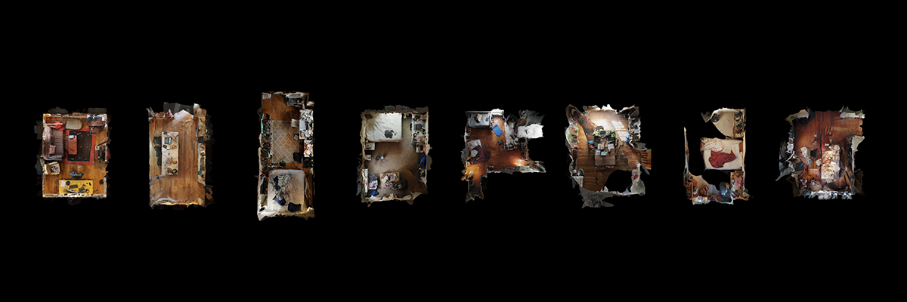

# Some Typology Machines by ExCap Students

* [Our Spaces of Quarantine](https://courses.ideate.cmu.edu/60-461/s2020/index.html%3Fp=3398.html) by David (2020)
* [Little Car Scanning Underbellies of Big Cars](https://ems.andrew.cmu.edu/excap17/hizlik/05/10/hizlik-final/index.html) by Hizlik (2017)
* [@the.circles.of.life](https://ems.andrew.cmu.edu/excap17/caro/05/07/caro-final/index.html) by Caro (2017)
* [Smalling](https://courses.ideate.cmu.edu/60-461/f2024/12/15/final-project-smalling-documentation/2578/index.html) by Ana (2024)
* [Addressing the unaddressed ](https://courses.ideate.cmu.edu/60-461/f2024/10/02/1089/1089/index.html) by Ana (2024)
* [Schenley Park Trail Typology](https://courses.ideate.cmu.edu/60-461/f2024/10/02/schenley-park-trail-typology/1038/index.html) by June (2024)
* [Vitruvian Self-Portraits](https://courses.ideate.cmu.edu/60-461/f2022/index.html%3Fp=892.html) by Zeak (2022)
* [Gigapixel Microscopy](https://courses.ideate.cmu.edu/60-461/f2022/author/shrugbread/index.html) by shrugbread (2022)
* [Travel Over Time](https://courses.ideate.cmu.edu/60-461/f2022/index.html%3Fp=1000.html) by kitetale (2022)
* [Memorabilia Before Impact](https://courses.ideate.cmu.edu/60-461/s2020/index.html%3Fp=1426.html) by Kaitlyn (2020)
* [Remnant of Affection](https://courses.ideate.cmu.edu/60-461/s2020/index.html%3Fp=1424.html) by Policarpo (2020)
* [Sonogram portraits of heartbeats](https://courses.ideate.cmu.edu/60-461/s2020/index.html%3Fp=1263.html) by Cathryn (2020)
* [The Virtual Artifact Gallery](https://courses.ideate.cmu.edu/60-461/s2020/index.html%3Fp=1666.html) by Huw (2020)
* [BridgeTrollCaptures](https://sketchfab.com/BridgeTrollCaptures) by ()
* [f(orb)idden orb](https://courses.ideate.cmu.edu/60-461/s2020/index.html%3Fp=1413.html) by Izzy (2020)
* [15 Bricks](https://courses.ideate.cmu.edu/60-461/s2020/category/projects/typology-machine/index.html) by Jacqui (2020)
* [Port Explorer](https://courses.ideate.cmu.edu/60-461/s2020/index.html%3Fp=1523.html) by Sean (2020)
* [Look in Here](https://courses.ideate.cmu.edu/60-461/f2022/index.html%3Fp=925.html) by BumbleBee (2022)
* [Face Exploration](https://ems.andrew.cmu.edu/excap17/author/bernie/index.html) by Bernie (2017)
