# Ultraviolet Imaging

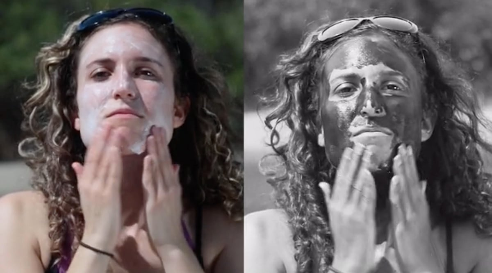 *[Inexpensive UV cameras](https://www.amazon.com/Soufyuane-Portable-Effective-Protection-Detection/dp/B0DVSZG81V/) are now widely available for examining sunscreen.*

Ultraviolet light has wavelengths that range from around 10nm-400nm. The "black light" that we know from clubs is "near-UV" or UVA (315–400 nm), and is responsible for tanning, photoaging, and some skin damage. UVB (280–315 nm) causes most sunburn and contributes strongly to skin cancer. UVC (100–280 nm) is almost entirely absorbed by the atmosphere, but artificial UVC sources can rapidly damage skin and eyes. The "Vacuum UV" band closest to X-rays is strongly absorbed by air. 

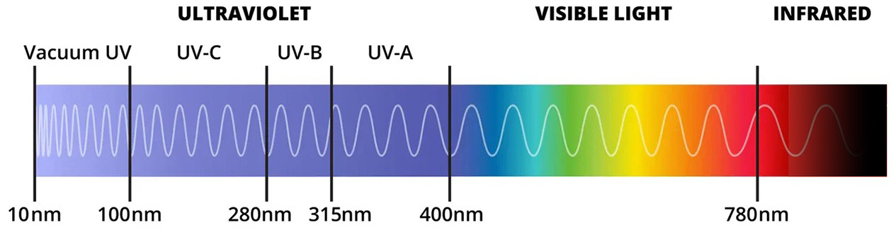

Ultraviolet imaging systems allow us to see hidden properties of materials beyond than their ordinary appearance. This page discusses imaging with **Ultraviolet Reflectance** (UVR) and **Ultraviolet Fluorescence** (UVF), generally using the UVA frequency band. Note that UVF is also sometimes called *Ultraviolet-Induced Visible Fluorescence* (UVIVF). Here's a quick summary of the difference: 

| Imaging mode                   | Camera records      | Illumination |
| ------------------------------ | ------------------- | ------------ |
| Regular visible imaging        | visible reflections | visible      |
| UV reflectance (UVR)           | UV reflections      | UV           |
| UV fluorescence (UVF or UVIVF) | visible emissions   | UV           |

---

## UVR: Overviews and Video Introductions

[This technical article by Enrico Savazzi](https://www.savazzi.net/photography/uv.htm) is an excellent resource about UV reflectance imaging. In addition, the following videos are helpful: 

* [*The World In UV*](https://www.youtube.com/watch?v=V9K6gjR07Po), an excellent 11m overview video by science YouTuber @Veritasium, discusses how UV offers new understandings of atmospheric haze, sunscreen, quinine, flowers, polar bears, and more: [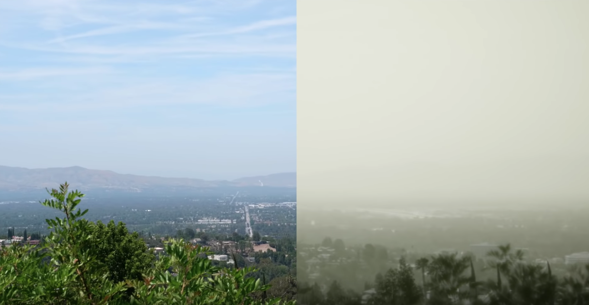](https://www.youtube.com/watch?v=V9K6gjR07Po)
* YouTuber [Physics Girl](https://www.youtube.com/watch?v=GRD-xvlhGMc) discusses sunscreen specifically in [this 12-minute PBS video](https://www.youtube.com/watch?v=GRD-xvlhGMc). [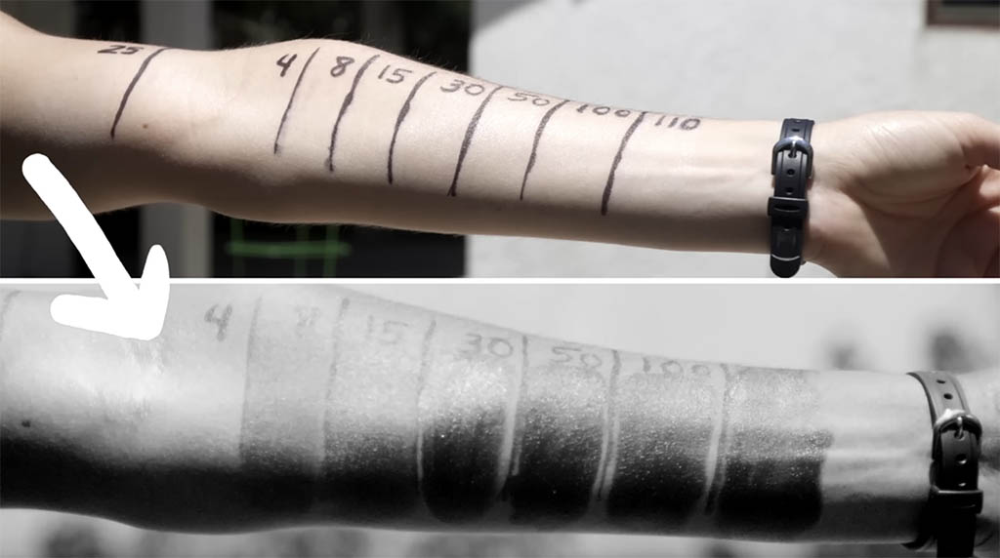](https://www.youtube.com/watch?v=GRD-xvlhGMc)
* [UV video overview by Thomas Leveritt](https://www.youtube.com/watch?v=o9BqrSAHbTc), showing diverse faces with/without sunscreen: [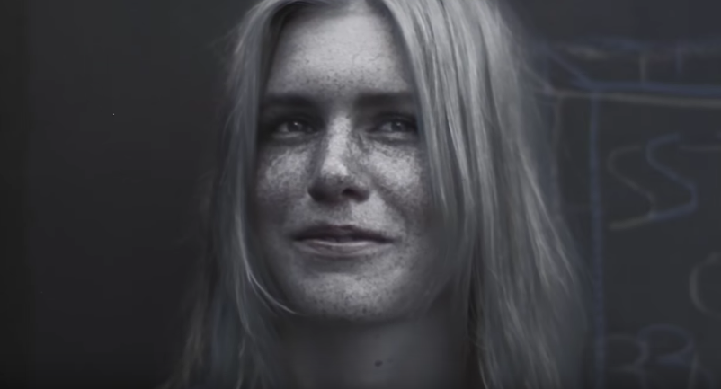](https://www.youtube.com/watch?v=o9BqrSAHbTc)

---

## Ultraviolet Vision and Markings

The vast majority of humans cannot see ultraviolet light. However, [this person](https://www.komar.org/faq/colorado-cataract-surgery-crystalens/ultra-violet-color-glow/) was able to see UV light after he had cataract surgery.

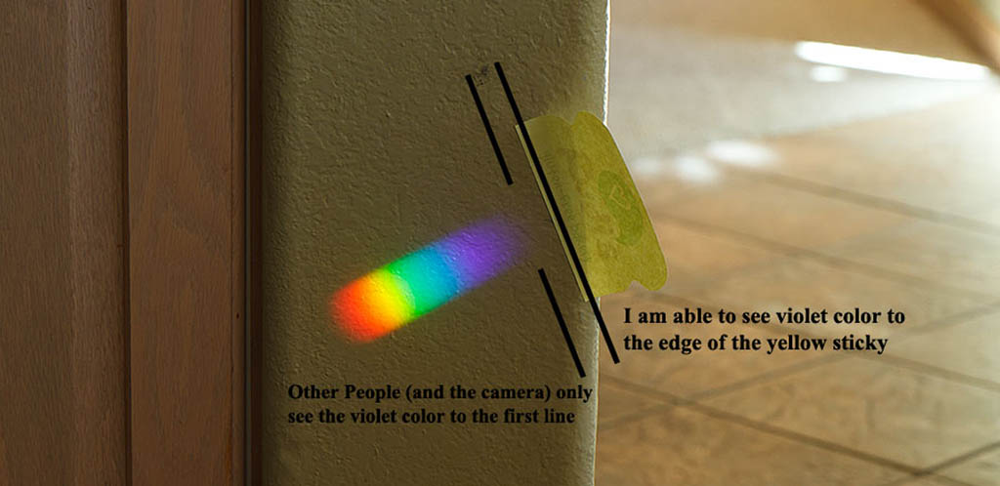

[Kestrels can see in the UV](https://youtu.be/AUm-TabNFF0), which helps them find prey from their UV-fluorescent urine. Here's David Attenborough (2m video):  

* [Spectra of different species' vision](https://fieldguidetohummingbirds.files.wordpress.com/2008/11/spectrum.jpg).

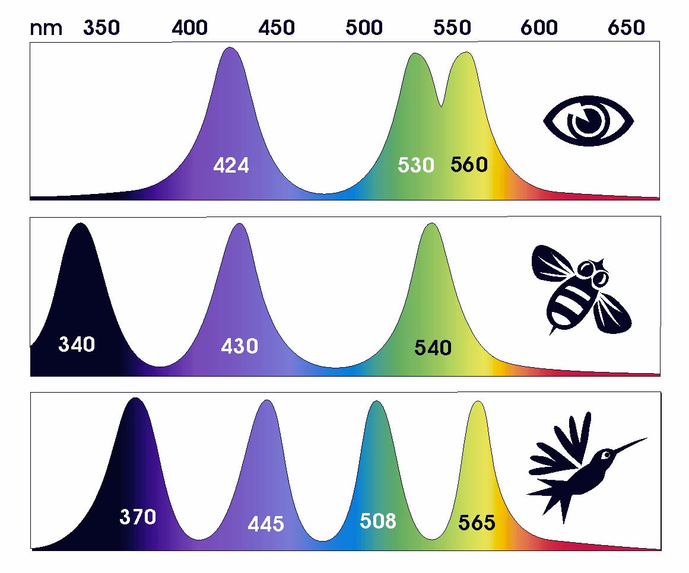

Many animals [appear different, and can see in the ultraviolet](http://www.theatlantic.com/technology/archive/2011/08/6-animals-that-can-see-or-glow-in-ultraviolet-light/243634/). For example,

* Butterflies are thought to have the widest spectral visual range of any land animal. Butterflies can use ultraviolet markings to find healthier mates. Ultraviolet patterns also help certain species of butterflies appear similar to predators, while differentiating themselves to potential mates.
* Reindeer rely on ultraviolet light to spot lichens that they eat. They can also easily spot the UV-absorbent urine of predators among the UV-reflective snow.
* One bird species was found to feed its young based on how much UV the chicks reflected.
* Some species of birds use UV markings to tell males and females apart.
* The flower Black-eyed Susans have petals that appear yellow to humans, but UV markings give them a bull's eye-like design that attracts bees.
* Sockeye salmon may use their ultraviolet perception to see food.

Here's an article on [birds & bees' UV vision](http://www.nature.com/scitable/blog/the-artful-brain/alternate_realities), featuring this false-color image which shows the additional information  eggs and plumage 

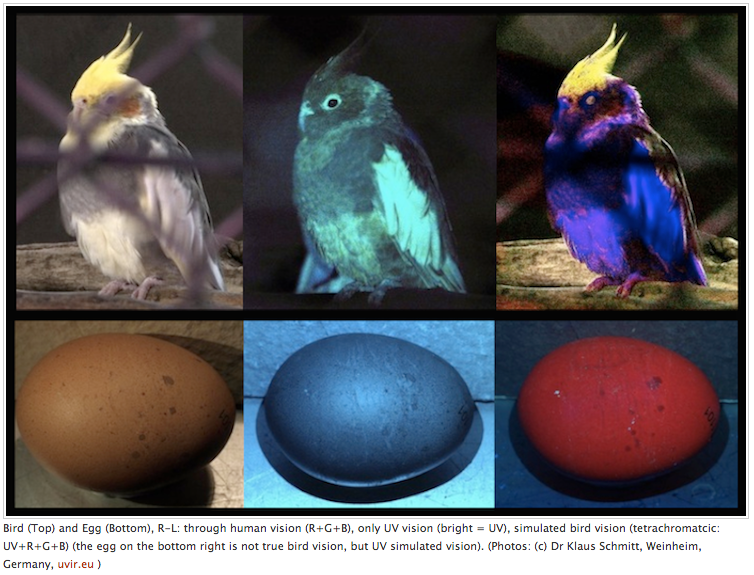

UV is also [widely used in forensics](http://ultravioletcameras.com/applications/longwave-ultraviolet-forensics-imaging-applications/), showing evidence of repair and cleaning: 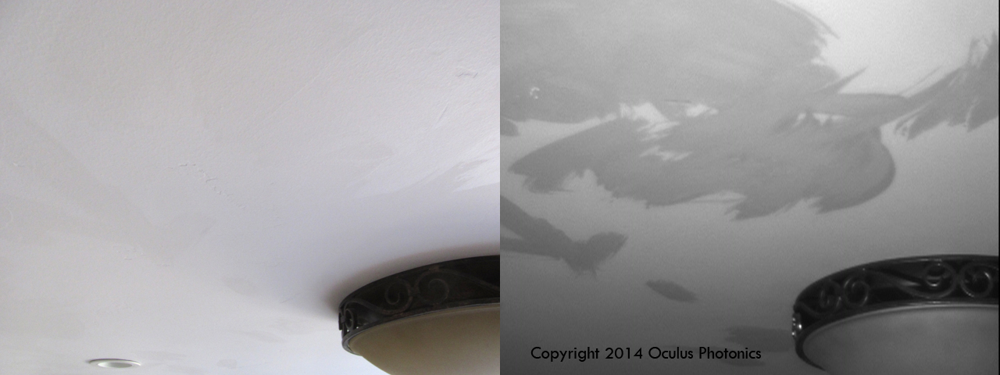

Recently, [skin splotches that are visible only in UV have been used as markers for face-tracking](https://vimeo.com/536145929/3227ef1035). 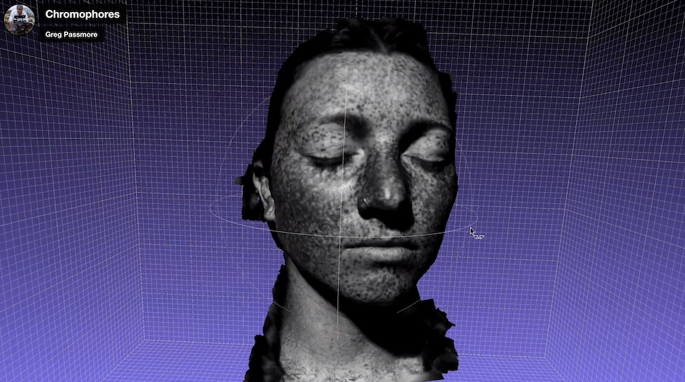

---

## Ultraviolet Imaging in the Arts

Cara Phillips makes portraits that explore the [aesthetics of the human skin in UV](http://www.theguardian.com/artanddesign/gallery/2012/aug/03/ultraviolet-beauties-cara-phillips-photographs): 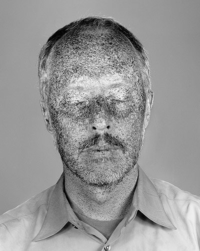

Early photographic emulsions were much more sensitive to ultraviolet and blue light than to red light. As a result, nineteenth-century photographs often recorded spectral information quite differently from human vision. Using the *wet collodion* chemical process, an early photographic technique invented by Frederick Scott Archer in 1851, photographer Michael Bradley [developed a series of portraits](https://fstoppers.com/film/cultural-tattoos-invisible-wet-collodion-prints-259738), featuring facial tattoos from the indigenous New Zealand culture, the Māori. 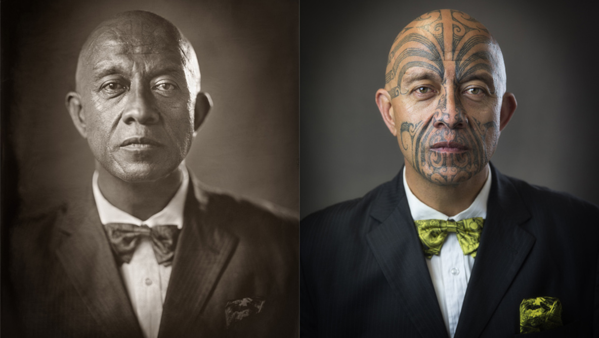

The wet collodion process primarily records UV information, as can be seen in the spectrum recording below. The spectrum was generated by a prism, and was directly photographed using collodion. A photograph of the same spectrum was taken simultaneously with digital color. The two photographs were then overlaid using registration marks to ensure accuracy. 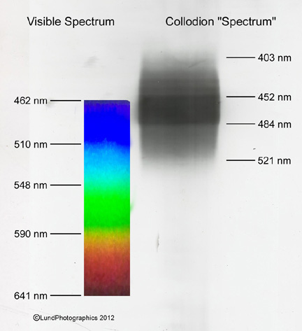

### Cultural Heritage and Conservation

Conservation is arguably the single most important artistic use of UV imaging. Conservators routinely use UV imaging to reveal the biography of an object — revealing things like: overpainting; prior restoration and repair interventions; and the use of (visually) similar but factually different pigments. 

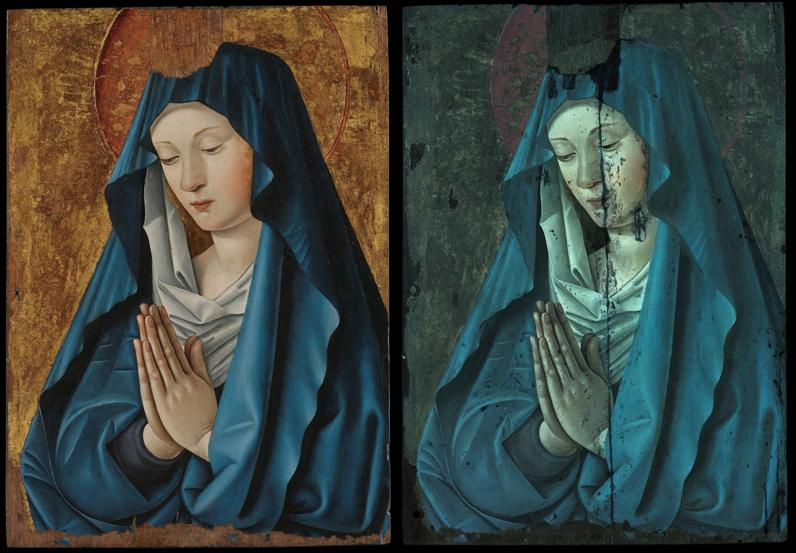

Conservators often use both UV reflectance and UV-induced fluorescence, since different varnishes, pigments, adhesives, and restoration materials behave differently under each technique.

---

## UV Imaging in Practice

* [This technical article by Enrico Savazzi](https://www.savazzi.net/photography/uv.htm) is an excellent resource about UV imaging.
* [UV-pass, visible-cut filters](http://www.savazzi.net/photography/baader_u.htm) are available.
* It is also relatively inexpensive to have a [Canon SLR permanently converted for UV](http://www.lifepixel.com/shop/ultraviolet-camera-conversion/canon-dslr-uv-camera-conversion).
* It is [worth pointing out](http://www.savazzi.net/photography/uv.htm) that UV & NIR photography also benefit from using [special lenses](http://www.savazzi.net/photography/coastalopt_60.html) which better focus these wavelengths.
* Of course, [dedicated UV cameras](http://www.edmundoptics.com/cameras/nir-uv-cameras/sony-xc-e-series-monochrome-ccd-cameras/56346/) also exist, some of which, like this [Nurugo UV camera attachment](https://www.amazon.com/Nurugo-SmartUV-Detachable-Lamp-Connectable/dp/B079YVY7PB) for Android, are relatively inexpensive.

 *The STUDIO has a small selection of UV cameras. You can see some of my skin damage.*

---

## Fluorescence: The Conversion of UV to Visible Light

### *UV-induced visible fluorescence*

You're probably familiar with "DayGlo" or "neon-colored" objects: certain clothes, hilighter pens, psychedelic posters. That's called **fluorescence**, and in daily life, it's a *visble* phenomenon that happens when UV light (i.e. "black light") hits certain materials. Here it is used to effect in a theater performance; note that this is a visible image recorded with a regular camera: 

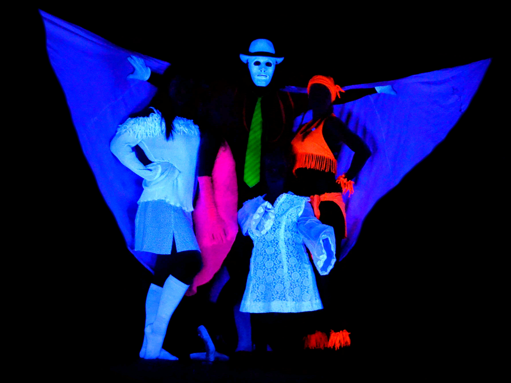

Pittsburgh artist [Mikael Owunna](https://www.mikaelowunna.com/) paints people with speckles of fluorescent paint, and then photographs the glowing speckles under UV light; the people look as if they are made of stars:

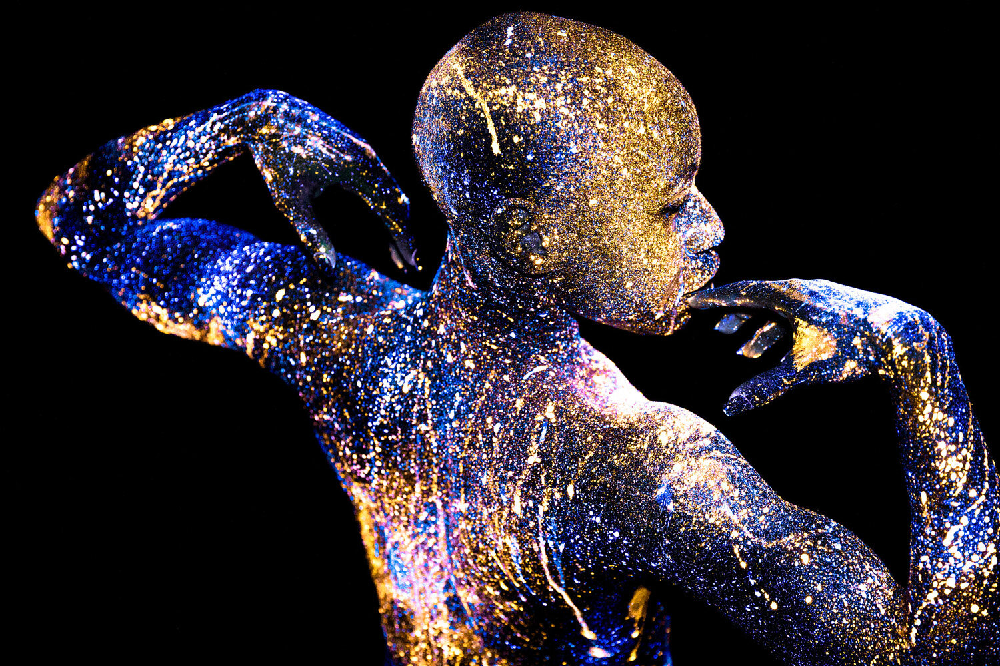

Fluorescent materials absorb UV light (and thus appear dark in a UV camera). The materials then convert some of that absorbed energy into visible light, which they release. Thus, fluorescent materials appear brighter to the eye because they appear to be glowing. *Fluorescent* materials cease to glow nearly immediately when the radiation source stops, unlike *phosphorescent* materials, which absorb UV light energy and continue to emit light for some time after, and *chemiluminescent* materials, which convert chemical energy to visible light. 

There's lots of interesting UV fluorescence in nature, such as in these minerals: 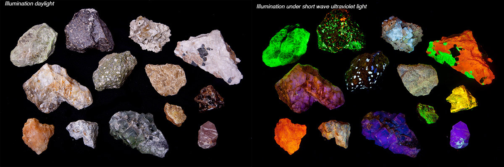

Scorpions fluoresce under ultraviolet light, but scientists do not know why. 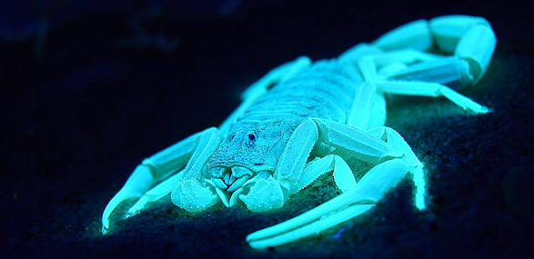

Because the material is *absorbing* UV light, most fluorescent materials appear dark in a UV camera. Here, fluorescence from a hilighter pen (at right) is viewed by one of the STUDIO's UV cameras (at left): 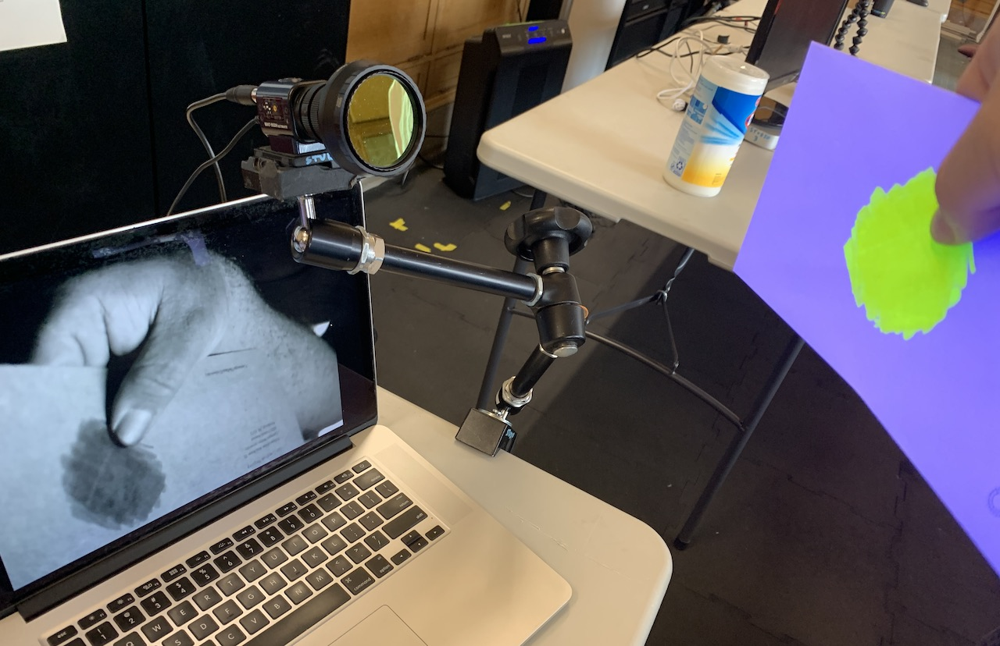

### Photographing Fluorescent Things is not UV Imaging

UV reflectance photography (as described at the top of this page) is very different from the photography of UV-excited fluorescence in the visible range; what is shown here is photography in the visible range. These techniques are distinguised with the terms UVR and UVF. [(Source)](http://www.savazzi.net/photography/uv.htm)

*UV fluorescence reveals hidden imagery in a Canadian Passport and Danish currency:* 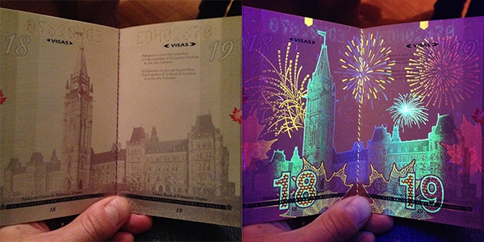

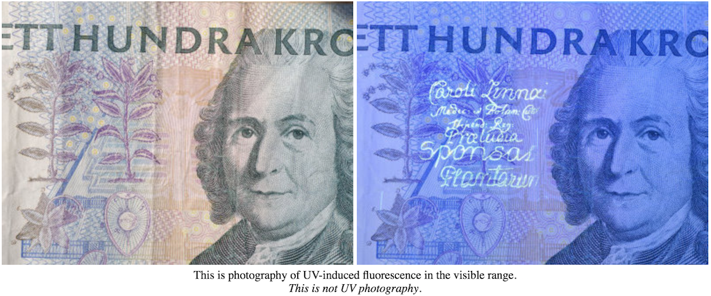

Because many body fluids exhibit fluorescence, UVF photography is also used in crime-scene investigations. Shown below: a suspected body fluid stain on cloth visualized in white light; The suspected stain visualized in UV light, without a filter on the camera, the stain has only weak fluorescence; suspected stain on cloth visualized in near-UV with a yellow camera filter; the surrounding glow is now blocked and the weak fluorescence of the stain can be seen. [(Source)](https://www.horiba.com/int/scientific/applications/others/pages/detection-of-body-fluids-with-an-alternate-light-source/)

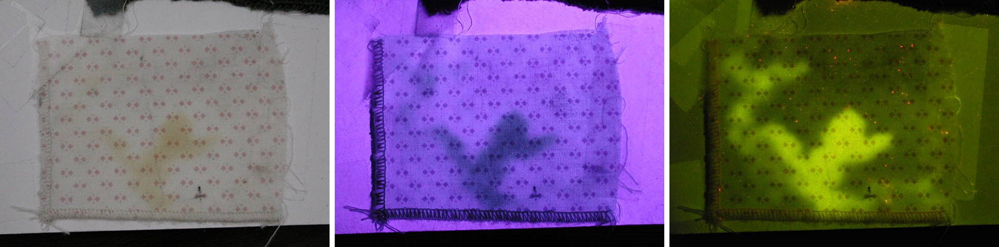

Not all "black lights" are the same. It's worth knowing that just as there are different colors of visible light ("red", "green", etc.), there are also different bands of ultraviolet light, even within the UVA band. Some materials are very selective about the UV frequencies which will make them fluoresce:

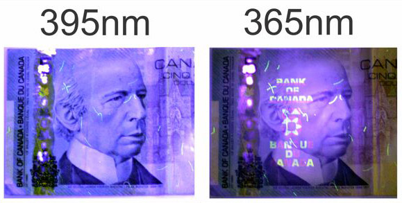

### Household Fluorescence

Check out the following with a black light: 

* Tonic water fluoresces blue due to the presence of quinine.
* Vitamin B2 fluoresces yellow.
* bananas
* honey
* olive oil and pesto
