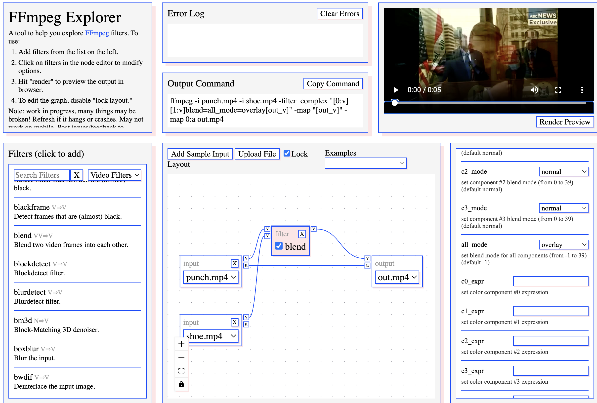

# Do You Need a Virtual Environment?

A virtual environment is an isolated folder that holds its own copy of Python and its own set of installed Python packages. Anything you install while it's active stays inside it and doesn't affect the rest of your computer. That isolation is useful, but it only applies to one kind of software, so whether you need one depends on what you're installing.

## What a virtual environment actually isolates

A Python virtual environment (created with `python -m venv`, or with tools like conda, uv, or Poetry) isolates **Python packages**, the things you install with `pip`. It does **not** isolate system programs like ffmpeg, git, or ImageMagick. Those are installed at the operating-system level through tools like `apt`, `brew`, `winget`, or an installer you download, and every program on your computer shares them regardless of whether a virtual environment is active.

> **Rule of thumb:** If you install it with `pip`, a virtual environment applies. If you install it any other way, it doesn't.

## When you should use one

Use a virtual environment whenever your project installs Python packages. That covers libraries such as `ffmpeg-python`, `moviepy`, `pydub`, or anything else you `pip install` for a script. There are three main reasons.

**Avoiding version conflicts.** Different projects often need different versions of the same library. Without isolation, upgrading a package for one project can quietly break another.

**Protecting your system.** On many operating systems, Python is used by the system itself. Installing or upgrading packages globally can interfere with tools your OS depends on. This is why many recent Linux distributions and Homebrew now refuse global `pip install` commands and show an `externally-managed-environment` error.

**Reproducibility.** A virtual environment makes it easy to record exactly what a project needs and recreate it on another machine or share it with someone else:

```
pip freeze > requirements.txt
```

## When you don't need one

You don't need a virtual environment if you're only using command-line programs that aren't Python packages. For example, if you're converting video by running this in a terminal, no Python is involved, and a virtual environment would do nothing:

```
ffmpeg -i input.mov output.mp4
```

You also don't need one for Python programs installed through your system package manager (like `sudo apt install python3-numpy`), since those are managed by the OS.

For standalone Python command-line tools you want available everywhere, a tool like [pipx](https://pipx.pypa.io/) is usually a better fit. It gives each tool its own isolated environment automatically, so you don't have to manage one yourself.

## A common mix-up: Python wrappers around system tools

Many Python libraries are wrappers that call a system program behind the scenes. `ffmpeg-python` and `pydub`, for instance, need ffmpeg to already be installed on your system. In this case you use both approaches:

1. Install ffmpeg the system way (`brew install ffmpeg`, `sudo apt install ffmpeg`, etc.).
2. Create a virtual environment and `pip install` the wrapper inside it.

Installing the wrapper in a virtual environment will **not** install ffmpeg for you. One exception is `imageio-ffmpeg`, which bundles its own ffmpeg binary inside the package. That's convenient, but it means you may end up with two different versions of ffmpeg on your machine.

## Quick reference

| What you're doing | Use a virtual environment? |
|---|---|
| Running ffmpeg or another system tool from the command line | No |
| Writing Python that uses `pip`-installed libraries | Yes |
| Using a Python library that wraps a system tool | Install the tool on your system, and the library in a virtual environment |
| Installing a standalone Python command-line tool | Use `pipx` instead |

## A note on safety

Virtual environments are mainly about keeping software organized and preventing conflicts. **They are not a security sandbox.** Code running inside a virtual environment has the same access to your files and system as any other program.

To stay safe with tools like ffmpeg, what matters more is installing from trustworthy sources (your OS package manager or builds linked from the [official ffmpeg site](https://ffmpeg.org/download.html)) and keeping them updated.


---

# FFmpeg by Artists

## Sam Lavigne's FFmpeg Explorer
A tool to help you explore FFmpeg filters.

[FFmpeg Explorer](https://ffmpeg.lav.io/)

[Check out more command line CV magic from Sam!](https://github.com/antiboredom/infinite-video-fall-2023)




## Schwwaa's Video Beaux
"Videobeaux turns focused command-line programs into an artist-led video-processing system—from controlled datamoshing and frame stutter to conversion, extraction, compositing, and chainable workflows."
[Video Beaux](https://videobeaux.online/index.html)


## Ramiro Polla's FFglitch
FFglitch is a multimedia bitstream editor, based on the open-source project FFmpeg.

[https://ffglitch.org/](https://ffglitch.org/)


---

# Installing and Using FFmpeg

FFmpeg is a free command-line tool for converting, trimming, compressing, and extracting audio from video files. It installs as a regular system program, so **you don't need a Python virtual environment for it**.

> If your project also uses Python libraries that rely on FFmpeg, such as `pydub` or `ffmpeg-python`, install FFmpeg here first, then install those libraries inside your virtual environment. The virtual environment holds the Python packages, not FFmpeg itself.

## 1. Open a terminal

**Mac:** Terminal lives in the **Utilities** folder inside your **Applications** folder.

**Windows:** Right-click the Start button and choose **Terminal** (Windows 11) or **Windows PowerShell** (Windows 10).

**Linux:** Press Ctrl + Alt + T on most distributions, or find Terminal in your applications menu.

## 2. Install FFmpeg

### Mac (Homebrew)

Check whether Homebrew is installed:

```
brew --version
```

If you see "command not found," install Homebrew:

```
/bin/bash -c "$(curl -fsSL https://raw.githubusercontent.com/Homebrew/install/HEAD/install.sh)"
```

> **Important:** When the installer finishes, it shows a "Next steps" section with a few commands. Copy and run those commands, then close and reopen Terminal. If you skip this, `brew` won't be found.

Then install FFmpeg:

```
brew install ffmpeg
```

### Windows (winget, recommended)

winget comes built into Windows 10 and 11. Check that it's available:

```
winget --version
```

If it isn't found, update **App Installer** from the Microsoft Store. Then install FFmpeg:

```
winget install --id Gyan.FFmpeg -e
```

When it finishes, **close and reopen your terminal** so Windows can find the new command.

### Windows alternative (Chocolatey)

If you already use Chocolatey, open PowerShell as Administrator (right-click PowerShell and choose **Run as administrator**). Check that Chocolatey is installed:

```
choco --version
```

If it isn't, install it with the command from the official page at [chocolatey.org/install](https://chocolatey.org/install). Then install FFmpeg (still in the Administrator window):

```
choco install ffmpeg -y
```

### Linux

Debian, Ubuntu, and Linux Mint:

```
sudo apt update
sudo apt install ffmpeg
```

Fedora ships a version called `ffmpeg-free` that leaves out some codecs. It works for most tasks:

```
sudo dnf install ffmpeg-free
```

For the full version on Fedora, enable the RPM Fusion repository first (see [rpmfusion.org](https://rpmfusion.org)), then install `ffmpeg`.

## 3. Check that it works

```
ffmpeg -version
```

If you see version information, you're ready. If you see "command not found" or "not recognized," see [Troubleshooting](#troubleshooting) below.

## 4. Using FFmpeg

FFmpeg works on files in whatever folder your terminal is currently in. First, move to the folder with your video. For example, to go to your Downloads folder:

```
cd ~/Downloads
```

(This works on Mac, Linux, and Windows PowerShell or Terminal.)

> **Tip:** Instead of typing a file's name, you can drag the file from Finder or File Explorer into the terminal window to paste its full path.

If a file name contains spaces, put it in quotes, like `"my video.mp4"`.

### Common examples

Convert a video to another format:

```
ffmpeg -i input.mov output.mp4
```

Extract the audio as an MP3:

```
ffmpeg -i input.mp4 -vn -c:a libmp3lame -q:a 2 output.mp3
```

Trim a clip from 1:00 to 2:00 without re-encoding (fast, but cuts may land slightly off because they snap to the nearest keyframe):

```
ffmpeg -ss 00:01:00 -to 00:02:00 -i input.mp4 -c copy clip.mp4
```

Shrink a large video for sharing (raise the `-crf` number for a smaller file, lower it for better quality; 23 is a good starting point):

```
ffmpeg -i input.mp4 -c:v libx264 -crf 23 -preset medium -c:a aac output.mp4
```

## 5. Keep FFmpeg updated

FFmpeg gets regular fixes, including security fixes for how it reads media files, so update it now and then:

| Platform | Command |
|---|---|
| Mac | `brew upgrade ffmpeg` |
| Windows (winget) | `winget upgrade --id Gyan.FFmpeg -e` |
| Windows (Chocolatey) | `choco upgrade ffmpeg -y` (in an Administrator window) |
| Linux (Debian/Ubuntu) | `sudo apt update && sudo apt upgrade` |
| Linux (Fedora) | `sudo dnf upgrade` |

## Optional: a portable copy (for shared or locked-down computers)

If you can't install software, for example on a shared lab machine, you can use a portable build instead. Go to [ffmpeg.org/download.html](https://ffmpeg.org/download.html) and use the links there for your operating system, which is the safest way to get a legitimate build.

Unzip the download, and put the `ffmpeg` file (on Windows, `ffmpeg.exe`, found inside the `bin` folder) in a folder in your project, such as `tools`. Then run it by its path:

**Mac/Linux:**

```
./tools/ffmpeg -i input.mp4 output.mov
```

**Windows:**

```
.\tools\ffmpeg.exe -i input.mp4 output.mov
```

On a Mac, the first time you run a downloaded copy, macOS may block it. Open **System Settings → Privacy & Security**, scroll down, click **Open Anyway** next to the message about ffmpeg, and run the command again.

## Troubleshooting

**"command not found" or "not recognized" right after installing.**
Close and reopen your terminal. Most installers only update the system PATH for new terminal windows.

**Still not found?**
Check where (or whether) your system sees FFmpeg:

| Terminal | Command |
|---|---|
| Mac/Linux | `which ffmpeg` |
| Windows PowerShell or Terminal | `Get-Command ffmpeg` |
| Windows Command Prompt | `where ffmpeg` |

In PowerShell, plain `where` means something different and prints nothing, so use `Get-Command` or `where.exe` there.

**"brew: command not found" on a Mac after installing Homebrew.**
You likely skipped the "Next steps" commands at the end of the Homebrew installer. Run the Homebrew install command again and follow those steps at the end.

**"No such file or directory" for your video.**
Your terminal isn't in the folder where the file is. Use `cd` to move there, or drag the file into the terminal window to paste its full path. Remember quotes around names with spaces.

**winget says "multiple packages found."**
Use the exact ID shown above:

```
winget install --id Gyan.FFmpeg -e
```

# FFmpeg Basics

## FFmpeg Syntax Basics

### Command structure

Every FFmpeg command follows the same basic pattern:

```
ffmpeg [input options] -i input.mov [output options] output.mov
```

For example:

```
ffmpeg -i input.mov -c:v prores_ks -pix_fmt yuv422p10le output.mov
```

Read it left to right: **take this input, apply these settings, and write this output.**

**Order matters.** Options placed *before* `-i` apply to the input file (like where to start reading). Options placed *after* `-i` apply to the output file (like which codec to use). The output filename always comes last, and its extension (`.mov`, `.mp4`) tells FFmpeg which container to use.

---

## Key flags explained

| Flag | Meaning | Example |
|---|---|---|
| `-i` | Input file | `-i input.mov` |
| `-c:v` | Video codec | `-c:v libx264` |
| `-c:a` | Audio codec | `-c:a aac` |
| `-c copy` | Copy video and audio without re-encoding (fast, no quality loss) | `-c copy` |
| `-profile:v` | Codec profile (for example, which type of ProRes) | `-profile:v 2` |
| `-b:v` | Video bitrate | `-b:v 10M` |
| `-b:a` | Audio bitrate | `-b:a 192k` |
| `-crf` | Quality level for H.264/H.265 (lower = better quality, bigger file) | `-crf 23` |
| `-r` | Frame rate | `-r 24` |
| `-pix_fmt` | Pixel format (important for alpha and 10-bit video) | `-pix_fmt yuva444p10le` |
| `-vf` | Video filter (resize, crop, rotate, etc.) | `-vf "scale=1280:-2"` |
| `-an` | Remove audio | `-an` |
| `-ss` | Start time (trim in point) | `-ss 00:01:00` |
| `-to` | End time (trim out point) | `-to 00:02:00` |
| `-t` | Duration (use instead of `-to`) | `-t 30` |
| `-n` | Never overwrite existing files | `-n` |
| `-y` | Always overwrite existing files without asking | `-y` |

Times can be written as `HH:MM:SS` (like `00:01:30`) or in seconds (like `90`).

---

## Examples

### Convert to ProRes 422

```
ffmpeg -i input.mp4 -c:v prores_ks -profile:v 2 output_prores422.mov
```

`-profile:v` sets which type of ProRes to make:

| Number | Name | Notes |
|---|---|---|
| `0` | `proxy` | Smallest files, for offline editing |
| `1` | `lt` | Lighter version of 422 |
| `2` | `standard` | ProRes 422, a common editing format |
| `3` | `hq` | ProRes 422 HQ, higher quality |
| `4` | `4444` | Highest quality, supports alpha (transparency) |
| `5` | `4444xq` | Even higher data rate than 4444 |

You can use either the number or the name, so `-profile:v 2` and `-profile:v standard` do the same thing.

### ProRes with alpha (transparency)

```
ffmpeg -i input.mov -c:v prores_ks -profile:v 4 -pix_fmt yuva444p10le output_prores4444.mov
```

The `a` in `yuva444p10le` stands for **alpha**. Your input file must already have transparency (for example, a ProRes 4444 or PNG sequence export from After Effects). FFmpeg can't create transparency that isn't in the source.

### HAP conversion

HAP is a codec designed for fast playback in media servers and live visuals software (like Resolume, TouchDesigner, and VDMX).

```
ffmpeg -i input.mp4 -c:v hap -format hap_q output_hap.mov
```

`-format` chooses the type of HAP:

| Format | Notes |
|---|---|
| `hap` | Standard HAP, smallest files |
| `hap_alpha` | Supports transparency (source must have alpha) |
| `hap_q` | Higher quality, larger files |

Two things to know about HAP:

- **Not every FFmpeg build includes the HAP encoder.** Check with `ffmpeg -hide_banner -encoders | grep hap` (Mac/Linux) or `ffmpeg -hide_banner -encoders | findstr hap` (Windows). If you only see a line starting with `V` and a `D` but no `E`, or nothing at all, your build can't make HAP files and you'll need a different build.
- **The width and height must be divisible by 4.** If they aren't, resize first by adding something like `-vf "scale=1920:1080"`.

### Trim a clip quickly (no re-encoding)

```
ffmpeg -ss 00:01:00 -to 00:02:00 -i input.mov -c copy output_trim.mov
```

This starts at 1 minute and ends at 2 minutes. `-c copy` copies the video without re-encoding, so it's **very fast and has no quality loss**. The trade-off is that cuts can only land on **keyframes**, so the start may be a little early or late, and the first moment may freeze or look glitchy.

### Trim a clip precisely (re-encoding)

```
ffmpeg -ss 00:01:00 -to 00:02:00 -i input.mov -c:v prores_ks -profile:v 2 -c:a pcm_s16le output_trim.mov
```

Because this re-encodes the video (here to ProRes 422, with uncompressed audio), the cut is **frame-accurate**. It's slower than `-c copy`, but reliable for editing and playback.

Placing `-ss` and `-to` *before* `-i` lets FFmpeg jump straight to the right spot instead of reading through the whole file from the beginning, which is much faster on long videos.

### Control bitrate (affects quality and file size)

Bitrate is how much data is used for each second of video. Higher bitrate means better quality and bigger files. [Example of bitrate comparison](https://www.youtube.com/watch?v=9e4jhI2B-Sk)

```
ffmpeg -i input.mp4 -c:v libx264 -b:v 10M -c:a aac output_highbitrate.mp4
ffmpeg -i input.mp4 -c:v libx264 -b:v 2M -c:a aac output_lowbitrate.mp4
```

The difference can be significant. Try both and compare the file sizes and how the videos look, especially in scenes with lots of motion or detail.

**Note:** Bitrate settings apply to delivery codecs like H.264 (`libx264`) and H.265 (`libx265`). **ProRes ignores `-b:v`.** Its quality and file size are set by the profile (`-profile:v`) instead.

For H.264, `-crf` is often easier than setting a bitrate. It targets a consistent quality and lets the file size vary:

```
ffmpeg -i input.mp4 -c:v libx264 -crf 23 -c:a aac output.mp4
```

---

## Batch processing

If you have a folder of files named like this:

```
clip01.mov
clip02.mov
clip03.mov
...
clip10.mov
```

you can have FFmpeg process all of them using a **loop**. In both examples below, first `cd` into the folder with your clips.

### On Mac or Linux (Terminal)

```
mkdir -p converted
for f in clip*.mov; do
  ffmpeg -n -i "$f" -vf "scale=-2:1080" -c:v prores_ks -profile:v 2 "converted/${f%.mov}_1080p.mov"
done
```

**Explanation:**

- `mkdir -p converted` makes a folder for the new files, so they don't get mixed in with the originals.
- `clip*.mov` means "all files that start with `clip` and end with `.mov`."
- `$f` is each filename, one at a time.
- `${f%.mov}_1080p.mov` makes a new name by removing `.mov` and adding `_1080p.mov`.
- `-n` skips any file that's already been converted, so you can safely run the loop again if it stops partway through.
- `done` ends the loop (it must be lowercase).

### On Windows (PowerShell)

```
mkdir converted
Get-ChildItem clip*.mov | ForEach-Object {
  ffmpeg -n -i $_.FullName -vf "scale=-2:1080" -c:v prores_ks -profile:v 2 "converted\$($_.BaseName)_1080p.mov"
}
```

**Explanation:**

- `mkdir converted` makes a folder for the new files.
- `Get-ChildItem clip*.mov` finds all the files that match `clip*.mov` in the current folder.
- `ForEach-Object` goes through each file one at a time.
- `$_` means "the current file," and `$_.FullName` is its full path.
- `$($_.BaseName)_1080p.mov` makes a new name from the original name (without `.mov`) plus `_1080p.mov`.

### What the loop does

In both cases, every clip is resized to **1080 pixels tall**, converted to ProRes 422, and saved in the `converted` folder with `_1080p` at the end of its name.

`scale=-2:1080` sets the height to 1080 and calculates the width automatically so the image isn't stretched. (Using `scale=1920:1080` would force every clip to exactly 1920×1080, which distorts any clip that isn't already 16:9.)

### Tips for naming files

- **Capitalization matters on Mac and Linux.** `clip*.mov` will not match `Clip10.mov`. Keep filenames consistent.
- **Use leading zeros** (`clip01`, `clip02` ... `clip10`) so files sort in the right order. Otherwise computers sort them as `clip1`, `clip10`, `clip2`.

## Batch Processing with FFmpeg

**Batch processing** means running the same kind of task on many files at once, like converting a folder of 2,000 `.mov` files to `.mp4`, or shrinking every video in an archive. FFmpeg itself works on **one file per command**, so batch processing is really about getting your computer to run that command over and over, once for each file.

There are three common ways to do this, from simplest to most flexible.

---

## Option 1: A loop (same settings for every file)

If every file gets exactly the same treatment, a **loop** is the easiest approach. A loop is a single line that tells the terminal: "for every file that matches this pattern, run this command."

First, `cd` into the folder with your videos. Then:

**Mac/Linux:**

```
for f in *.mov; do ffmpeg -n -i "$f" "${f%.mov}.mp4"; done
```

**Windows PowerShell:**

```
Get-ChildItem *.mov | ForEach-Object { ffmpeg -n -i $_.FullName ($_.BaseName + ".mp4") }
```

The `-n` option tells FFmpeg to **never overwrite** a file that already exists, so if the loop gets interrupted, you can run it again and it will skip the files that are already done.

---

## Option 2: A spreadsheet (different settings for each file)

When files need **different** settings (different trim points, sizes, or output names), a spreadsheet is a great way to plan and organize the work. The spreadsheet doesn't run FFmpeg itself. Instead, you use it to **write out one FFmpeg command per row**, then run all of those commands at once.

### Step 1: Get a list of your files

In the terminal, `cd` into your video folder and save a list of filenames to a text file:

**Mac/Linux:** `ls *.mov > files.txt`

**Windows Command Prompt:** `dir /b *.mov > files.txt`

Open `files.txt`, copy everything, and paste it into **column A** of a spreadsheet (Excel, Google Sheets, Numbers, or LibreOffice).

### Step 2: Add columns for your settings

Use the other columns for anything that changes from file to file. For example:

| A: input | B: output | C: width |
|---|---|---|
| interview01.mov | interview01.mp4 | 1280 |
| interview02.mov | interview02.mp4 | 640 |

Spreadsheets make this fast even with thousands of rows: you can sort, filter, fill a column down, or use formulas like `=SUBSTITUTE(A2, ".mov", ".mp4")` to create output names automatically.

### Step 3: Build the commands with a formula

In a new column, write a formula that combines your columns into a full FFmpeg command, then fill it down to every row:

```
="ffmpeg -n -i """&A2&""" -vf scale="&C2&":-2 """&B2&""""
```

The tripled quotes (`"""`) look strange, but they're how a spreadsheet formula writes a quotation mark into its result. They make sure filenames with spaces still work. Each row should now show a complete command, like:

```
ffmpeg -n -i "interview01.mov" -vf scale=1280:-2 "interview01.mp4"
```

### Step 4: Save the commands as a file and run it

Copy the whole command column and paste it into a **plain text** file saved in the same folder as your videos:

**Mac/Linux:** Save it as `run.sh`, then in the terminal run `bash run.sh`. (In TextEdit, choose **Format → Make Plain Text** before saving.)

**Windows:** In Notepad, save it as `run.bat` with "Save as type" set to **All Files**. Then run it from Command Prompt by typing `run.bat`, or from PowerShell with `.\run.bat`.

---

## Option 3: A script in VS Code (for larger or ongoing projects)

Once you're working with thousands of files regularly, it's worth moving to a small **script**, usually written in Python. The idea is the same as the spreadsheet method, but instead of copying commands into a text file, the script reads your spreadsheet (saved as a `.csv` file) and runs FFmpeg for each row itself.

A script can also do things the spreadsheet method can't, such as:

- Skipping or flagging files that are broken, instead of stopping.
- Keeping a log of which files succeeded and which failed.
- Processing a few files at the same time to finish faster.

**Visual Studio Code** (VS Code) is a free editor that works well for this. You can open your project folder, edit the script and your `.csv` file side by side, and run everything in its built-in terminal (**Terminal → New Terminal**). The free **Rainbow CSV** extension colors each column, which makes large spreadsheets much easier to read inside VS Code.

A simple script like this only needs Python's built-in tools, so it doesn't require a virtual environment.

---

## Tips for working with lots of files

**Test on a few files first.** Try your command on 3 to 5 files and check the results before running it on thousands.

**Work on copies, and save outputs to a separate folder.** Never overwrite your originals. Create an output folder with `mkdir converted` and point your output names there (for example, `converted/interview01.mp4`).

**Use `-n` so you can safely restart.** If the batch stops partway through, running it again will skip the finished files.

**Check your disk space.** Thousands of new video files can fill a drive quickly.

**Watch out for unusual filenames.** Spaces are fine as long as filenames are in quotes, but characters like quotation marks or slashes in filenames can break commands. Renaming files to simple names first can save a lot of trouble.

**Be patient.** Video processing is slow. A batch of thousands of files can take hours or even days, so it's often best to start it and let it run overnight.

## FFmpeg Resources:
* [Filters Index](https://ayosec.github.io/ffmpeg-filters-docs/)

* [FFmpeg Recipes](https://amiaopensource.github.io/ffmprovisr/)

* [FFmpeg's website](https://ffmpeg.org/)