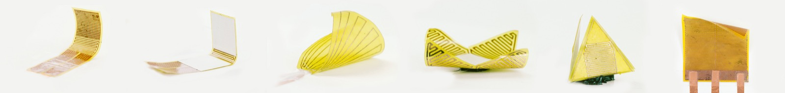

#uniMorph by The Tangible Media Group at MIT

uniMorph is a new fabrication technology created by the Tangible Media Group at MIT. uniMorph is a way of creating flexible film that can bend and unbend based on temperature form environmental factors or electronic input. With the correct embedded parts the film is also able to sense the bend angle over the film. By combining and re-arranging these film pieces the group has been able to create a large number of forms and behaviours. The current uses of this technology are all very basic and mostly just early demonstrations of potential future uses. One area that I think these demos do not explore is the use of ridge forms that act as a skeleton for these uniMorph muscles. I'm looking forward to where this tech goes in the future.

[Link to project paper](http://tmg-trackr.media.mit.edu/publishedmedia/Papers/592-uniMorph%20%20Fabricating%20Thin%20Film/Published/PDF)