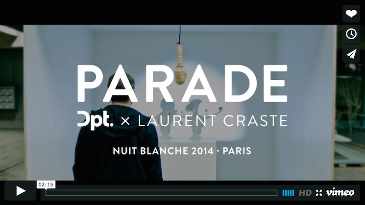

# Looking Outwards 04
### Parade by DPT
--
Parade is a different kind of interactive sculpture: it hides the tehcnology that makes it so magical and, in doing so, perpetuates an alternate reality, if even for a few moments of disbelief.

The piece presented is not some transformed "capture" of an orignal object, but instead the original object perceptually manipulated using a transformed shadow. The physical object never changes, but with user input of directionally cast light, the artist inserts an alternate shadow, thus entirely changing our percept of the scene. By elegantly altering the expected feedback of a familiar system, magical behaviors seem to arise from it. 

What fascinates me most about this piece is how it uses "capture" in a completely different way. It reminds me of the Augmented Hand Series by Golan Levin, Chris Sugrue, and Kyle McDonald, whereby the focus isn't on the captured object but on *the space between* the captured object and the "real" object. This space, facilitated by the artist but created by the inidividual, allows one to remove him or herself from reality, where traditional laws of physics cease to be.

Parade was made in 2014 by creative studio DPT. The original project can be found [here](http://dpt.co/en/parade-2/).