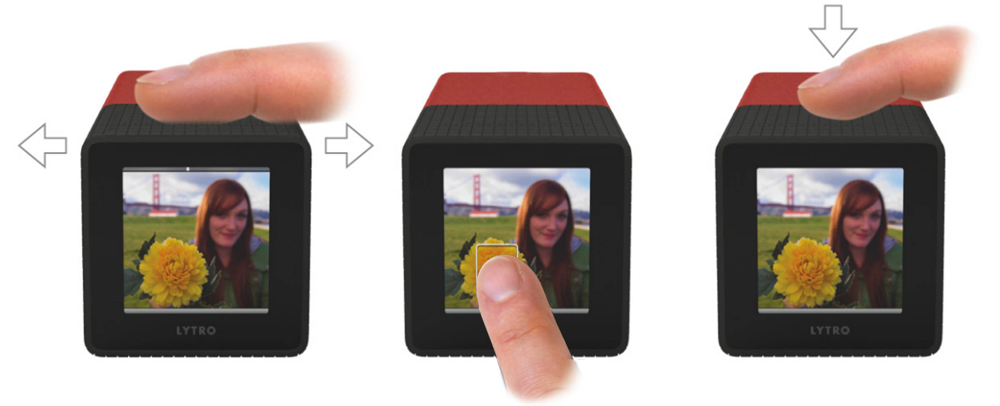
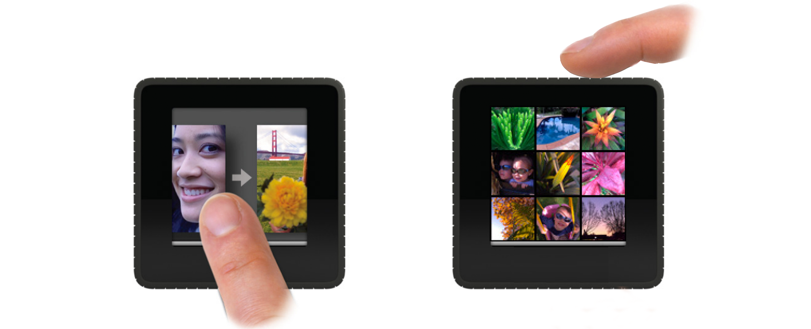
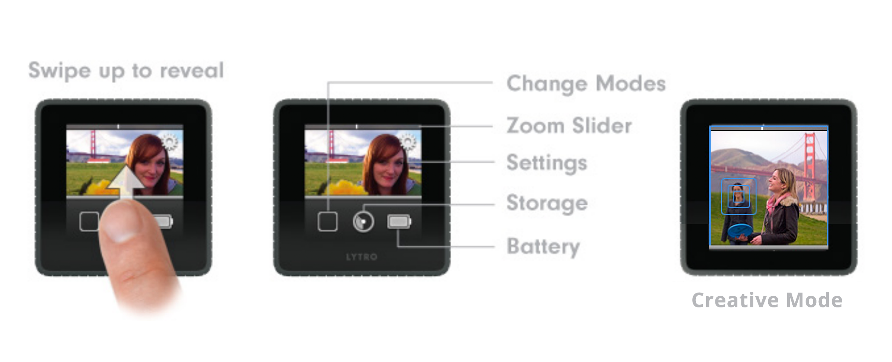
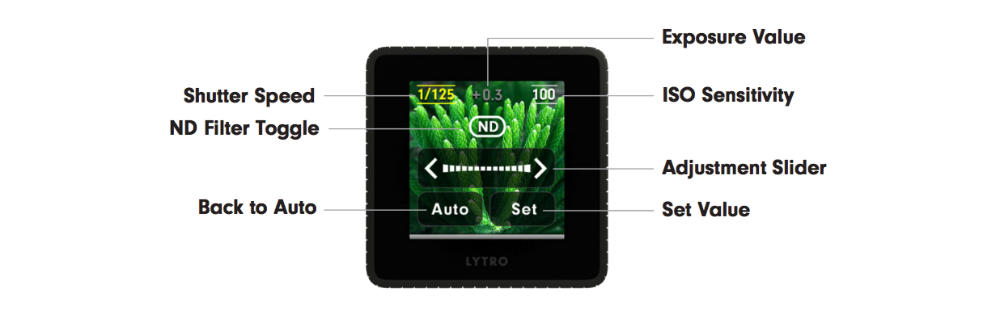

# Lytro (Gen 1) Operation

### Everyday Mode

![Lytro Buttons] (assets/lytro_buttons.png)

To turn the camera on, press the power button, located on the bottom of the camera.

The default mode of operation is **Everyday Mode** (see below). This mode is comparable to that of a "point and shoot" camera. To take a photo, simply compose your shot by zooming in or out with the zoom slider (faint lines on top of camera). As seen on the touch screen, the exposure will automatically adjust, but if you want a different area of the photo to be the middle exposure, click on that area of the image. Then, click the shutter button (indented button on top of camera).

To review the images you have taken, swipe left on the touchscreen (see below). These images are refocusable. To preview what a different focus would look like, click on the part of the image you want to be in focus. You can double tap on the image to zoom in closer to see greater detail.

You can also zoom out with the zoom slider to see your photos on a 3x3 grid. To return to shooting, click the shutter button.

[Here's a video recap of the basics.](https://www.youtube.com/watch?v=fT8Lc-HNEIM)

### Creative Mode

The second mode, called **Creative Mode**, allows greater precision in image making. With it, you can more precisely control the initial area of focus and thus, focus range. Furthermore, you can also zoom in three times as much. To activate this mode, swipe up from the bottom of the touch screen and click the square on the left. You will notice a blue border around the screen.

Now, when you click on an area of the scene, instead of changing the exposure to match that area, the camera refocuses to focus that area.

###Manual Settings

A number of settings can be manually set, specifically ISO and shutter speed. By swiping up from the preview screen and clicking on the gear icon in the top right, the settings menu is revealed. Clicking "Manual" will turn on these settings. To use them, return to the preview screen and swipe *down*. Select the value you want to control and use the slider to set a higher or lower value. If you are setting both the ISO and shutter speed, you can also turn on a Neutral Density filter, which can help prevent overexposure.

### Tips for Taking Photos

The Lytro camera is capable of focusing up to within an inch of the lens and, within the same photo, retain enough information of the background to focus to infinity. The best photos seem to make use of objects in the near background and far foreground. Utilizing this z space is key to crucial to success with the camera system.

### Charging
The battery lasts for a long time, up to 400 photographs. The downside is that it takes 5-8 hours to recharge fully.

### References

[Video: Lytro Camera Tutorial - Basics] (https://www.youtube.com/watch?v=fT8Lc-HNEIM)

[Video: Lytro Camera Tutorial - Creative Mode] (https://www.youtube.com/watch?v=k0NLekZVkQA)

[PDF: Lytro Camera Full Manual] (http://www.fototrade.cz/download/lytro/Lytro-Manual-ENG.pdf)