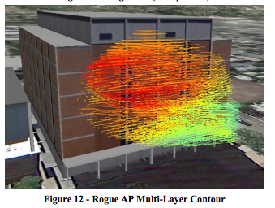

#Looking Outwards 3

## Three-Dimensional Wireless Heat Mapping and Security Assessment using Multi-Rotor Aerial Drones 

[Link to article](http://delivery.acm.org/10.1145/2660000/2656447/p45-pack.pdf?ip=128.237.208.103&id=2656447&acc=ACTIVE%20SERVICE&key=A792924B58C015C1%2E5A12BE0369099858%2E4D4702B0C3E38B35%2E4D4702B0C3E38B35&CFID=725566122&CFTOKEN=55045606&__acm__=1447088620_e6d428394972b79724567e1a138866c8)

Wireless networks are well known to be at risk a variety of attacks and/or monitoring by malicious users. Much effort has been put into developing encryption and authentication protocols for these networks, yet time has shown that weaknesses are frequently found in their implementation. For this reason, many organizations conduct site surveys to measure signal strength at various locations surrounding the premises. What was once meaured by foot can now be done by a drone. There are different ways to access wireless coverage areas not only on the ground, but also in areas not accessible to most human actors, such as balconies, roof tops, and the airspace surrounding buildings. 

This allows an individual or organization to gain awareness and visualize the extent of their coverage area above ground level. 

The data collection module was based on the Raspberry Pi Model B, a small single-board computer, running a modified version of Debian Linux, named Raspbian. The Alfa Networks AWUS036- NHA USB 802.11 Wireless Network Card was used for collecting Link Quality data, and the uBlox CN-06 GPS was used for geolocation. 

All the info this combination gets:
 
 * SSID
 * Link quality
 * Relative Signal Strength Indicator (RSSI)
 * Media Access Control (MAC) address
 * Channel
 * Geolocation 
 * Altitude
 * Atmospheric pressure
 
Also unrelated but interesting links:

http://samy.pl/skyjack/

https://www.usenix.org/conference/woot15