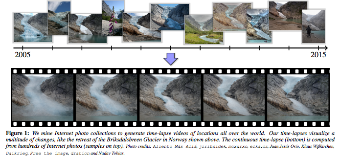

#Looking Outwards 10

## Time-lapse Mining from Internet Photos

[Link to paper](http://grail.cs.washington.edu/projects/timelapse/TimelapseMiningSIGGRAPH15.pdf)

Authors: Ricardo Martin-Brualla, David Gallup, Steven M. Seitz,
from the University of Washington & Google Inc.

***A glacier melting over a decade from crowd sourced photos***

Through conventional means of crowdsorcing photos of landmarks or other highly photographed objects, this method can be used to create a time-lapse of the photographed object over many years that otherwise wouldn't been possible. This is a novel & resourceful way to capture ultra slow movements. 

Steps: 

1. Cluster 86 million photos into landmarks and popular viewpoints. 

2. Sort the photos by date and warp each photo onto a common viewpoint.
3. Stabilize the appearance of the sequence to compensate for lighting effects and minimize flicker. 
4. Create time-lapse.

The most complicated part of this process and what the majority of the paper covers is step 2. The photos that are gathered vary between anpother. In this process they must warp the perspecive, take out occlusions and color correct a massive amount of photos. 	