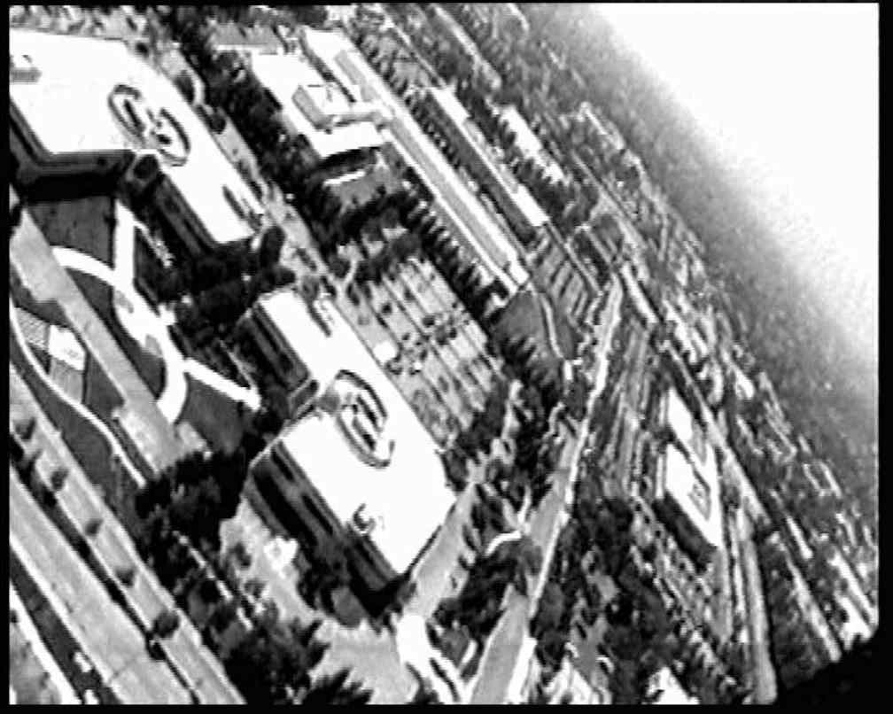
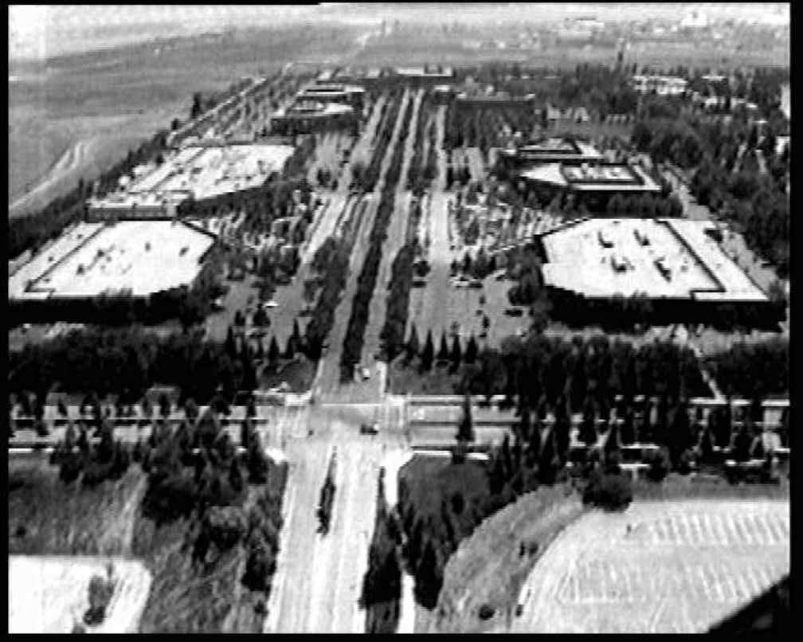
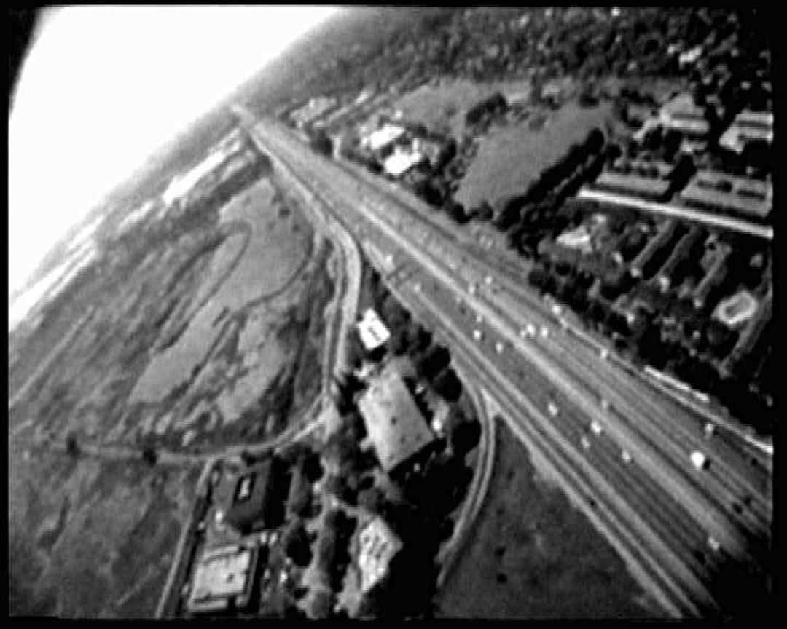

Natalie Jeremijenko - BIT Plane
=======

Given the work I did with a drone for the final project, I wanted to go back to early drone art projects to see how our treatment of the topic might have changed and how people were thinking about drones before their now well-known use within the military. I fond an intersting projet by Natalie Jeremijenko titled BIT plane that dates back to 1997.

> BIT Plane was an exploration into this new territory I called “information space.” Where ideas about information were being played out on the ground, so to speak, tangibly changing what places looked like, the geography. (Jeremijenko)

A view of Sun Microsystems from the BIT plane:

## Background

Natalie Jeremijenko is somewhat unique. She is an artist/engineer with a background in biochemistry, neuroscience, physics, and computer science. Her BFA back in 1992 was on virtual reality, but then she also got a BS the next year in neuroscience and biochemistry. Today she is an Associate Professor in the Visual Art Department, NYU and affiliated with the Computer Science Dept and Environmental Studies program.  Previously she was on the Visual Arts faculty at UCSD, Faculty of Engineering at Yale University

In 1997 she worked on a radio-controlled aircraft with video in collboration with the [Bureau of Inverse Technology](http://bureauit.org/). The BIT plane as it was called was sent over Silicon Valley to capture aerial footage. It was guided as drones are today via a live control and a video feed. 

What's cool about the project is that BIT plane was flown over several no-camera zones around: Apple, Lockheed, Nasa Ames, Netscape, Xerox Parc, Interval Research, Atari, Hewlett Packard, Oracle, Yahoo, SGI, and Sun Microsystems.

A view of HP:

The BIT plane website includes a transcript of what seems like one of BIT plane's flights. Or a few of them mashed up together. It's totally unclear who put the trasncript together, but it reads like a series of disjoint odd military radio communications. Here's an extract: 

> A PARTICULARLY PLEASANT PLACE TO LIVE AND WORK

> Mountain View, Hewlett Packard

> started business in a 1-car garage in nearby Palo Alto their tools were simple: a bench, vice, drill press, file, soldering iron hacksaw and and some purchased components

> In 1987 the garage was officially designated a California State Historical Landmark visited by thousands yearly

> Moffet Air Base Sun MicroSystems Adobe Systems Silicon Graphics

> In recent reports, thousands of 3-car domestic garages in this area have been subject to random Non-Owner openings and closings attributed to the massive high-powered US Marine signals active in the area

> ONCE A FERTILE ORCHARD REGION KNOWN AS THE VALLEY OF HEART'S DELIGHT

> Reports of seeping underground waste storage of hydrochloric and hydrofluric acid carbon tetrachloride, methylene chloride and other production solvents of the wafer fabrication process are not verifiable from the air.

Highway 101:

## My Experience

BIT plane might just be the first piece of drone art ever made. And what a bold move! A project like this today feels almost impossible, if not plain silly. With the legal expertise that tech companies have amassed, an artist would be reckless to try to capture no-camera footage over their campuses. The work still feels relevant and impressive today; Jeremijenko ironically captured footage of a lot of the companies that made and continue to make military technology such as drones. This is a quote from Jeremijenko herself:

>The idea that motivated the elaborate security... was that if you took a camera in there, you could somehow steal intellectual property. And that didn’t really sync with my idea of what ideas, thinking, intellectual property is, right? Information is a property of people and communities and discussions, and actual work, it’s not something you can just take a picture of and steal. But that was the paradigm, and it actually remains the prevailing paradigm, that information is property, that it can be stolen with cameras.

I just wish the website had more information about the project! It was really hard for me to piece together how it was conceived, why, how such a plane was built in 1997, who flew it, what the footage was used for, etc. 

On the other, hand Jeremijenko has some interesting thoughts on drones which I think are actually quite controversial. She's apparently working on a new version of BIT plane to explore constructive uses of drones. Here's another quote from her interview: 

>When it comes to drones, it is a tremendous cultural challenge to ask, Can they do something productive? And I’m afraid that surveillance, even for agricultural or environmental purposes, though often touted as a good use of drones, is pathetic, right? It doesn’t give you the on-the-ground uses of knowledge to be able to address the environmental issues that they’re supposedly surveilling, and it doesn’t give you the capacity to act in a productive and constructive way, unless you are on the ground and working that agriculture or fishery. So my concern about drones is not that they are somehow invading privacy. Take all the images you like; I don’t see what sort of sense you can make of them. My real concern is the larger cultural challenge that we face: can we use these constructively?

## References

* BIT plane original website: <http://bureauit.org/plane/>
* Jeremijenko interview writeup and original audio: <http://dronecenter.bard.edu/interview-natalie-jeremijenko/>