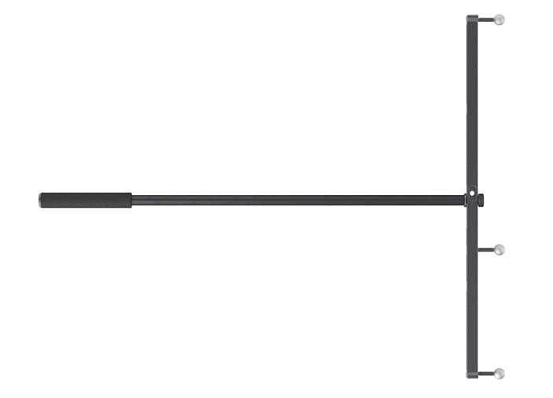
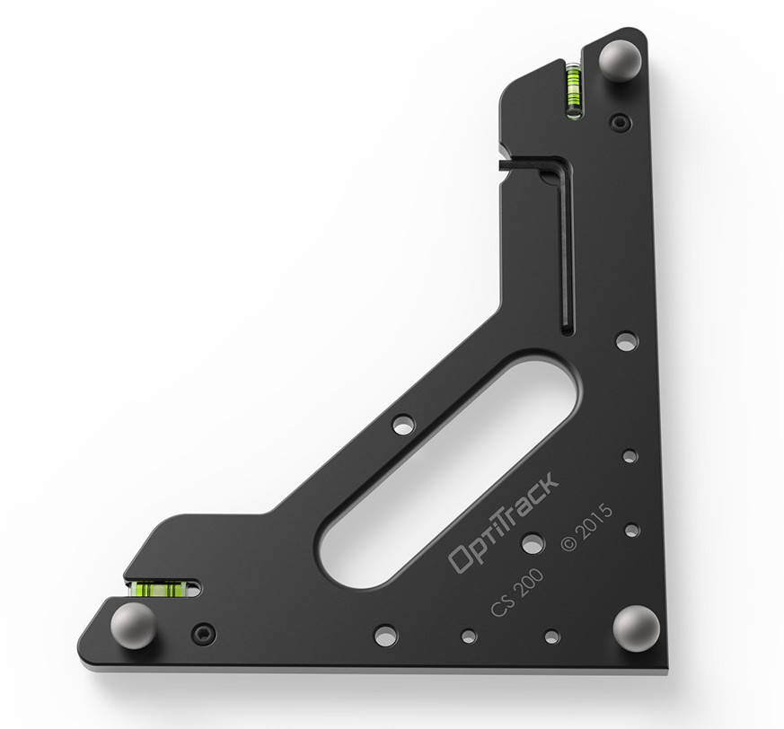

TBA -  Tutorial: Optitrack Motion Capture System
========

This tutorial is not yet complete!

This is a very high level tutorial for how to set up the Optitrack system and not lose all of your data. It includes some notes about how to set up 2 skeletons and rigit bodies (additional objects in your scene). 

If you have suggestions for improving this tutorial, please share! 

Tips
----
* Remove any kind of reflective material form your scene while wanding and while recording. In fact, the system will refuse to calibrate if there are too many reflections other than the calibration wand present in the camera views.

Step 1: Gathering your gear and setting up software
----

Things you need to get from Ideate lending:

* Callibration wand: 

* Callibration square for the floor:

* Velcro suits: Ideate has 4 sizes XS, S, M, L. Sometimes the gloves and booties get mixed up between the suits so you might have to search through more than one bag. 

* USB Key for Motive software: Don't forget this! You need the USB key to launch the Motive application. 

* Optitrack markers: Ideate currently has about 70 markers. Just enought to get two minimal skeletons. 

***

Step 2: Callibration
----
1. Log in to the Media Lab computer
2. Plug in the USB Key
3. Open Motive software
4. Start Wanding
5. Set Ground Plane

"You should be careful when using the masking features because it totally ignores all the pixels from selected regions from the 2D image of the camera. In other words, the data in masked regions will not be acquired by the system for computing the 3D data, and excessive use of it may result in data loss or frequent marker occlusions. Therefore, all extraneous illuminations must be removed or covered before the using the masking tool. After all reflections are removed or masked from the view, proceed onto the wanding process." (<http://wiki.optitrack.com/index.php?title=Calibration>) 

***

Resources
----
* <http://wiki.optitrack.com/index.php?title=Quick_Start_Guide>

