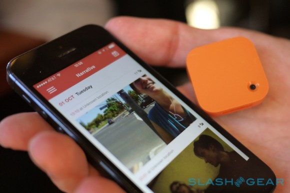
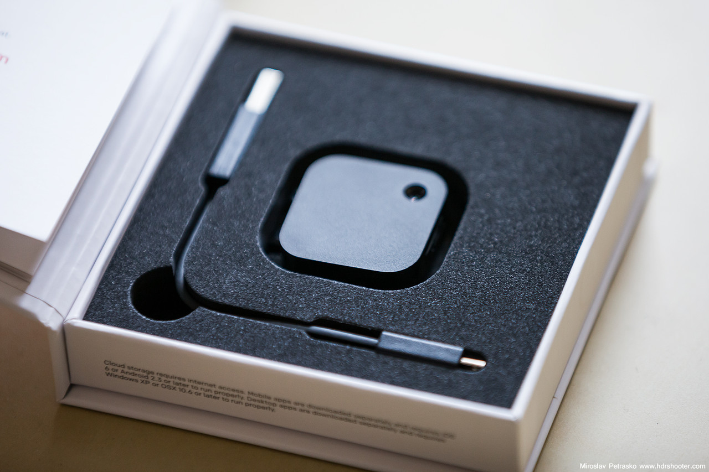
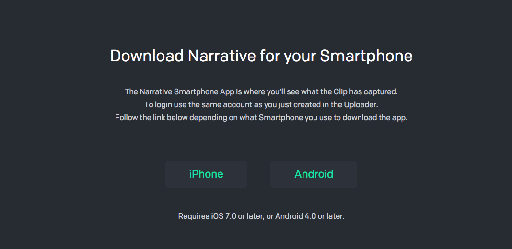
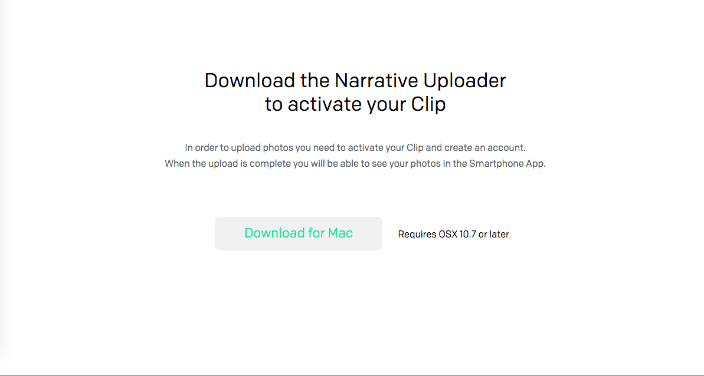

**Narrative Wearable Camera**

*Background*

The Narrative Clip Camera is a 36x36x9 mm wearable camera created for the purpose of “lifelogging”, the concept of capturing and recording everyday moments, by automatically taking photos every 30 seconds. The small square camera boasts touch-sensor control, a 5 megapixel camera, and mobile and web access via free apps to photos captured. While the initial prototype was funded through Kickstarter, the company “Narrative” has since released a version 2, with a higher resolution camera and more features. 

*What’s Included*

The Narrative Clip Wearable Camera arrives in a small square box with a USB cable and the camera. 

*Activating and Using the Camera*

go to http://start.getnarrative.com/
Follow the instructions on the page to install the required software: 
       1. A desktop launcher for the camera (requires log in information/account creation)

            
       2. Download corresponding mobile app.
   

After the Uploader has been downloaded, you’ll be requested to plug in the camera to complete activation. This is also the method by which you charge the battery. 

The battery life of the camera is indicated by four LED lights on the side of the camera whose different lights indicate different statuses:
1 light blinking: memory full or battery low
2 lights (every other) blinking: error with camera; plug into computer to learn more
1 steady light: battery at 25%
2 steady lights: battery at 50%
3 steady lights: battery at 75%
4 steady lights: battery at 100%

To take a photo, simply double tap the front of the camera. To turn it off, place it face down such that the clip is facing up, or put it in a dark area.

