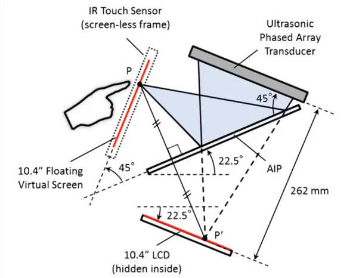
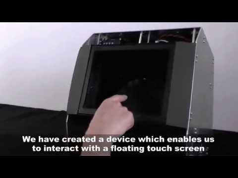

## Looking Outwards 01

*Michelle Ma, 6 September 2015*

Haptomime and the Visuo-tactile projector were presented at Emerging Technologies for SIGGRAPH 2015 by Shinoda - Makino Lab at the University of Tokyo. Both projects use the principle of ultrasonic transducers to create tactile stimuli that can be coupled with holographic and projected images.

### Haptomime

The first project, Haptomime, allows the user to interact with a touch screen interface in mid air. The "screen" is an illusion hovering parallel to the user, and the tactile interaction is conducted by infra-red sensors that detect the location of the user's finger and ultrasonic sensors that send concentrated beams as feedback. This coupling leads to amazing tangible interactions with screen-based applications. For example, altering the pressure of the ultrasonic feedback allows the user to feel the sensation of playing smooth piano keys or tapping on a glass panel. According to Shinoda Lab, this project is meant to eliminate person-to-person contact through screens, thus limiting the spread of diseases.

[Project Abstract](http://dl.acm.org/citation.cfm?id=2647407&dl=ACM&coll=DL&CFID=710705347&CFTOKEN=21065656)

### The Visuo-tactile projector

In this project, the animations and tactile stimuli are projected directly on the users skin using an Airborne Ultrasound Tactile Display and pico projectors. They also investigated the "Visio-Tactile Threshold (VTT)", which is the minimum distance on the skin that is required to recognize the position difference between a projected visual point image and a tactile stimulation. According to their research findings, the distance between tactile points and visual points as measured by research subjects tends to be shorter. Using the VTT, they were able to mimic certain sensations, such as fireworks and crawling critters, on human skin. The project is meant to offer new possibilities for theme park attractions.

[Project Paper](http://www.hapis.k.u-tokyo.ac.jp/public/hiroyuki_shinoda/research/pdf/12SICE/Yoshino_ThA05-02.pdf)

I had the pleasure of experiencing these projects at the 2015 conference. It is very hard to gauge the projects without experiencing the tactile stimulation firsthand. They were truly able to capture the sensation of touch, couple it with projected imagery, and create a synergy. For example, when I tried out the Visuo-tactile projector, it actually felt like there were mini fireworks in my hand; and when the animation changed to a crawling inch worm, I actually pulled away in disgust. It is a very calculated experience and far more refined than the air-blowing, water-spouting attractions you find in theme parks. The projects have a long way to go before they can translate into polished products, but they opened my eyes to virtual sensations which stretch beyond virtual objects or environments.

### Side Note

Haptomime also reminded me of a simple technique of creating holograms using an LCD that I would like to investigate.

