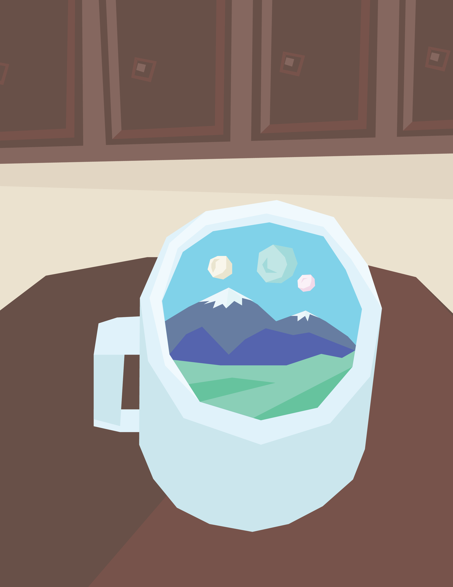

# Final Project Proposal

###11/30/2015 Update -- Collaboration with Smokey
###Applying Film Editing Techniques to High Speed Film While Maintaining Timescale

Smokey and I want to elevate high-speed capture from a gimmick to a narrative tool. We've decided to  create a montage of a complex moment (either a drink being mixed or two people kissing) using the high-speed camera. The moment will be captured from multiple angles, changing by at least 30 degrees every indented cut. We will also record sound at 96 kHz and use a combination of stretching and overlapping to create an audio accompaniment that fits the montage. The finished project will be an edited video that will re-define how high-speed video can be used.

### Throwin' Around Some Ideas

I know I need to pick something that can be iterated on quickly, so I'm trying to think about what kinds of projects would work in and around the CMU campus.

I think time distortion is really cool! My favorite project we looked at in class is [DAWN CHORUS by Marcus Coates](https://www.youtube.com/watch?v=PCCpnDtgxXk). I'm trying to think of what would be cool to see sped up or slowed down.

On Monday, Smokey and I talked about the possibility of working together. He had an interesting idea about temporally compressing sound by cutting a recording into chunks and overlaying them.

###Misc. list of my ideas

- Besides singing, are there other actions humans do that when sped up resemble small animals? What other kinds of distinctive bird songs would come through clearly? (Audio Recording Devices and a Camera)
- What would a slit-scanned time lapse look like? (Cameras 'n Programmin')
- What if you had a cup whose interior is a small video view of another world? (Flock of Birds, 360 Video)

*An interdimensional coffee mug*
