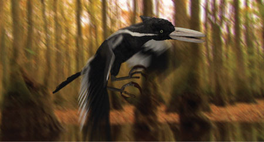
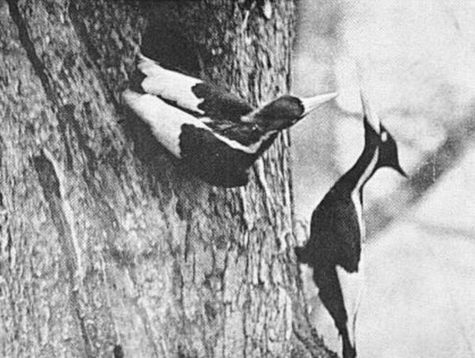
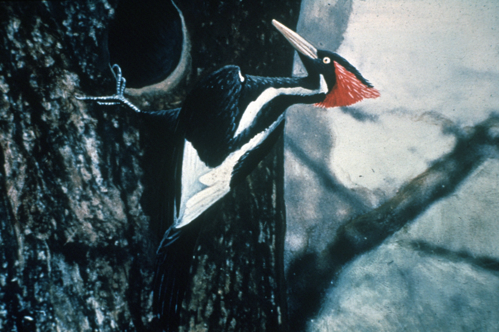
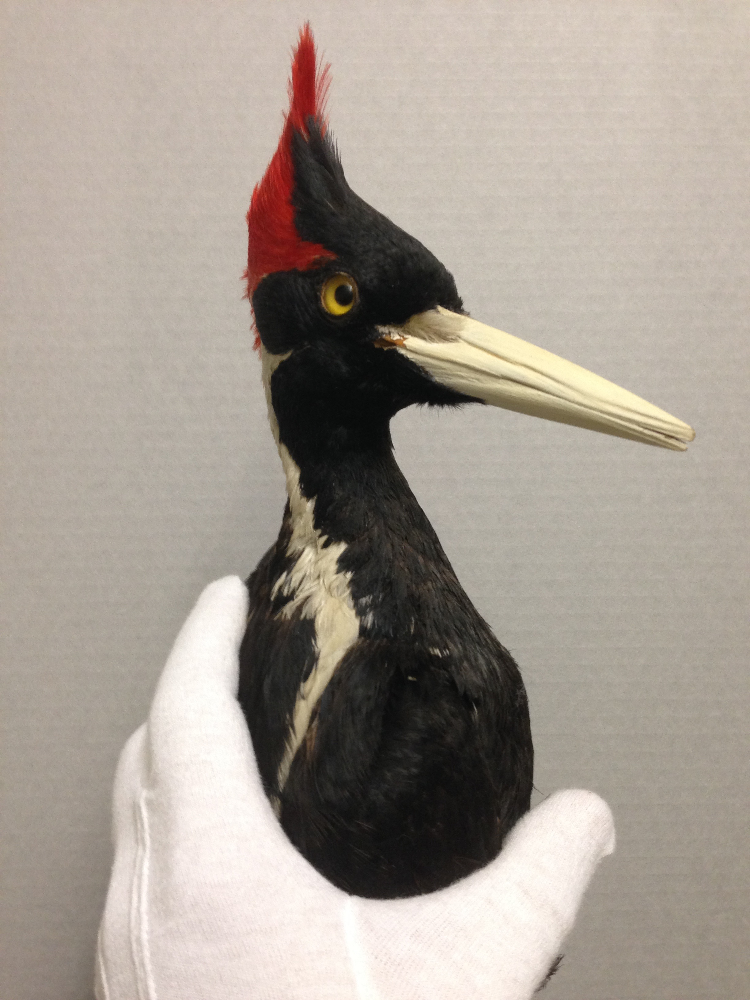
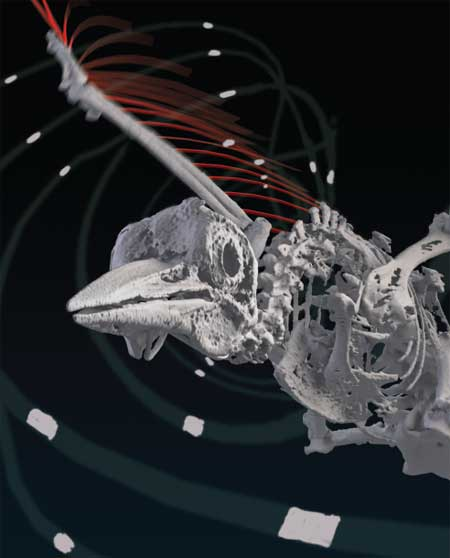

# Looking Outwards 02: Bird Motion Capture

###Creating a Digital Ivory Billed Woodpecker, 2004

[Article Link: Taking Flight](http://www.cgw.com/Publications/CGW/2010/Volume-33-Issue-1-Jan-2010-/Taking-Flight.aspx)

The above article describes a collaborative project from 2004 at the Cornell Lab of Ornithology, where a [computer-generated version of an Ivory Billed Woodpecker](http://www.cgw.com/images/media/PublicationsArticle/0110/Birds001.jpg) was created to verify whether or not a living one had been recorded in a blurry video. 

Why all the effort for one bird? The Ivory Billed woodpecker is believed to nearly (if not already) extinct, so any chance to confirm a potential sighting is vigorously pursued, at least inside of the birding community.

What's especially interesting about the Ivory Bill is that, because it became scarce before color photography, the only pictures we have of it are black-and-white or hand-colored. 

[Black and White Photo Of Ivory Woodpeckers](https://en.wikipedia.org/wiki/Ivory-billed_woodpecker#/media/File:Ivory-bill_pair.jpg)

[Hand-Colored Photo of Ivory Woodpecker](https://en.wikipedia.org/wiki/File:Ivory-billed_Woodpecker_by_Jerry_A._Payne.jpg)

[Taxidermied Ivory Billed Woodpecker](http://www.miamisci.org/blog/wp-content/uploads/2014/01/ivory-billed-woodpecker1.jpg)

The process for creating the digital Ivory Bill was very complex, involving a [CT scan of a taxidermied specimen](http://www.cgw.com/images/media/PublicationsArticle/0110/Birds003.jpg), extensive modeling in Maya, and a mix of motion capture, rotoscoping,  and key frame animation.

The most fascinating part of this project to me was the decision to capture the motion of a bird in flight, which was done by placing mo-cap markers on a red-winged black bird. However, red-winged blackbirds are significantly smaller than Ivory Bills and thus fly differently. To correct this, video was shot of a flying Pileated Woodpecker, a bird much closer in size to the Ivory Bill, and rotoscoped onto the digital Ivory Bill to correct its method of flight.

I acknowledge that there have been leaps and bounds in 3D technology since 2004, but the head and feet of the digital Ivory-Billed Woodpecker seem rather dead. The size of the head is rather disproportionate, and the feet are at a very stiff angle. I think this is a result of the muscle mass, position, and feather orientation of the dead taxidermied bird not closely matching that of a live bird.

Regarding the true identity of the bird in the blurry video, the result was inconclusive. 

This project was a collaboration between a large number of individuals, I've tried my best to list them below according to the article: 

- David Luneau - the researcher who captured the blurry video
- Donald Greenberg - professor and computer graphic expert who suggested the project
- Jeff Wang - graduate student, modeled Ivory Billed Woodpecker
- Kim Bostwick - curator of the bird collection at the Cornell University Museum of Vertebrates, granted access to taxidermied woodpecker and worked on bird mo-cap
- David Kaplan - graduate student in computer graphics, word on bird mo-cap
- Brendan Holt - developed motion capture system for birds
