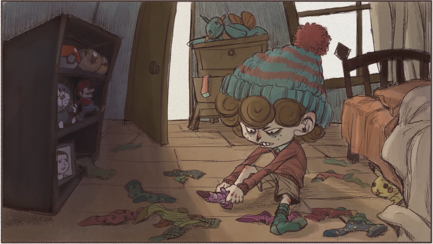
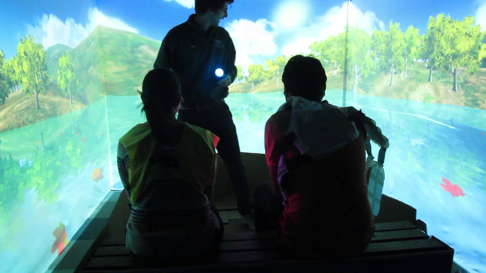
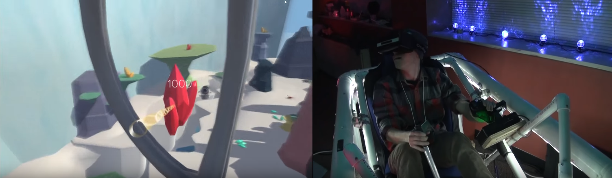

#Looking Outwards 10: Building Virtual Worlds (BVW) festival at the Entertainment Technology Center (ETC)

Building Virtual Worlds (BVW) is a semester-long course at the Entertainment Technology Center (ETC) where small teams of students create a new virtual world every two weeks. itself is a showcase of this work. (Work from the Visual Story course and the ETC Fundamentals course was also on display). 

Below are a handful of the BVW experiences I got to try out.

###The Tale of Mismatched Max, 2015

[Video Link: The Tale of Mismatched Max](https://vimeo.com/146450312)

Max, a boy who mismatches his socks, finds the same fate befalling his body parts. In the game, the player controls Max's torso using a kinect to re-attach his head, arms and legs as they float around the room. However, there's a variety of junk items mixed in with Max's appendages, and if the player picks up a stick instead of Max's left leg, they have to furiously shake their own left leg to make the junk object detach. 

The game itself was incredibly responsive and amusingly deranged. I was most impressed by the setup of the game's physical presentation space. Upon entering a room filled with cardboard stone walls and bookcases, a team-member sat me down on a cushioned chair, where I was handed a storybook (actually an ipad in a book casing) that introduces the story of Max's predicament. Then I stepped up to play the game, and afterwards, I got to write my name and score on the cardboard stone wall. Short, sweet, and memorable!

###Ogopogo, 2015

[Video Link: Ogopogo](https://www.youtube.com/watch?v=Q8657EkggZ8)

On a quiet tour of lake Ogopogo, the eponymous monster suddenly appears! The experience is in a room with a boat on a mechanical platform, and surrounded on three sides with screens that show a virtual lake. Before boarding the boat, the two players are given life jackets with PlayStation moves attached to them. A team member acting as a tour guide introduces players to the lake, and then appropriately freaks out as the boat is swallowed whole by Ogopogo itself. The tour guide and the players respond to this dire situation by rocking the boat back and forth, and Ogopogo is forced to regurgitate the boat, ending with it landing right at the beginning of the tour.

Since this ride requires two players, I teamed up with someone I'd never met before. The tour guide did a very good job of making us feel confortable sitting together on the calm lake, as well as getting us to slide back and forth on the bench when stuck in Ogopogo's belly. (The moose skulls and the Mountie hat were a nice touch!)

The boat platform uses pneumatic pressure to rock the boat itself, resulting in some pretty powerful jolts. The rocking appears to be based on a mix of in-game events and the location of each player's PlayStation move. The combination of this mechanical element plus the enthusiastic tour guide really sells the experience. This was a quality theme-park-level ride! 

###BUCKiT, 2015

[Video Link: BUCKiT](https://www.youtube.com/watch?v=in4r6etm9Eg)

BUCKiT is a combo VR and tactile experience where the player flies around and collects valuable animals and minerals on an alien planet. For the physical setup, the player climbs into a control pod suspended by a complex PVC pipe structure with the help of a team member who explains the controls and and helps adjust the player's VR headset. Using the physical controls to navigate, the player pilots their ship and uses a tractor beam to collect objects and deposit them into a bucket held by a friendly robot companion.

Visually, the game was minimal yet aesthetically cohesive. I had a bit of a hard time adjusting to the controls, but thoroughly enjoyed exploring the space. And collecting turtles. I collected a lot of turtles. This was my first peripheral-associated VR experience. The simulation of flying around in a ship was like nothing I'd ever tried before! It was a bit disorienting, but I'm happy to have tried it and hope the physical apparatus continues development. 
