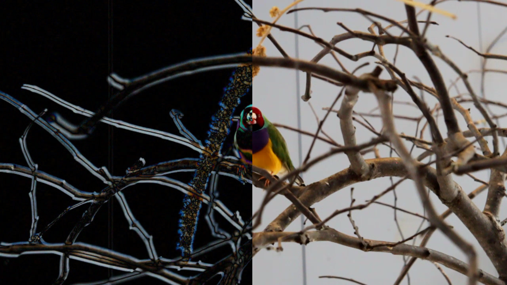
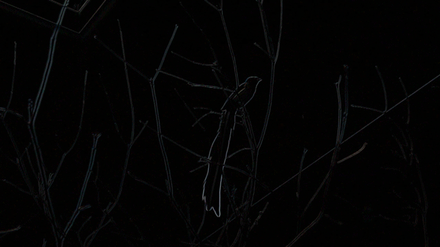
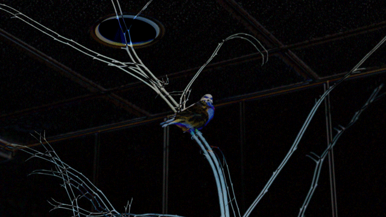

#Frame Differencing - Bird Movement

*Still Image of Gouldian Finch, demonstrating Frame Difference. Read on for gifs, which show the effect in motion.*

The object I captured is bird movement. I know, I know, that's bit ephemeral, but it's what interests me. 

So I spend a lot of time watching birds. Because I've done this for years, I'm pretty good at recognizing the patterns that let me know if there's a finch in a nearby tree or that the silhouette flying overhead is a pigeon and not a peregrine falcon. (With the side effect that I sometimes misidentify dead leaves as small birds, but I digress.) 

I've noticed that when pointing birds out to friends, they tend to either just miss the motion of the bird, or sometimes have a hard time seeing it at all. So, I decided to investigate how to make bird's movements (both big and small) more visible. 

The answer turned out to be Frame Differencing, which is a calculation of the difference between the current frame of a video and the previous frame of a video. The overall effect highlights motion, while minimizing still elements. 

A big thanks to Michelle Ma, who suggested I look into Frame Differencing, and Golan Levin, who wrote the Frame Differencing Processing code I used an modified, [which can be found here](http://www.flong.com/storage/images/texts/essay_cvad/FrameDifferencing.pde). My modification of the code [can be found here](frame_difference/frame_difference.pde).

As for the birds themselves, they were recorded at the [Pittsburgh National Aviary](https://www.aviary.org/). Below is just a portion of the footage I captured and modified.
(The original video was shot at 1280x720, but has been scaled down by 50% for gifs.)

*Owl Finch takes a bath.* 

*Cutthroat Finches hop and fly.*

*Paradise Whydah flies away.*

*Inca Dove shuffles off.*

*Green Singing Finch flies away.*

*Various birds fly around.*

A happy accident: I had to shoot everything freehand because the plate on my tripod was stuck, but the resulting "shake" has the cool effect of highlighting the outline of the area around the birds. (If there where no screen shake, all non-moving elements would be black space).