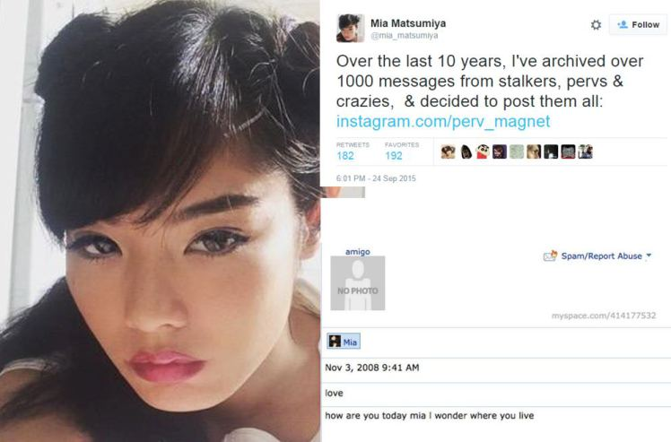
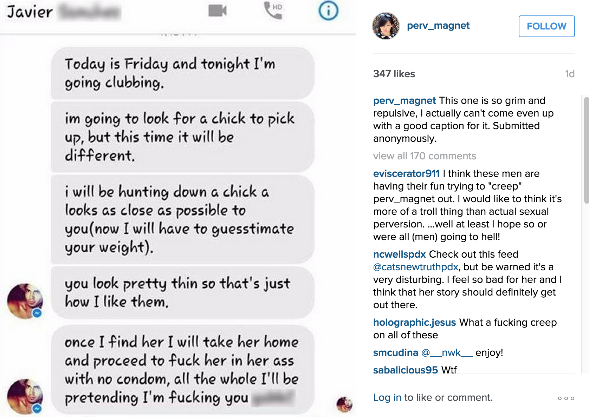

#Mia Matsumiya AKA perv_magnet

--

  

###Overview

Mia Matsumiya, an Asian-American Music performer has taken to instagram to document years of sexual harassment online under the handle “perv_magnet”. She has experienced slews of sexual harassment since starting her online blog a few years back and has received no aid from authorities even after many men have messaged her about how they will rape her and even after a stalker was found with hundreds of stories he had written about stalking and raping her.

[Matsumiya’s Instagram] (https://instagram.com/perv_magnet/)
[Short Article about the Project] (http://www.themarysue.com/woman-calls-out-creeps-instagram/)

--

###Why it’s Exciting!
This isn’t your average form of ‘capture’ but I think it is a very effective use of screen capture - something most everyone can have access to- that in itself work to capture a larger and unseen portion of internet culture- the harassment of women. I think many girls actively using the internet don’t want to give away their real gender due to dangerous behavior of other users. (my first few account online had me listed as a boy). It is especially hard for women who post photos online. I like Matsumiya’s project because she does not try to say anything other than “here are screencaps of unappealing comments I’ve gotten on the internet and I think they are gross.” Often, when people try to bring up these issues they get criticized for making a fuss or told to just bear it. Here, Matsumiya isn’t asking for change and isn’t even asking to be heard. She’s just documenting. This can bring out more change than asking for it.

###Why it’s not as Exciting…
I think it’s been a trending topic on the internet which will give it a good amount of attention but many of the sites covering the story are liberal to begin with: theMarySue.com, HuffingtonPost, Buzzfeed, etc.

Other than that, the story is actually pretty successful considering many other women have tried to call out this behavior before and have not been heard. Mia Matsumiya seems to be the right woman for this at the right time.

  

  

