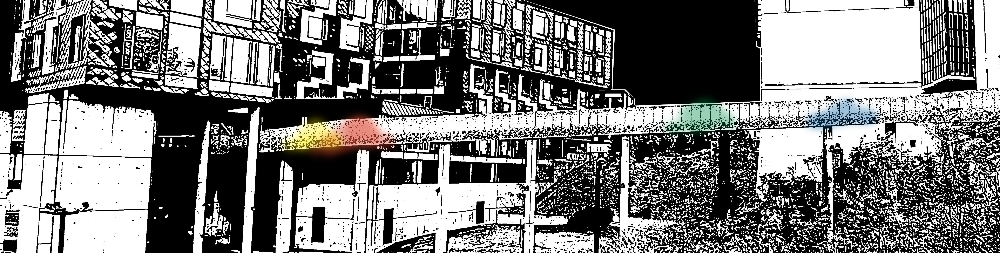

## Final Project Proposal

For my final project, I am eager to do something interactive. I would like to live-capture the position of people walking across the Pausch Bridge and use that to affect the bridge lighting. More specifically, I would like to explore lighting that "follows" (and perhaps trails) people as they walk across the bridge. I would like to explore using different colors of light for each person, and perhaps play with how the colors are affected when people stop and interact with eachother.

I hope to accomplish this by interacting with the bridge lighting server using a framework created by Evan Shimizu. I have a (very) small amount of experience scripting lighting shows for the bridge, but none of it was done programmatically. I have permission to use the bridge for this project.

For position sensing, I hope to use the bluetooth low-energy beacons that are placed every few feet across the bridge. My understanding is that they were placed there for Kris Katani's NavCog project, but because they work simply by broadcasting ID information, I should be able to piggyback off of them without affecting other uses.

I plan on writing an iOS app allowing the user to configure some parameters for 'their' light as they cross the bridge. The app will handle monitoring the presence / relative distance of the beacons (using relative radio strength), and will transmit this to a server-side app that uses the data to generate the bridge lighting.

Unfortunately, this will require each person have the app downloaded, which is limiting. It would be nice to use a camera with computer vision to at least provide default lighting for people without the app. The size of the bridge, the lack of existing cameras, and the nighttime conditions make this a formidable challenge. This might be nice to explore for future work.

*Components:*

- Server-side app that uses position data to define bridge lighting. 
- iOS app that reads positions of BLE beacons and sends data to server-side app. 

*Challenges:*

- Will be my first native iOS app. Plan to write in Swift.  
- Will be my first time to use BLE beacons. Will leverage CoreLocation. Latency of detection (usually every 1s) with network latency may be a significant issue – thinking about ways to infer future location of user to keep it fast. Initially, will simply query for 'closest beacon'. (Because of metal and glass on the bridge, I'm not sure how accurately I will be able to do this.)
- Will be my first time to interact with the bridge lighting server programmatically. There are ample past projects that I should be able to learn from, and it's possible I may use Shimizu's [Lumiverse framework](http://lumiverse.cs.cmu.edu/).

