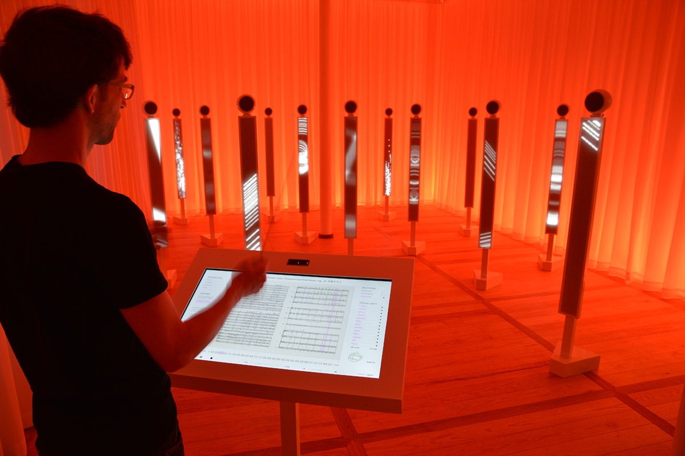
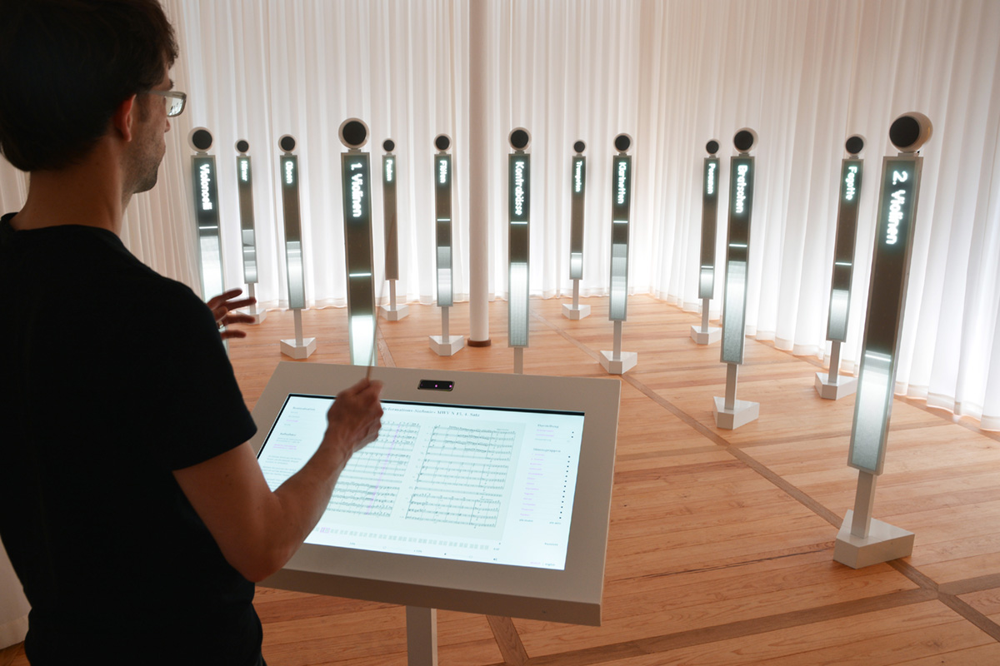
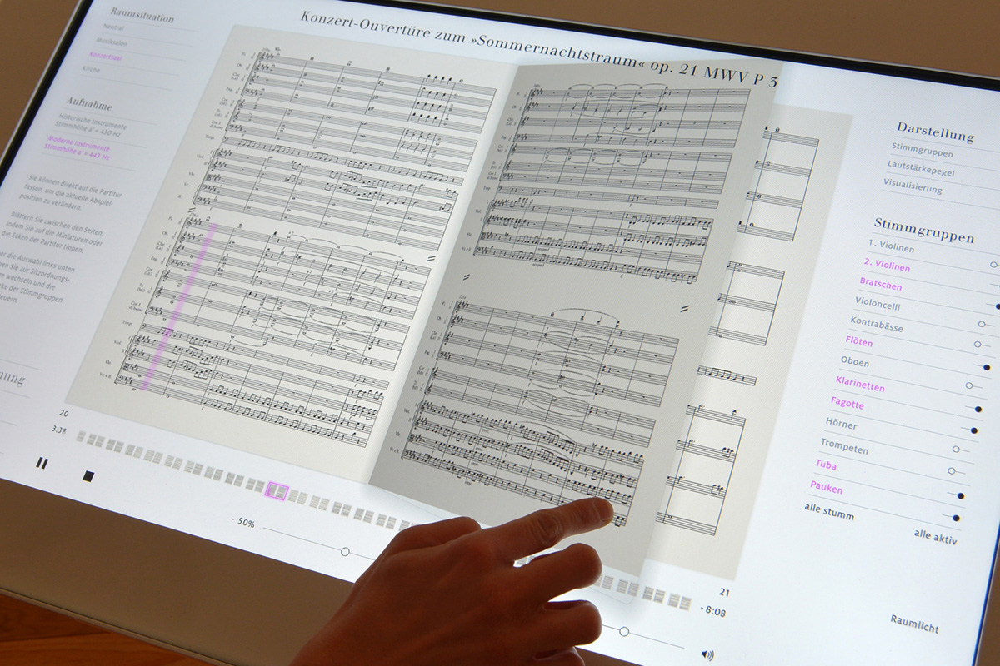

## Looking Outwards #3: *Mendelssohn Effektorium* by Bertron Schwarz Frey Studio and WHITEvoid (2014)

*Mendelssohn Effektorium* was created for the Mendelssohn-Bartholdy Museum in Leipzig, Germany. The museum endeavors to share more than the experience of visiting the physical space (once Mendelssohn's apartment) that makes up the Mendelssohn-Bartholdy muesuem. Bertron Schwarz Frey Studio and WHITEvoid collaborated to construct an interactive space in which the viewer conducts an 'orchestra' playing Mendelssohn pieces. Each instrument section is represented by a display with a speaker. The viewer approaches a podium and can turn to a particular piece on the display. They can control the lighting, the instrumentation (e.g., traditional instruments or modern), the room accoustics, and other features from the console. They then conduct the orchestra using a baton that is tracked using a LEAP motion controller. The motion of the baton is used to set the tempo of the piece.

These pieces are compelling for a couple of reasons. Firstly, they place the viewer in a role few would find themselves in. Secondly, they offer a sense of control over many complex things. This combination is thrilling, and the use of new capture techniques enables more realistic simulations than seen before. One day, it would be thrilling to have the sensation of actually conduct a real orchestra – but until then, this abstraction feels sufficiently interesting. Moreover, the intent of exposing the viewer to Mendelssohn compositions in a compelling way is clearly successful.

I do think the work would benefit from further exploration of how the design of the (modern / futuristic looking) components of the exhibit fit in with the (drapey, organic, traditional) curtains. Also, it would be interesting to see additional features pulled from the baton motion – e.g, dynamics, volume, energy.

---

  
Mendelssohn Effektorium (2014)  
*source: http://www.whitevoid.com/#/main/interactive_structures/mendelssohn-effektorium*

  
Mendelssohn Effektorium (2014)  
*source: http://www.whitevoid.com/#/main/interactive_structures/mendelssohn-effektorium*

  
Mendelssohn Effektorium (2014)  
*source: http://www.whitevoid.com/#/main/interactive_structures/mendelssohn-effektorium*

---

## Sources
- [https://vimeo.com/86918178](https://vimeo.com/86918178)
- [http://www.bertron-schwarz-frey.de/wordpress/index.php/archive/3328?lang=en](http://www.bertron-schwarz-frey.de/wordpress/index.php/archive/3328?lang=en)
- [http://www.aconica.de/index.php?img=104](http://www.aconica.de/index.php?img=104)
- [http://www.whitevoid.com/#/main/interactive_structures/mendelssohn-effektorium](http://www.whitevoid.com/#/main/interactive_structures/mendelssohn-effektorium)