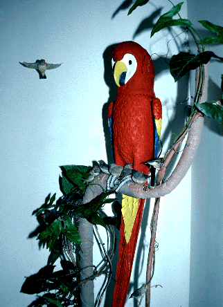
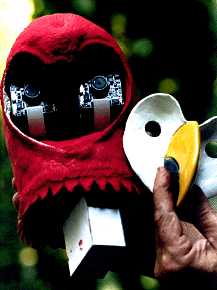
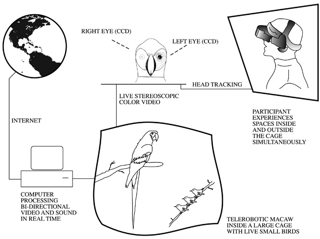
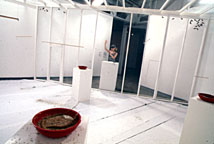
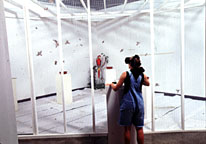

## Looking Outwards #4: *Rara Avis* by Eduardo Kac, et. al (1996)

*Rara Avis* consisted of a robotic macaw that was placed in an aviary and surrounded by 30 (live) birds. Users outside of the aviary could put on a VR headset and control the head rotation of the macaw, and experience the aviary from the macaw's perspective. Additionally, remote users could stream video from the left and right eyes over the internet. These users could trigger the macaw to make sounds, and hear audio from the space itself.

Kac's later works are arguably more provocative (e.g., the creation of a transgenic green-glowing, live rabbit) but Rara Avis is a nice use of available technology (this was, after all, the same year Google was first developed). 

Ultimately, the work addresses a few interesting ideas. Of course, the piece symbolically places the user in the cage with the birds, perhaps creating an unforseen empathy. *Rara Avis* also explores the relationship of virtual presence and actual presence. The contrast is exaggerated by the limitations of technology at the time – distant internet users would not have the available bandwidth to stream color video, and therefore would experience the space in color. It is important to remember the context of this, which was a time when the internet was being sold as a way to bring people together in a revolutionary way. Even so, few were familiar with videoconferencing.

Another facet of *Rara Avis* that is interesting is the cooperation between local participants and remote participants. Each set is influenced by the control of the other set, but they operate without any separate guidance, or even explicitly shared goals.

*Rara Avis* is a piece that requires considering context when examining nearly 20 years later – it's easy to dismiss it because of the archaic looking technology. Still, though the nature of virtual and physical presence have been examined, they seem still ripe for further exploration as VR technology advances. 

---

  
*Rara Avis* Robotic telepresence macaw (1996)  
Source: [http://www.ekac.org/raraavis.html](http://www.ekac.org/raraavis.html)  

  
*Rara Avis* Robotic telepresence macaw  (1996)  
Source: [http://www.ekac.org/raraavis.html](http://www.ekac.org/raraavis.html)  

  
*Rara Avis* structure (1996)  
Source: [http://www.ekac.org/raraavis.html](http://www.ekac.org/raraavis.html)  

  
*Rara Avis* Inside and outside the cage (1996)  
Source: [http://www.ekac.org/raraavis.html](http://www.ekac.org/raraavis.html)  

---

## Sources
- [http://www.ekac.org/raraavis.html](http://www.ekac.org/raraavis.html)
- Ironically, videos of this project have thus far been impossible to find.