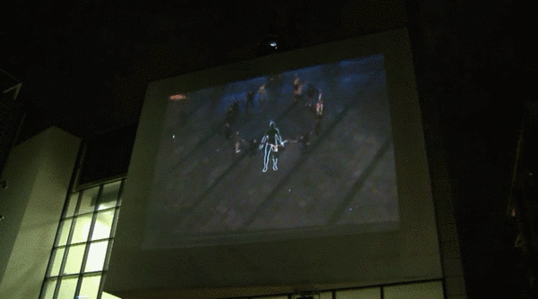
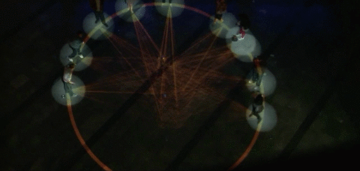
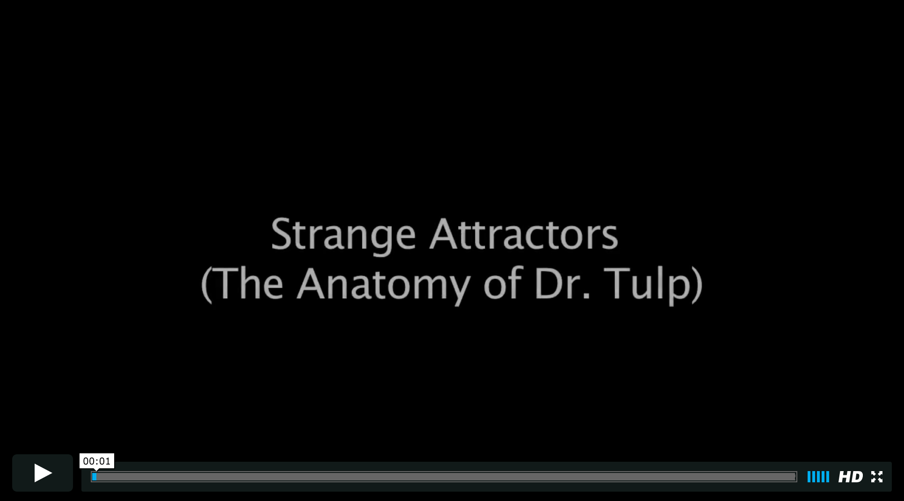

## Looking Outwards #7: Strange Attractors (The Anatomy of Doctor Tulp) by KMA (2009)

*Strange Attractors* is a projected kinetic art installation created by the media artists making up KMA. The title references *The Anatomy Lesson of Dr. Nicolaes Tulp*, a Rembrandt painting depicting a public dissection. At times, the installation projects a bodily form on the ground. The installation explores the relationships between the individuals participating within in as well as to the bodily form. This was a commissioned piece for the Abandon Normal Devices festival in Liverpool.

Details about the actual technical specifications of the work are somewhat slim – though they state that the programming is Max/MSP and Jitter. Other similar works by KMA used thermal imaging for person detection, and that is likely being used here. A large screen allows the participants and spectators to see the scene from above.

These projected interactive installations are appealing to me for a few reasons. They encourage the viewer to physically explore the work to see what may happen. They can visualize invisible relationships between individuals and groups. There are some minor technical glitches (false positives on body detection) which do not really detract much. 

Ultimately, the piece seems successful. It captures the odd relationship between people and a dead body, and eachother. Interesting questions are raised. Where is the line between spectating and participating? Do the spectators identify with the body?

---
  
*Strange Attractors (2009)*   
Source: Captured from [https://vimeo.com/6794228](https://vimeo.com/6794228)

  
*Strange Attractors (2009)* 
Source: Captured from [https://vimeo.com/6794228](https://vimeo.com/6794228)

  
[https://vimeo.com/6794228](https://vimeo.com/6794228
)

---

## Sources 
- [http://www.kma.co.uk/work/strange-attractors/](http://www.kma.co.uk/work/strange-attractors/)
- [https://vimeo.com/6794228](https://vimeo.com/6794228
)

