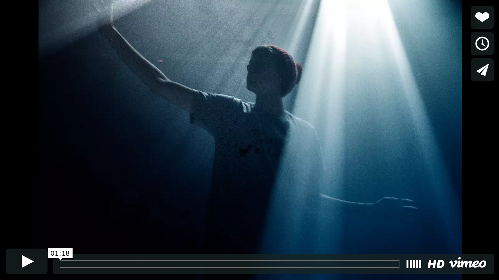

## Looking Outwards #8: *Epilog* by Schnellebuntebilder (2013)

*Epilog* is an interactive floor projection piece by Schnellebuntebilder, an interaction and animation studio. Viewers interact with 25 minutes of interactive sequences. In some sequences the viewer scatters particles and fog. In others, they are chased by schools of fish.

The pieces utilizes motion tracking cameras, VVVV, and Pure Data. Sound is generated in realtime. Fog is utilized. 

*Epilog* is a nice demonstration of what is possible with high end tracking and clever programming. The physics of the particle scattering is lovely in itself, but there are lots of other fun bits. For example, at times the viewers are bestowed with impossible-seeming light-filled shadows. 

The piece focuses on shadows and light, there are no other colors used. This is not at all limiting. Particles and perfectly outlined individuals will likely one day be overdone, but here it is still delightful. 

---

  
*Epilog*   
Source: Captured from [https://vimeo.com/99909498](https://vimeo.com/99909498)

*Epilog* video at [https://vimeo.com/99909498](https://vimeo.com/99909498) 

---

## Sources  
- [https://vimeo.com/99909498](https://vimeo.com/99909498)
- [http://www.schnellebuntebilder.de/#/fourxfour/epilog/](http://www.schnellebuntebilder.de/#/fourxfour/epilog/) (Project page)
