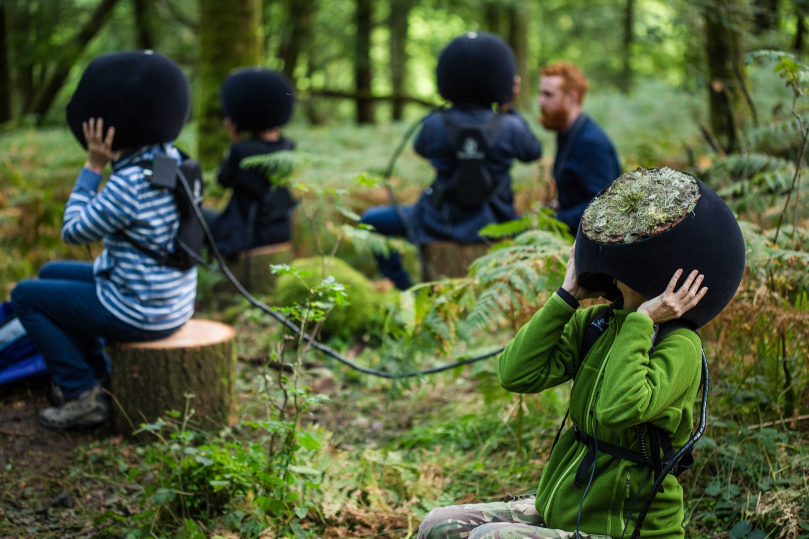
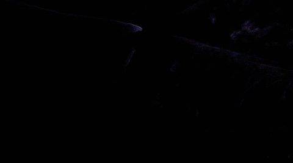
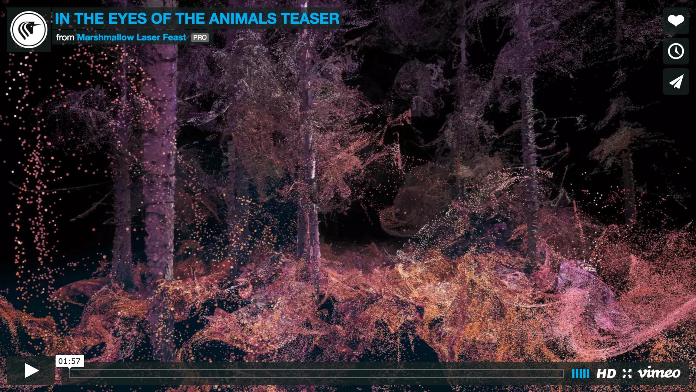

## Looking Outwards #9: *In the Eyes of the Animal* by Marshmallow Laser Feast (2015)

The creative studio, Marshmallow Laser Feast, created an immersive VR experience about the imagined life-cycle of three animals within UK's Grizedale Forest. 

Imagery was captured using a variety of techniques: LIDAR, photogrammetry, and CT Scanning, as well as drones with custom 360° cameras. Binaural audio was also captured. The backend is created with VVVV and MaxMSP (details are documented well on [this Creative Application Network article](http://www.creativeapplications.net/maxmsp/in-the-eyes-of-the-animal-mlf-virtualise-a-forest-through-the-eyes-of-its-creatures/)).

The multiple capture techniques is notable. As we have seen, each has a particular set of characteristics that make their output unique. The promotional video for *In the Eyes of the Animal* seems to show a nice complementary usage of each technique. Great effort is placed into creating an immersive environment (check out the VR helmets in the middle of the woods). VR clearly is not for everything, but there are times like this where it is amazing to see how people can be dropped into stories in incredibly detailed physical worlds.

---

  
*In the Eyes of the Animal*    
[Source](http://www.creativeapplications.net/maxmsp/in-the-eyes-of-the-animal-mlf-virtualise-a-forest-through-the-eyes-of-its-creatures/)

  
*In the Eyes of the Animal*   
Source: Captured from [https://vimeo.com/140057053](https://vimeo.com/140057053) 

  
*In the Eyes of the Animal*     
Source: Captured from [https://vimeo.com/140057053](https://vimeo.com/140057053) 

  
*In the Eyes of the Animal*   
Video at [https://vimeo.com/140057053](https://vimeo.com/140057053) 

---

## Sources
- Video at [https://vimeo.com/140057053](https://vimeo.com/140057053)
- [http://www.creativeapplications.net/maxmsp/in-the-eyes-of-the-animal-mlf-virtualise-a-forest-through-the-eyes-of-its-creatures/](http://www.creativeapplications.net/maxmsp/in-the-eyes-of-the-animal-mlf-virtualise-a-forest-through-the-eyes-of-its-creatures/)
- [http://www.andfestival.org.uk/events/in-the-eyes-of-the-animal/](http://www.andfestival.org.uk/events/in-the-eyes-of-the-animal/)
