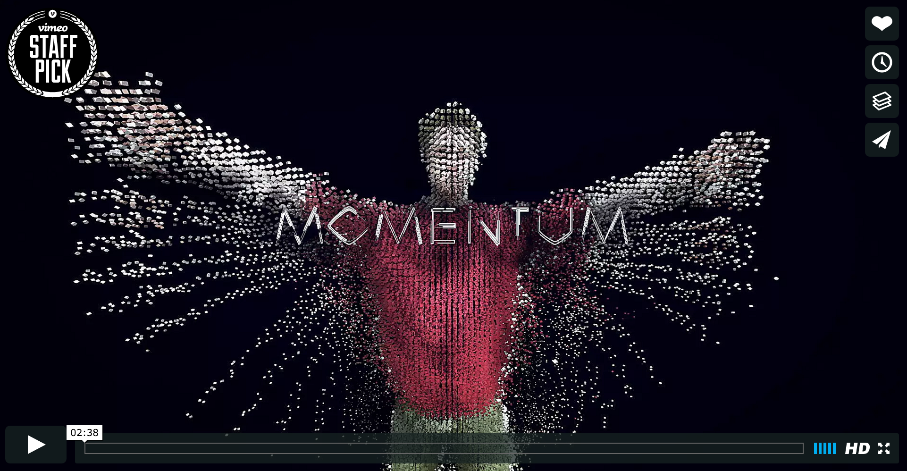

## Looking Outwards #10: *Momentum* by Schnellebuntebilder (2014)

*Momentum* is another project by Schnellebuntebilder with kling klang klong. The video is created in realtime using VVVV, Kinect V2, Max, Ableton Live. The movement is translated to sounds which are layered onto the soundtrack. Different 'acts' of the piece utilize different effects. 

It is absolutely remarkable how the source tracking data is from a consumer device. Of course, it helps that the animation is incredibly detailed and impressive. Each section is distinctive, surprising, and impressive. I am particularly intrigued by the combination of timelined audio / effects with those triggered/manipulated by user motion.

The artists summarize the piece saying, "movement becomes sound and music and matter seems to dissolve." Like many pieces I have explored, the piece feels (and is) experimental. It explores what is possible, and encourages the viewer to experience their existance in new ways. Perhaps the always-exploratory qualities prevent such work from establishing itself as fine art. Or perhaps it is just a matter of placing the work in the right context. For *Momentum* and similar works I feel I must ask if the work is the recorded capture or the work is the installation. Or, perhaps it is both.

---

  
*Momentum*   
Captured from [https://vimeo.com/112193826](https://vimeo.com/112193826) 

  
*Momentum*   
Video at [https://vimeo.com/112193826](https://vimeo.com/112193826)

---

## Sources
- [https://vimeo.com/112193826](https://vimeo.com/112193826)
- Behind the Scenes [https://vimeo.com/112223038](https://vimeo.com/112223038)
- Project documentation at [http://www.schnellebuntebilder.de/#/fourxfour/momentum/](http://www.schnellebuntebilder.de/#/fourxfour/momentum/)
