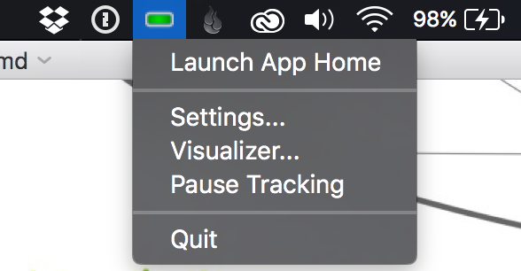
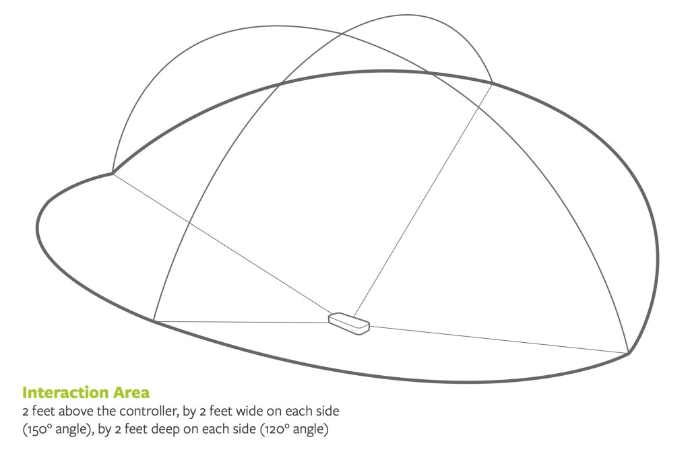

## Leap Motion Controller
A brief getting started tutorial for using the Leap Motion Controller for OpenFrameworks projects ([Using another platform?](#otherplatforms))

Created by [Ryan Huber](http://www.github.com/rchuber) in December, 2015.

  
*The Leap Motion Controller*

# About the Leap Motion Controller
The Leap Motion Controller was first released in mid-2013. It is a small USB device that is capable of tracking a user's hands (or tools) with precision in mid-air. The Leap exposes information about the position of each joint and bone in the fingers, palm position and orientation, arm position, and tool (such as a pencil) position. The LEAP provided API makes it easy to do things like detect pinch and swipe gestures, identify the direction fingers are pointing, and identify extended fingers.

The Leap Motion Controller works by projecting IR light from 3 LEDs into the space above the device, and using two cameras to capture stereoscopic images of the space. The Leap software (running on the host machine) compares the two images to generate tracking information. Details of how the software functions are scarce (though there is a fair amount of supposition). One thing you will read frequently is that Leap *does not* capture a point cloud of the hands.

Tracking information is captured quickly – potentially at a rate of 300fps with a USB 3 port.

Leap provides [an SDK and drivers for Mac, Windows, and Linux](https://developer.leapmotion.com/).

# Connecting and Installing
1. Connect The Leap Motion Controller to a USB port on a supported computer. Leap Motion suggests not using a hub, as the required bandwidth may not be available. USB 3 ports are preferred, though USB 2 is supported. [Minimum supported systems are described here](https://www.leapmotion.com/setup), but in general, the resources required for the Leap are not substantial (an i3 processor with 2GB of RAM).
2. Place the controller. The typical placement is on a table facing up with the green light to facing toward the user, and the glass side up. However, the Leap driver will, by default, automatically correct the orientation based on hand position. The controller can also be forward-mounted on a headset, in which case it tracks the hand motion in front of it. 
3. Download the SDK for your platform from [https://developer.leapmotion.com/](https://developer.leapmotion.com/). You will need an account to do so. For this tutorial, you will not actually need the SDK files themselves. However, you do need to have agreed to Leap's developer license. Furthermore, the SDK package includes useful documentation for use with many different platforms. Conveniently, the Leap Motion Installer is also included. This installer will need to be run on any computer you intend to connect the Leap to.  
4. Run the Leap Motion Installer. This will install the driver for interacting with the Leap, a settings application for configuring your controller, the Leap app store (useful for exploring how existing apps use Leap gestures), and a visualizer tool. If you are on a Mac, you will see an icon in the menu bar that reflects the state of your Leap controller. If it is green, your Leap is connected and tracking.  
  
   

5. Walk through the options available on the Leap Motion settings app. They are described pretty clearly within the app, and are worth understanding. It will also key you in to some additional functionality of the Leap (for example, you can allow or deny application access to the Leap motion cameras.) If you plan on tracking tools (rather than just hands), you'll need to enable that on the 'Tracking' tab. Finally, it's worth looking at the 'Troubleshooting' tab. The diagnostic tool on the right will provide useful feedback if you are having tracking issues.
6. If you are all connected, you should be able to launch the Leap Visualizer tool from the menu bar icon (it is also available within the Leap Motion application, just click "Diagnostic Visualizer" on the 'Troubleshooting' tab.) Go ahead. Wave your hands around. Assuming everything is set up, you should be able to see the tracking data from the Leap visualized on your screen. This is a good opportunity to see where Leap does well and where it fails – for example, the field of view close to the screen is quite different than a few inches above it. **Having problems?** [Leap's troubleshooting guide is here.](https://support.leapmotion.com/entries/39199843-Troubleshooting-Guide)

  
*The Leap Motion Visualizer*

# Your first Leap-controlled OpenFrameworks app
1. [Download OpenFrameworks](http://openframeworks.cc/download/).
2. There are a number of OpenFrameworks addons for the Leap Motion Controller. The most popular is the ofxLeapMotion. [Download it from GitHub.](https://github.com/ofTheo/ofxLeapMotion) or use `git clone git://github.com/ofTheo/ofxLeapMotion.git`. You may be tempted to go try the similarly named ofxLeapMotion2 addon. However, in reality, V2 is implemented here as well.
3. Drop the plugin into your OpenFrameworks directory, so that it lives at `openFrameworks/addons/ofxLeapMotion/`.
4. Assuming you have Xcode for Mac OS, you should ideally be able to open and run the `ofxLeapMotion/example/ofxLeapMotion.xcodeProj`. *Doesn't run? Get some 'Expected Expression' critical errors?* At the time of this writing, the packaged example doesn't run with the most up to date version of OpenFrameworks (0.9.0). You could go download an older version of OpenFrameworks OR just download an [updated version of the example application](https://github.com/rchuber/ofxLeapMotion-example) and place it within your openFrameworks 'apps' or 'examples' directories.
5. You should now be tracking hands. Take a look in ofApp.cpp (or testApp.cpp, in the original example) to see what's going on. You'll see there are two options for interacting with the Leap data. The first is an abstracted, simple technique. The second allows you to interact directly with the Leap SDK. If you ever plan on doing anything complex, you might want to jump right into the second method. You can see what kinds of things are possible in the offical [Leap API Overview](https://developer.leapmotion.com/documentation/python/devguide/Leap_Overview.html).

# Adding ofxLeapController to your own application
The easiest way to do is to copy a working example application and modify it to meet your needs. If you can't do that (i.e., you have an existing application)...

1. Start with the instructions provided by ofxLeapMotion on the [readme page](https://github.com/ofTheo/ofxLeapMotion).
2. If the application runs, great! If not, make sure the following project settings fields contain the same Leap Motion entries as a working example application:  
	- Linked Frameworks and Libraries (on the "General" tab)  
	- Header Search Paths, and Library Search Paths on the "Build Settings" tab)  
	- Run Script, on the "Build Phases" tab should contain an line related to the Leap Motion. (Be sure the path given is correct.)  

If you get errors about incompatible libraries, look in the ofxLeapMotion group you created in step 1, and remove the directories in ofxLeapMotion/libs/lib/ that do not apply to your operating system.  

# Mounting the Leap Motion Controller
The Leap Controller is small and relatively attractive. However, you may want to mount it in order to hide the USB cable (which juts out from the side), to secure it in place, or to make it feel more integrated with an installation. If you are using the Leap in conjunction with an Oculus headset, you are in luck – Leap offers an Oculus mount, but you can also find and 3D print mounts (including ones designed by Leap) from [Thingiverse](http://www.thingiverse.com/search?q=leap+motion&sa=). 

Even if you are not using the Oculus, you might consider using the files for the VR mount to help with developing a drop-in or undermount holder.

If you are thinking about mounting it behind glass, do your research – the IR reflections will be a problem. Some have commented that black IR-transparent glass will work, however.

  
*The Leap Motion Controller Interaction Area courtesy Leap Motion*

**Suggestion** In my experience, users unfamiliar with the Leap Motion Controller will touch the glass surface of the controller as if it is a touch pad. Asides from being confusing to the user, it also smudges the screen which will reduce (potentially dramatically!) the fidelity of the tracking. To prevent this, some (perhaps on-screen, etc.) signifier indicating that the device affords mid-air control will be necessary.

# Things to be aware of
- If the Leap Motion Controller stops tracking, see the [guide from Leap Motion](https://support.leapmotion.com/entries/39199843-Troubleshooting-Guide). This occurred for me fairly reliably after my attached MacBook Pro woke from sleep. The given instructions were not successful, but restarting the machine was.
- As mentioned earlier, if the screen gets smudged tracking quality may be dramatically affected. Fortunately, the Leap application can detect this condition. Other IR light sources in the area may affect tracking, which is also detected by Leap.

# Other platforms
- Using Processing? A (library with substantial documentation)[https://github.com/nok/leap-motion-processing] is available.
- A [full list of platform integrations and libraries](https://developer.leapmotion.com/integrations) is available on the Leap website. (At this time, they include Unreal, Vuo, Scratch, C++, Unity 3D, Processing, JS, AS3, and Objective-C.)
- If you're using Leap Motion for VR, you'll want to read [Leap's VR setup guide](https://developer.leapmotion.com/vr-getting-started).

# More information
- [Leap's *Tutorials* YouTube channel](https://www.youtube.com/playlist?list=PLZgjuTxMC0h0OumNNxPqOjcjTF0r7VUE8)
- [Lots of code examples from Leap](https://developer.leapmotion.com/gallery/category/example)
- [SDK and Developer Documentation](https://developer.leapmotion.com/documentation/index.html?proglang=current)
