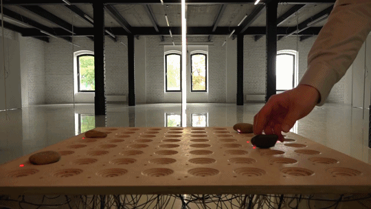

# The Jamsky - Step Sequencer

This one isn't quite as on the bend of experimental capture, but I'm too fascinated by the innovative interface not to post it.

The [Jamsky](http://www.devkid.com/?projects=jamky) is a "postdigital drum machine". It's a step sequencer that is used to make a drum beat. There have been a lot of hackable sequencer projects (After the monome, people went crazy), but I love the tangible nature of this. Rocks are not mere toggle switches. Aside from the obvious (you can hold a rock), rocks can be moved and shifted around the interface. One can see the effect of similar patterns of steps as they are shifted around the sequencer.

The ability to knock a rock from one step to another is an odd UI effect. It encourages experimentation and play far more than an LED toggle button does. The device also inherently encourages an economy of rocks.

The device was constructed from a CNC'd section of wood, some basic but tedious wiring of sensors and LED's, custom circuitry, and rocks.
<iframe src="https://player.vimeo.com/video/141385690" width="500" height="281" frameborder="0" webkitallowfullscreen mozallowfullscreen allowfullscreen></iframe>  
