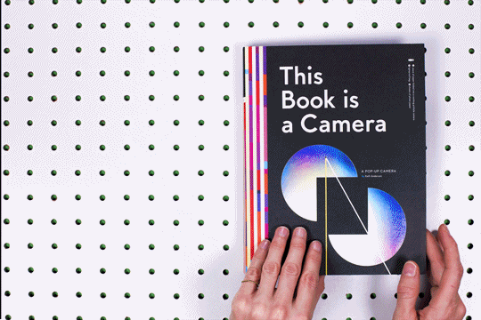

# This Book Is A Camera

[This Book Is A Camera ](https://kamra.invisi-dir.com/)

<iframe src="https://player.vimeo.com/video/146785653" width="500" height="333" frameborder="0" webkitallowfullscreen mozallowfullscreen allowfullscreen></iframe>

This popup book is a fully functional pinhole camera. The book explains - and demonstrates - the basic workings of cameras. It’s an awesome an interactive way to teach photography principles - far more interesting than many (all?) of the photography books I have slogged my own way through.

More information [here](http://www.kellianderson.com/books/thecamera.html) and [here](http://kellianderson.com/blog/2015/11/the-book-is-a-camera-really/).

The book comes with a few sheets of film and instructions for developing.

