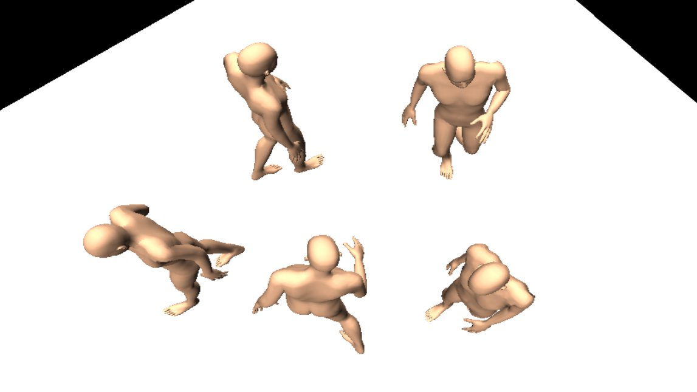
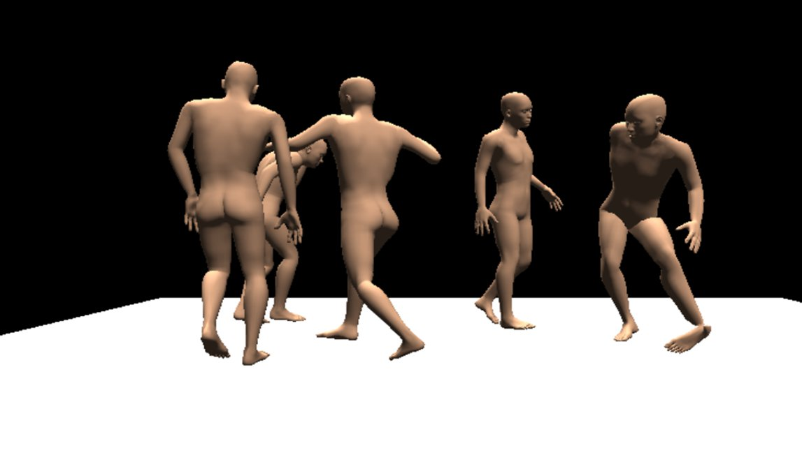

# MoCap Canon

In this project, Akiva and Smokey created a looping temporaly delayed 3D choreography in the spirit of Norman Mclaren's [Canon](https://www.youtube.com/watch?v=2VrnXw9waJI). We repeated a precise motion captured set of movements and applied the same animation to multiple figures that follow/echo each other. Foley sound effects were also incorporated.

The final product is an executable where one can observe the animation and fly around the scene. Watch a video of the project above.

Click [here](build/Canon.exe) to download the windows executable, and [here](build/Canon.app) for mac. View our various source files [here](/source/).

The motion capture data is astounding in it's "human-ness". Even a very abstract figure, with such accurate human movement - becomes a relatable character. Akiva and I both learned an immense amount all accross the workflow of motion capture, 3D rigging and animation, choreography, and more. 

# Future Steps

Bringing the Unity executable to virtual reality is the next most concrete step. We also would love to just play with this form more. More complicated choreography with interlacing 'beats' - perhaps involving external objects being picked up, placed down, ducked under, and so on, would be appreciated. 

Next, recording the audio during the capture period (including having a choreography with audio worth recording) would, ultimetly, save a lot of time.

In the future, we would like to be able to create this dance 'live', using the Optitrack's system of transmitting live capture data over networks. This would make the choreography process much easier and more enjoyable. We began work on a unity app to recieve and display the skeleton data live. While we were able to create a live camera view on a simple rigidbody, sending and understanding the full skeleton data proved to be slightly *too* uncharted of territory. We would like to return to this challenge in the future.

Read [here](challenges.md) for a more detailed discussion of the challenges we faced, and how we solved them.