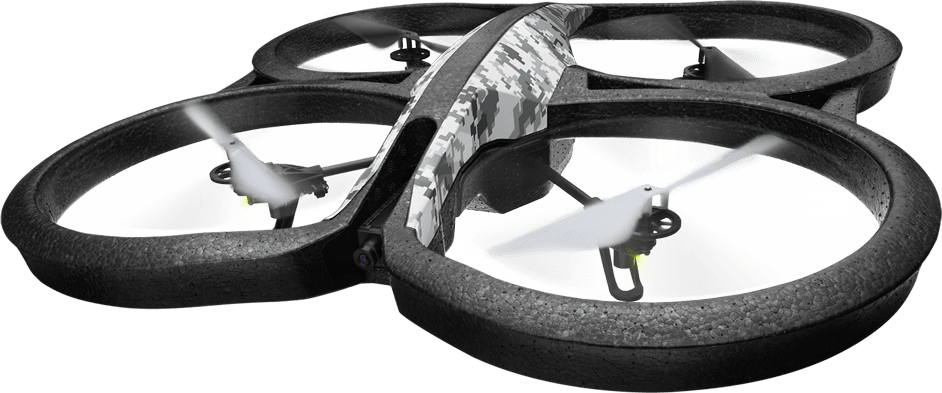
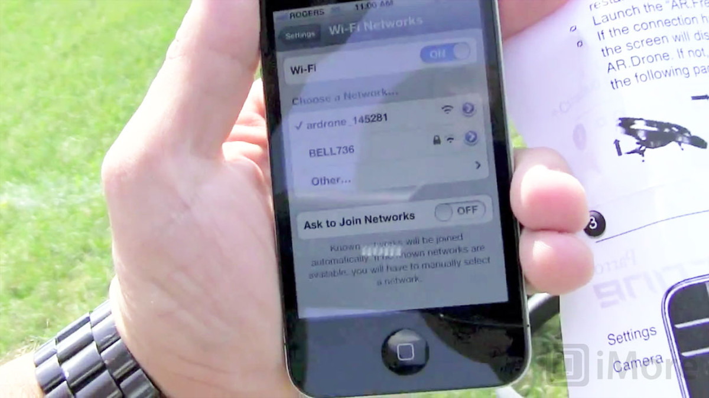
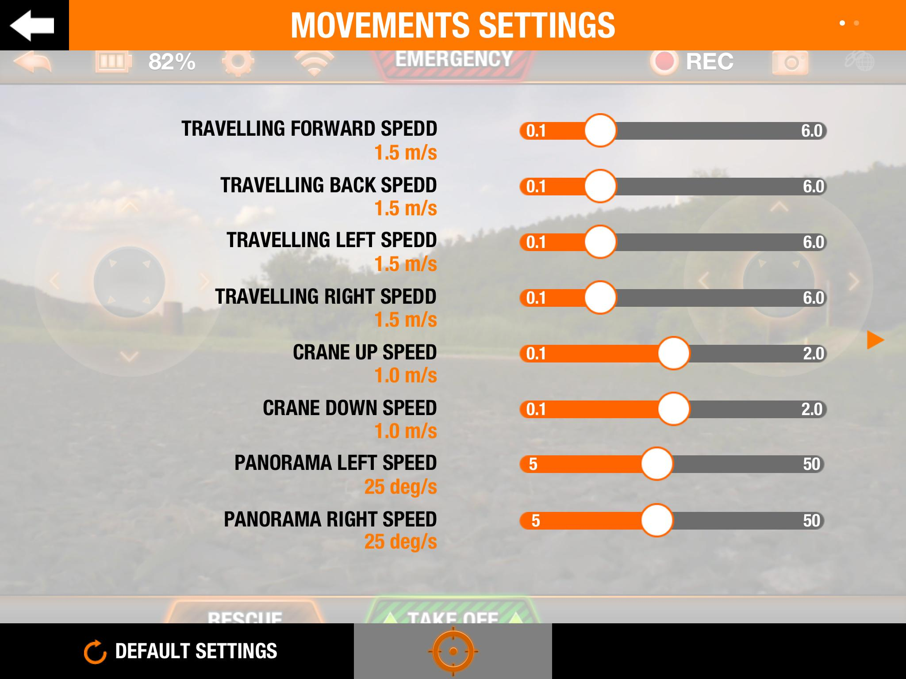
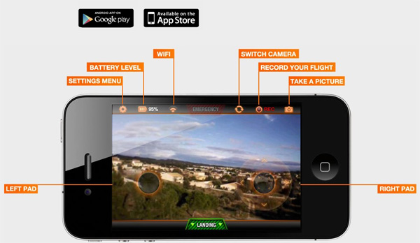

##Parrot A.R.Drone Tutorial

###The Parrot A.R Drone is quite an adventure and super fun to play around with.There are a few things you must setup before safely flying the Drone.Here are a few steps to follow:

1) Have an Ipad or Iphone to control the Drone with. You will want to download the AR Free flying App. The drone can be used anywhere with the self -genereating WiFi network

2) Connect the A.R Drone to the Battery.When the lihts turn from red to green that means the settings are initalized.Now connect to the 'A.R Drone' wifi on your phone or Ipad.

3) Another important thing you do not want to miss is updating the firmware. se this site to guide you in the proces of updating the firmware for the drone -> http://ardrone2.parrot.com/update-ardrone-1/
There are instructions for both PC and MAC

4) There are several features on the App itslef which help you with navigating and flying the drone. There are more controls and speed adjustments when landing and taking off.

6) Once you get comfortable with the beginner drone you can go ahead and try the more technolgically advanced one.Beware that this drone's camera is not the best quality!

5) Fly! Now the sky's the only limit.

