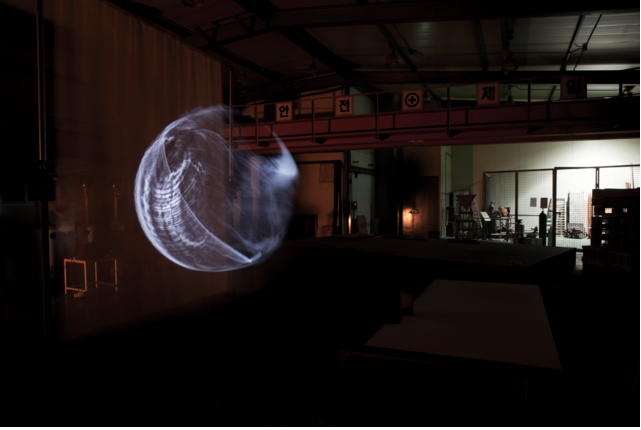

##Lunar Surface Projection Mapping

More Information: [http://thecreatorsproject.vice.com/en_uk/blog/3d-air-drawing-produces-lunar-long-exposure-photographs](http://thecreatorsproject.vice.com/en_uk/blog/3d-air-drawing-produces-lunar-long-exposure-photographs)

Since we are doing an interactive hologram piece for our project. I thought it would be cool to search up something along
the lines of the project. So I found this cool  projection mapping which uses a projector and a 
3D camera to replicate the effects of the glowing moon .I think the resulting installation is heavenly and surreal.
This is also a kind of effect I would like to achieve with a hologram if we use a more ephemeral object. I think it
would be great to show like glowing smoke or water through a hologram style projection.

 
