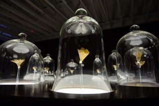

#Skin Sculptures

So what the heck are the skin sculptures all about? Singaporean artist Ezzam Rahman collects scrapes of skin from the soles of his foot. The artist has this habit of peeling of his own skin and incorporated this grotesque habit of his into his works.He made theses shaving into a flower form and placed them inside delicate jars. I really appreciate his way of exhibiting his piece. His work revolves around the theme impernanaence and how flowers will lose its petals and wilt, losing its form. Just like flowers, theses skin florals will also peel of and nothing is permanent.

