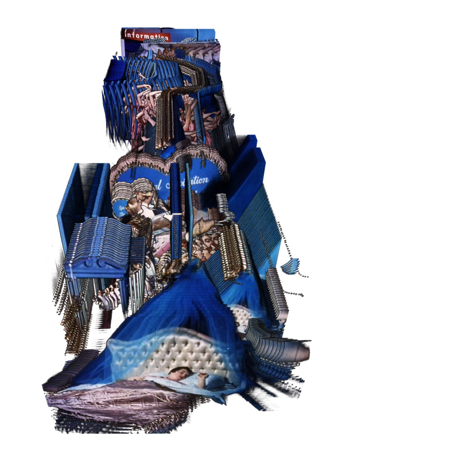

Martin Hilpoltsteiner's Recreating Movement is a computer program that displays static frames from a video sequentially in 3-dimensional space, creating a volume of closely related images. What I find interesting about this technique is how it plays with time, giving audiences the ability to see different points in time simultaneously. The viewing of motion is especially enhanced using this technique, which gives an immediate, comprehensive understanding of a movement. The emphasis of this technique is placed on the *differences* between frames. 

The artist's explanation of the process explores a variety of ways to re-organize frames in ways that serve useful purposes, like in "Preview mode", which displays single frames removed from the larger volume of frames, to allow quick and intuitive searching. To further exploit the technique, the artist could leverage the simultaneous view of many points in time to create highly immediate yet comprehensive summaries of videos. Currently, each frame is spaced and displayed uniformly in the z-axis, which gives equal weight to every frame. By tying the spacing of each frame to the amount of change from the previous frame, a new type of volume would be created that emphasizes scenes with the most action/motion, and de-emphasizes scenes with little action/motion. Scenes with little action would be compressed; scenes with more action would be stretched out. The result of this would give audiences glanceable summaries of videos that maximize information conveyed.

