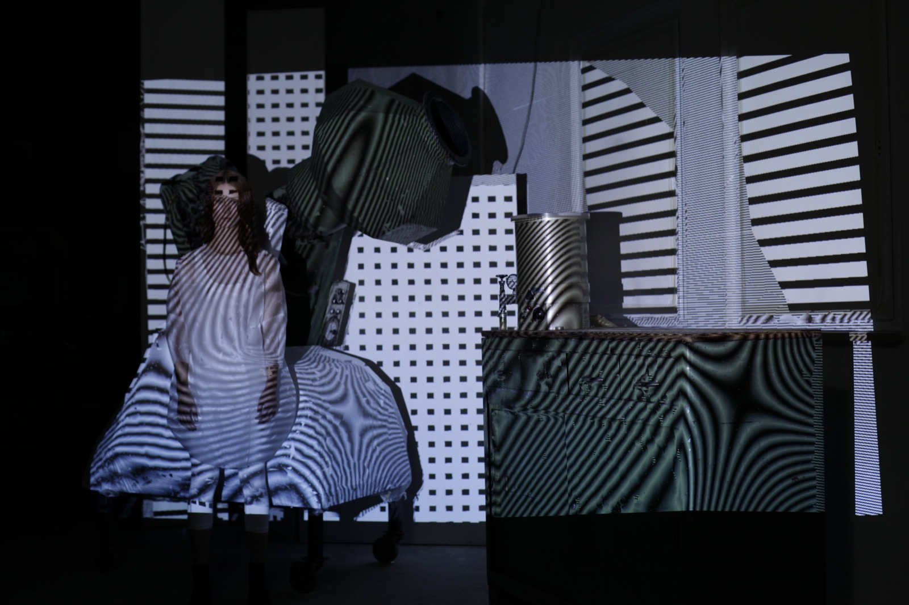

#Probable Universe by Ann-Kristin Abel and Paul Ferragut

Probable Universe is an audio-visual installation that uses a projector mounted on a robotic arm to reproject a 3D scan of the space back onto the space. The 3D scan in question was created with a  Faro focus 3d laser scanner and then converted into a mesh. As the installation runs the shaders on each surface procedurally change and morph. This change in texture along with the random movements of the robot arm mean that is installation is constantly in new states that are virtually limitless.

This piece has a really strong connection to the space that it exists in. Because the whole room is scanned and can be projected on, the whole room becomes part of the installation. After watching the behind the scenes video it seems that some of the objects in the space were custom placed there for this installation, but most of the architecture and furniture in the space just happen to be there. I would love to see a future version of this project that took more care to curate the room and objects in it. Alternatively it would be great to capture a space without any physical manipulation by the artists.

[Link to project page](http://universe.convivialproject.com/)