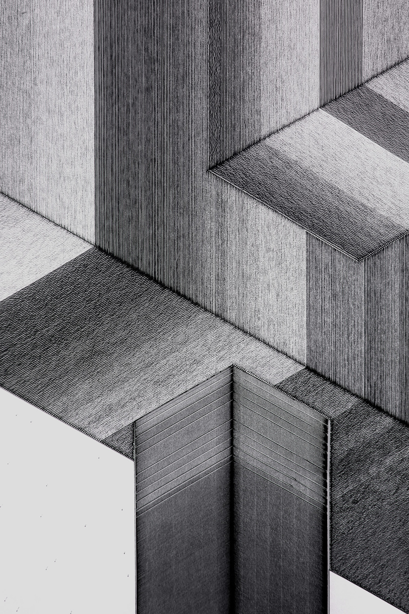

#Possible, Plausible, Potential by Miguel Nóbrega

This set of physical drawings created by Miguel Nóbrega is a prime example of an artist exploring the use of CNC and code as a collaborator rather than as a tool. Each drawing starts as a procedurally generated set of 3D objects in a computer program written in processing. An isometric image of this geometry is then sent to a CNC drawing machine. The machine uses up to seven colored markers to draw and texture the image. The procedural nature of the code means that the stream of images could be unending, and the physical qualities of the drawing machine and the markers mean that each part of the image has an organic feel. This juxtaposition between hard and soft edges is a beautiful symbol for Miguel’s work flow. As he was creating the program he had to continually look at the images produced and decide how to adjust the code to point the machine in an interesting direction.

[Link to project page](http://superficie.ink/)