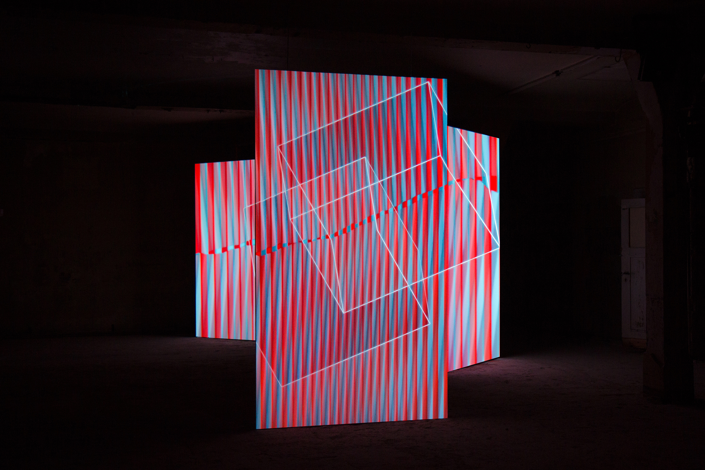

#Perspection by Matthew Biederman and Pierce Warnecke

Perspection is a projected installation piece that brings anamorphic imagery to a new level. Multiple screens are used throughout the space to capture images from digital projectors. Each image is part of a large image meant to be viewed from exactly one point in the space. That point changes over time from one viewer's eyes to the next. A MaxMSP patch and a Kinect track the viewers in the space so that the image can be aligned properly.

This project looks cool on video, but I suspect that it’s actually losing a lot in translation. Being in the space must be really different simply because you would be able to move naturally and have the images follow you. The images that I’ve seen only have three screens in the space. I would be interested to see this technique used in more complex screen formations or even projection mapping to objects or people in space.

[Link to project page](http://www.mbiederman.com/Perspection)