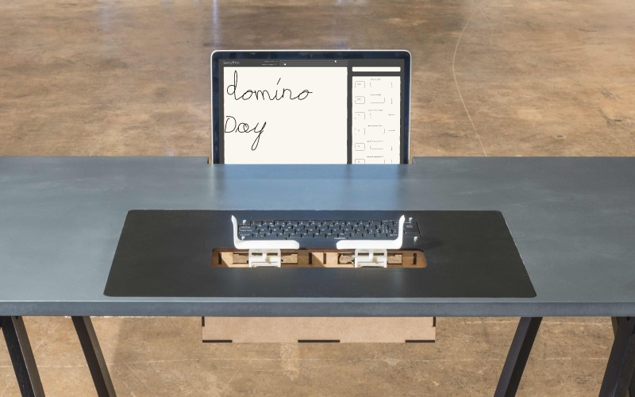

#Lazy Pen by Nicolas Nahornyj

The Lazy Pen is an interesting take on the idea of handwriting in the digital age. Combining the speed accuracy and digital qualities of a keyboard and the personal style of handwriting. The user rests his/her wrists on plates that can move in two axes. These movements apply changes to the styling of each letter. What makes this project really stand out from other alternative keyboards is the way that it captures the gestural human emotion. If this idea was able to be physically simplified it would have a large potential to make it’s way into popular use.

[Link to project page](http://www.nahornyj.com/lazypen.html)