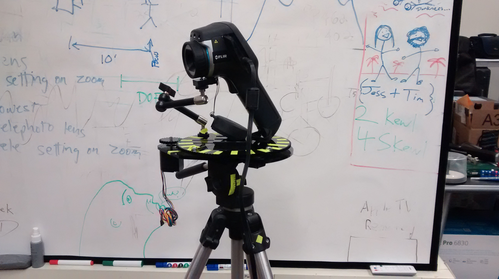
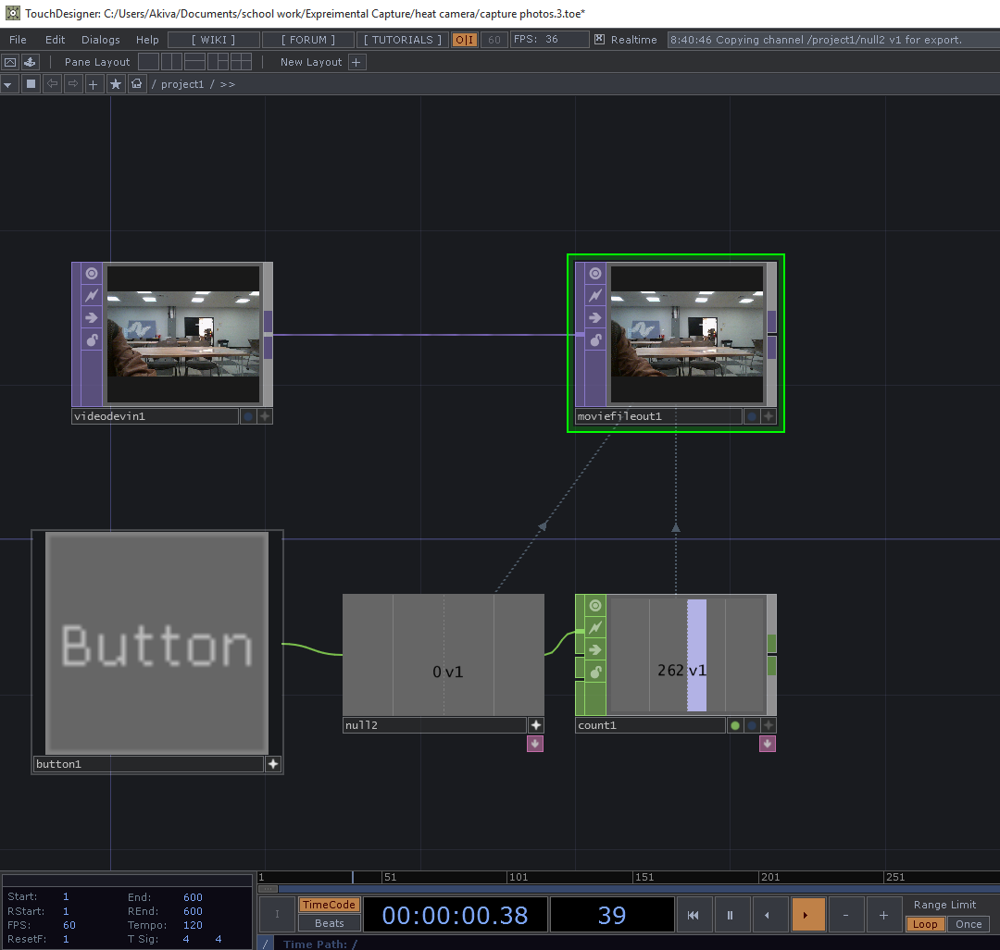

# Panoramic Thermal Cinemagraph
### Project 4
--

--
### Overview

This project was comprised by a set of experiments sounding Thermal photography. These experiments culminated in a Panoramic Thermal Cinemagraph and a work flow for creating these images. I started by creating light paintings with a Thermal digital camera. This was a successful process, but I was unhappy with the lack of recognisable figures and detail. My next step was to create a set of still panoramas. These ranged from 45 to 360 degrees. Stitching images in to panoramas proved to be challenging due to the low resolution and contrast created by the thermal camera. By using a custom camera rig I was able to ensure that there was enough cross coverage between photos. By carefully adjusting for focus and heat range, and by placing high and low heat items throughout the scene I was able to create a set of images that could be stitched. The final stage of this project was to add a temporal element to the panorama. This was an important part of this project because thermal image are most powerful when they are showing the way that heat can be transferred. To accomplish the Cinemagraph effect where only a small portion of the scene is in a repeating motion I used video editing software to combine a still panorama with video footage from the same angle.

--
### Hardware

At the heart of this project was the FLIR E30bx Thermal Imaging Digital Camera. Although this camera has the amazing ability to capture heat, it also has many drawbacks including low resolution, maximum of 30 frames per second, no on board video recording, and a non standard 3/16" mounting nut.

A core requirement for the image effects used in this project is the ability to control the position of the camera. To accomplish this I first needed to create an adapter plate to convert form a 3/16" nut to a 1/4" nut. I created this using a 1/4" nut and four thin sheets of laser cut acrylic. The CAD files for this adapter cam be found in this repo.

Once the camera could work with 1/4" gear I was quickly able to combine a tripod, turntable, and magic arm. This rig allowed me to keep the camera stable and to rotate it by regular amounts.

--
### Software

Because the software on the camera is very limited I used a external capture card to stream the live image on to my laptop. I created several Touch Designer patches to record images, videos, and create light paintings. These patches can be found on this repo.

I also used PTGui, Photoshop, and After Effects to stitch, edit, and animate the final product. After trying a handful of software solutions to creating panoramas, I found that PTGui was the most effective and offered the most options. Because the images didn't have very many high contrast points all software has a hard time automatically stitching. PTGui allowed me to manually add control points where needed.

--
### References

[Panoramas for HDS Colours](http://www.hugha.co.uk/Panoramas/Panoramas4HDS.htm)

[Gigantic Thermal Infrared Panoramas](http://www.flirnews.com/2015/03/05/gigantic-thermal-infrared-panoramas/)

Thanks to Ben Snell for lending me his turntable.
