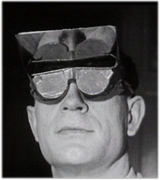

#Looking Outwards 01
###Inversion Goggles
In the 1890s, a perceptual psychologist by the name of George M. Stratton began experimenting with internalized capture techniques (i.e. acting directly on the perceptual system). In his paper "[Some Preliminary Experiments on Vision Without Inversion of the Retinal Image](http://www.cns.nyu.edu/~nava/courses/psych_and_brain/pdfs/Stratton_1896.pdf)" (1896), he discusses one study in particular in which he wore goggles that inverted his vision for three days straight and observed how, over time, he adapted to these changes.

In the decades that followed, many other researchers would repeat his experiment, including the duo Theodor Erismann and Ivo Kohler in the 1930s and 1940s. Their subjects came to wear inversion goggles for [up to three months long](http://www.awz.uni-wuerzburg.de/en/archive/film_photo_and_tone_archives/video_documents/th_erismann_ikohler). Like Stratton, Erismann and Kohler observed how the brain can effectively "reprogram" itself to see, given the same information, albeit reflected vertically.

What fascinates me most about these studies is that they use a more intimate and more direct "capture" paradigm. Here, the image processing is entirely analog and puts the partipant in closer contact with the observed environment. Whereas most "capture" techniques today process information within a closed system and output the transformed information in a new medium, these goggles remove a layer of abstraction, doing away with the need for "capture" altogether. 

Furthermore, the mind becomes the substrate on which the computations are executed. The perceptual transformations are internalized and a much deeper understanding of the processes at play are revealed. The experiment (or the art) *is* the individual and the accompanying experiences gained. This is what I'm curious to explore: modes of presenting the external world that shift our perceptions and act directly on the mind to restructure our internalized selves.

### More References
[The Reversal of Glasses and Seeing the Upright](http://www.awz.uni-wuerzburg.de/en/archive/film_photo_and_tone_archives/video_documents/th_erismann_ikohler/die_umkehrbrille_und_das_aufrechte_sehen/) (film)

[James Gibson - Living in a Reversed World](https://www.youtube.com/watch?v=C-Opnrb6l9A) (film)
