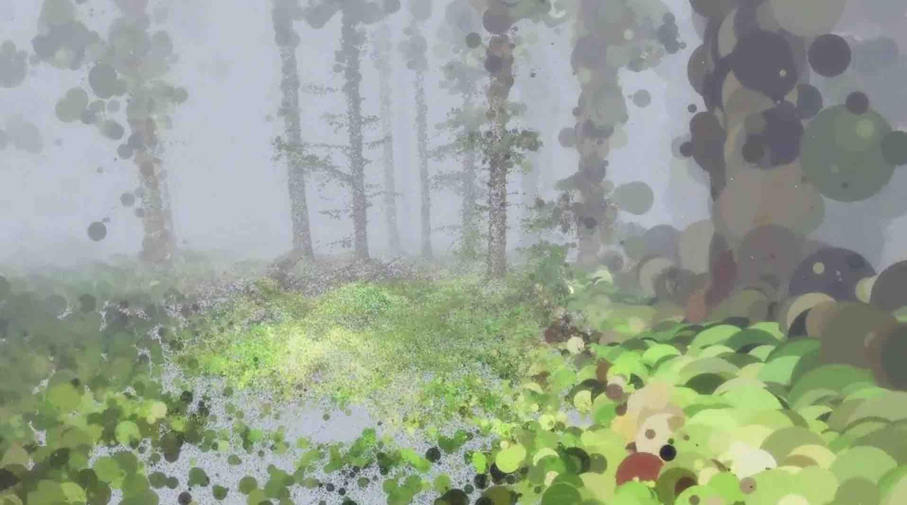

# Looking Outwards 2

###[**In the Eyes of the Animal**](http://www.creativeapplications.net/maxmsp/in-the-eyes-of-the-animal-mlf-virtualise-a-forest-through-the-eyes-of-its-creatures/) by Marshmallow Laser Feast (2015)

At the AND Festival last week, MLF situated a VR experience of a forest from the point of view of the animals inside, inside the same forest users experienced. Using a Faro X330 lidar scanner capable of sensing objects 330 meters away, they constructed an "image" of Grizdale forest with 80 million colored dots. 

What struck me most was not just the sheer beauty of composition but the way they allowed the technology the ability to influence the final product. Whereas most people choose to abstract once further and create a mesh from the triangulated collection of dots of photogrammetry, they used only those dots in the experience. However, they changed the dot size to mimic blurriness in our peripheral vision, creating a heightened sense of awareness and focus while elevating technical limitations to the level of craft.

This piece reminds me of a few similar interactive works that also take place in the space of the forest, most notably so the [Bioluminescent Forest](https://vimeo.com/115082758) and [A Way to Go](http://a-way-to-go.com/). It's curious as to why there have been so many recent "forest interventions." Whether virtual or physical, they seem to bring us closer to these natural spaces and, in some of these cases, in order to actually experience the work. What is it about the forest that lends itself so well as a subject and environment?