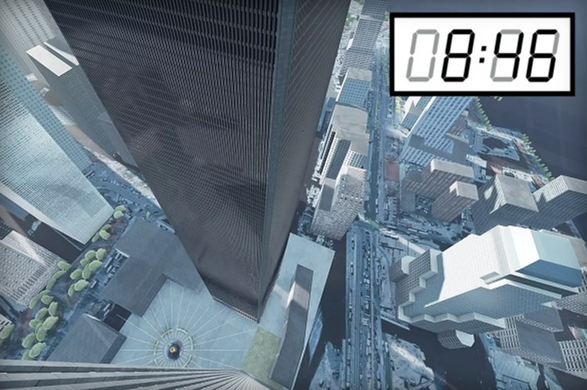

#Looking Outwards 5
####9/11 Virtual Reality Simulator
--
[[08:46]](http://www.08h46.com/) is a new virtual reality experience that simulates the attacks on 9/11 in the first tower from the point of view of a typical office worker.

My first and final reaction to this experience is one of disgust. I think it's incredibly distateful to the nation and especially to the families involved to trivialize the attacks. However, there are some interesting implications involved with its creation.

The experience is communicated as a "narrative driven VR experience." However, its purpose is unclear. One could argue that it's meant to act as a sort of therapy to help people overcome the attack. However, this effort shrinks in comparison to the accessibility of 9/11 memorial and museum and the cathardic experiences that can be had within.

One could also propose that it is intended to be an educational tool (since, after all, kids currently entering high school weren't even alive for the attacks). This brings up the ethical question of: Is it even appropriate to force kids to experience such a horrible event?

My interpretation of the experience is as a game, which likely speaks to the prevalence of VR for gaming but also to the way the experience is designed. The aesthetics and story structure are reminiscent of first-person shooter games, which unearths a likely unintended set of connotations.

The experience also begs the question be asked: Why do we need to record history? What part of it do we want to preserve? What parts might we leave out and why? At what point does an event slide out of the present consciousness and become "historicized"? At what point does "capture" stop being documentation or analysis and become synthesis? 

As a brief aside: Compare this form of capture to that of [Brenda Romero](https://www.ted.com/talks/brenda_brathwaite_gaming_for_understanding?language=en#)—a game designer who also makes games based on key historical moments, but makes them to facilitate understanding in a more implicit way.

[Here's The Verge's take on it.](http://www.theverge.com/2015/10/30/9642790/virtual-reality-9-11-experience-empathy)