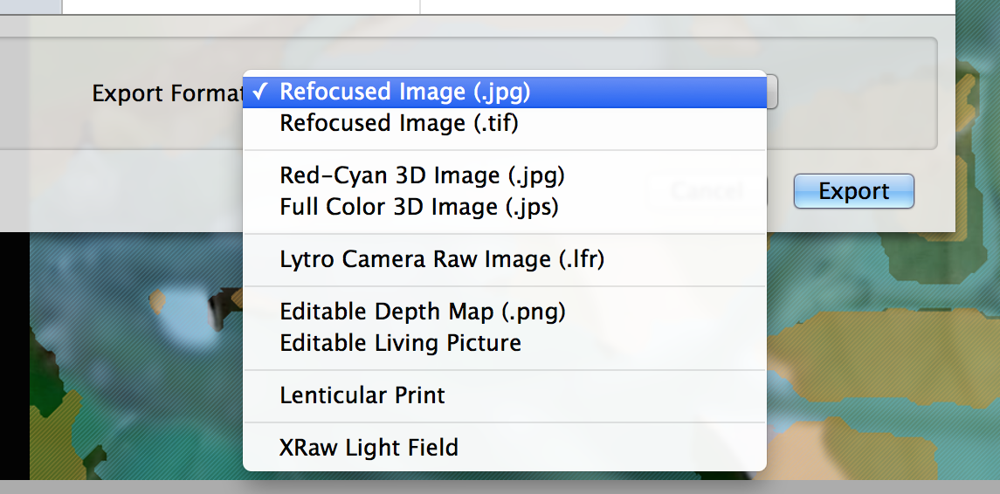

# Lytro (Gen 1) Image Manipulation

### Lytro Desktop
Lytro provides software called [Lytro Desktop](https://www.lytro.com/desktop/) that allows you to edit the light field images with traditional photo retouching tools in addition to the ability to refocus, edit the depth map and create animations.

Below, you can see the refocusing feature of Lytro Desktop. Other features of light field manipulation include the ability to, albeit only slightly, change the point of the view of the image up, down, left and right.

The native fileype of Lytro is the .lfr, or Light Camera Raw Images. Images can be exported as any number of filetypes, including jpegs, 3D images and depth maps. Movies can be exported after creating animations within the Lytro Desktop software.

### Data Extraction

The .lfr filetypes are not open source. However, they have been reverse-engineered. The first to do so is Nirav Patel—his code can be found [here](https://github.com/nrpatel/lfptools). In addition, [here](http://lightfield-forum.com/2012/07/lytro-hack-how-to-extract-data-and-jpg-files-from-the-lfp-file-format-using-lfpsplitter/) are instructions for compiling the code in Windows and an additional [reference post](http://eclecti.cc/computervision/reverse-engineering-the-lytro-lfp-file-format).

NOTE: You can get reasonably close to using the raw data of the camera without using the above command-line tools by exporting your image as an *Editable Living Picture*. This will produce a file containing an lfp image stack, a png depth map, and tifs of multiple views of the same image.

