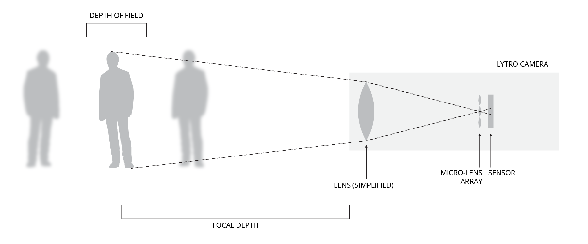

# Lytro (Gen 1) Introduction

###### Note: This is the tutorial for the original Lytro camera (Gen 1). The newer model, Lytro Illium, is larger in size and can produce better quality images.

### Introduction
The Lytro camera is capable of taking photos that can be refocused in post-production (i.e. after the image is taken). This is called Light Field, or Plenoptic, Photography.

This becomes very useful when you do not have time to focus or in situations where you want the creative freedom to select the focus (focal depth) and aperture (depth of field) later on.

### How It Works
Traditional cameras use a lens coupled with a sensor to record a two-dimensional array of light. Depending on how far the lens is from the sensor, the image will have a different depth of focus (i.e. objects are in focus in the foreground or in the background).

In the Lytro camera, a micro-lens array (MLA) is placed between the lens and the sensor. This allows the sensor to record extra information about the image, specifically the direction light is coming from for each pixel recorded. This forms a three dimenional array of information called the light field.

After the light field is recorded, computer software is able to recreate the scene and algorithmically adjust focus after the face. It's important to note that the "refocused" images are representations of what a specific depth of field and depth of focus *would* look like, given the information gathered by the initial light field.

###Specifications
**IMAGE RESOLUTION.** Because the Lytro must capture more data per pixel compared with traditional cameras, the resolution of images is considerably lower. The lightfield image is 11 Megarays, but a refocused image exported as a jpg has a max resolution of only 1 Megapixels.

**IMAGE SHAPE** The Lytro only captures square images.

**APERTURE.** The amount of light let into the lens is fixed at f/2.0, but this can be adjusted in post-production (through provided desktop software). 

**SHUTTER SPEED.** The speed at which the shutter opens and closes is automatic (anywhere from 1/250 to 8 seconds), depending on the brightness of the scene.

**STORAGE** The 8GB model can store approximately 350 raw light field photos.

### References
[Lytro Support](https://support.lytro.com/hc/en-us/articles/200864220-Lytro-Light-Field-Camera-Overview), [Popular Mechanics: Lytro Camera: How it Works](http://www.popularmechanics.com/technology/gadgets/reviews/a6900/the-lytro-light-field-camera-how-it-works/), 
[Lytro First Generation Camera Specifications](https://store.lytro.com/collections/the-first-generation-lytro-camera/products/first-generation-lytro-camera-8gb), [Stanford Article on Plenoptic Cameras](http://graphics.stanford.edu/papers/lfcamera/lfcamera-150dpi.pdf)