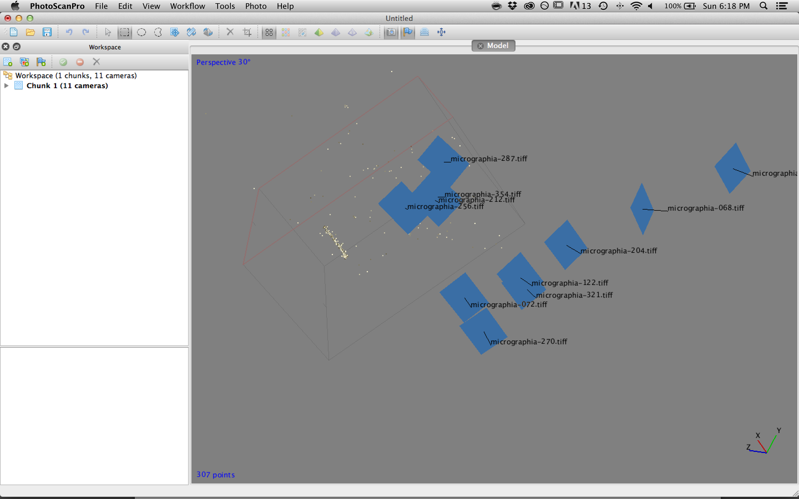

# Project 1: An Object
### Micrographia by Robert Hooke

***

Upon traveling to the Hunt Insitute for Botanical Documentation, I became incredibly fascinated by the anthropomorphism of books. Every librarian I spoke with embued them with a different sense of life.

The senior librarian Mary K described them as such: Books are made to serve two purposes: (1) To store information and (2) To allow access to it. What makes it difficult for books is that they are expected to perform both of these tasks simultaneously. They must not only carry forward this knowledge through time but open themselves up to anyone who so chooses to partake in it.

Soon there after, Mary K showed me one of her most prized possessions: a 1952 copy of *Fahrenheit 451*. There wasn't anything particularly special about it—an old torn paperback with a peeling spine, loose pages and water stains. But this wasn't why she liked it—her attraction was motivated by the wear on the internal pages, which had all turned a dark brown around the edges, moving toward a lighter center. The book was literally burning itself to death. 

I had never before heard anyone call a book "dead," but from the perspective of a librarian, it made complete sense. If a book wasn't able to fulfill its purpose (i.e. it was too worn), then you had two choices: rebind it or replace it. Books died all the time, except the ones that were too rare to replace. 

This got me thinking: How can I capture the "liveliness" of a book? How can I present the book as a cumulation of experience and spring of knowledge?

Eventually, I found just the book to capture—*Micrographia: Some Physiological Descriptions of Minute Bodies Made by Magnifying Glasses with Observations and Inquiries Thereupon* by Robert Hooke (1665). In it, Hooke recorded his microscopy observations with incredible precision and humility. He discovered a whole new world of fantastic creatures not by looking out, but by looking in.

I began my project by capturing just this book. The process of capturing was incredibly labor intensive, but produced wonderful results. However, I didn't realize just how difficult handling such a large data set would be, and as a result, there were many more dead ends than I expected.

Here are some sketches and process shots:

After many iterations and trial and error, I ended up using openFrameworks to bring my book to life by using the text to speech to anamorphize the book and imbue it with life through its author. I intended on simultaneously decomposing the book as the text was read to imply the transformation of words on paper to thoughts and actions as books decay with use, but unfortunately, I was unable to figure out how to do that in OF.

Here's a screenshot of the final model:

