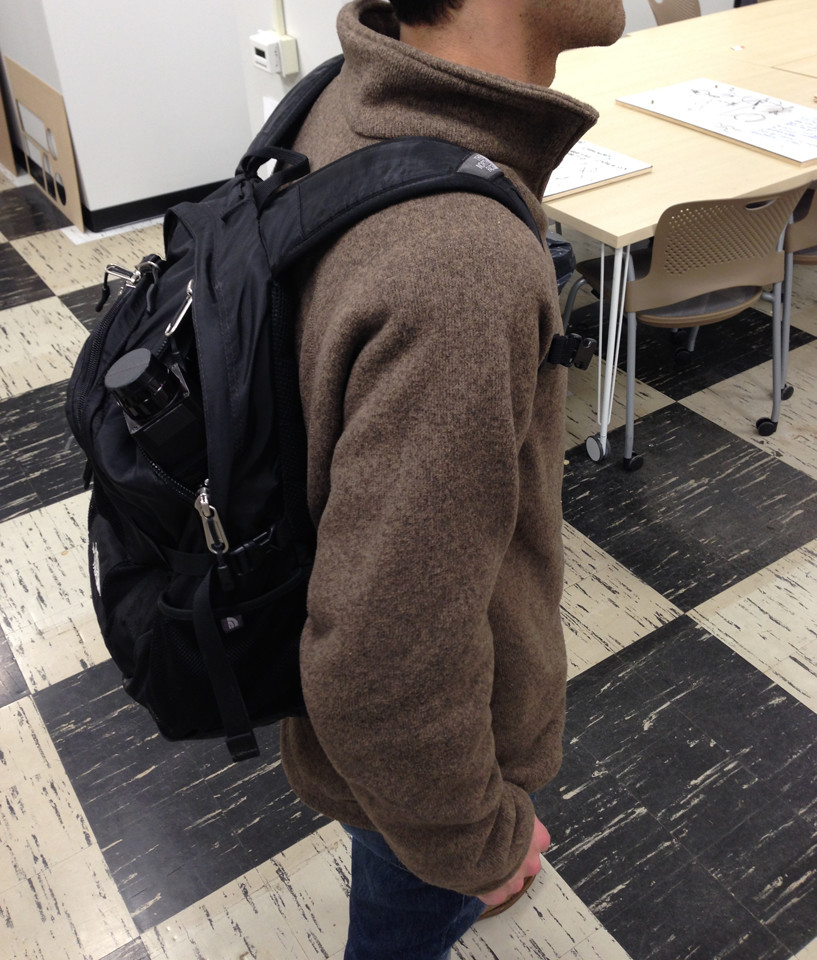
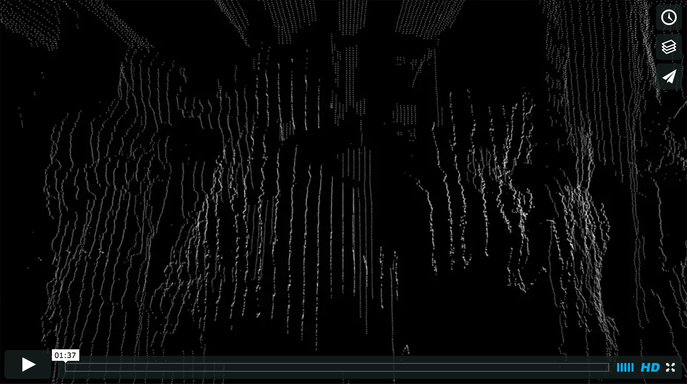
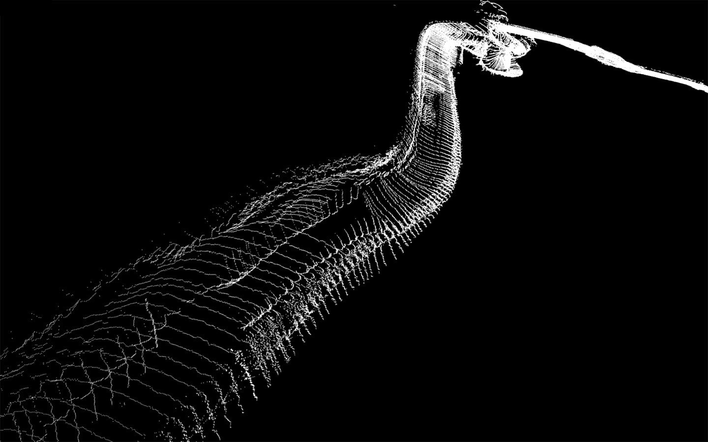
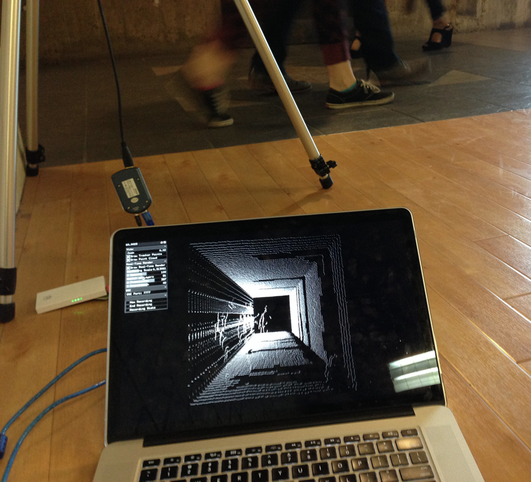
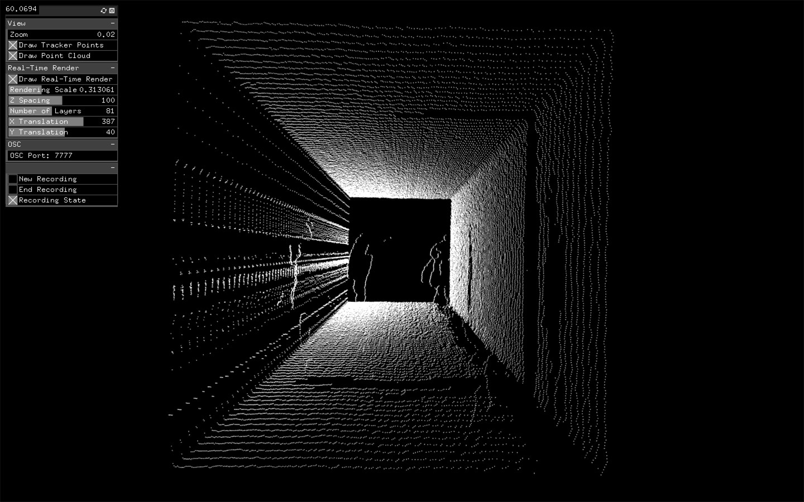

#Lidar Photography
###Temporalized Spaces and Visualizations

*Project 3: Landscapes (+ part of ongoing final project)*

--

### Overview

Lidar is a range-sensing technology that uses the time of flight of modulated pulses of light (in this case, near-infrared) to find the depth in a scene. It's typically employed by the government and military to survey land from above. Here, I've used it to surreptitiously slitscan urban environments and people.

### Tech Specs

I'm using a [Hokuyo URG-04LX-UG01](https://www.hokuyo-aut.jp/02sensor/07scanner/urg_04lx_ug01.html) lidar, which has a 240˚ planar field of view, 0.35˚ resolution, 18' radius, and 10Hz refresh rate, and [Dan Moore's ofxURG library for OpenFrameworks](https://github.com/danthemellowman/ofxUrg). You can find my code for URG Recording and visualization here (<-- will add link shortly).

### Experiments: Active Scanning

*Alleys*

I was initially intruiged by the ability of the lidar to capture scenes which a conventional camera cannot. For example, capturing the nightlife of a city without supplying illumination is difficult, if not impossible with most cameras. So... I strapped the lidar to my car and took off into the night.

I soon found out that I couldn't capture much from the streets, as most people and buildings were at least 18 feet away from me, so I decided to traverse the alleys instead. The results are more or less realistic representations of these spaces. Virtually, they appear as desolate as they did at 2 am in the morning—much like Specular's [Exquisite City](http://www.specular.cc/exquisite-city). Yet, in these representations there is a certain solitude—in the small stretches of driveways between two buildings or in the plot of ground beneath a tree—that doesn't exist (at least for me) in the physical world.

*People*

Seeing as driving around wouldn't get me close enough to capture people, I then decided to hide the lidar in my backpack and walk down a *really* busy street at night. Using the volume control on a pair of headphones to start and stop recording, I walked along the edge of the sidewalk and captured multitudes of people—all without them knowing.

The results are quite breathtaking and remind me much of Adam Magyar's [Stainless](https://vimeo.com/83664407). However, this is no still life. The temporal artifacts are now apparent, as the subject of capture is also moving, sometimes with me and sometimes against. Note how the former is manifested as shapes elongated in time and the latter as forms compressed. It's also interesting that the bounce of my gait is directly manifest in the oscillating vertical displacement of the scan (the "waves" or "ripples"). In these ways, the capture has a particularly interesting quality: the observer and the observed have become inextricably intertwined.

My only regret is that the horizontal resolution was not higher, but I could only walk so slow without looking creepy.

*Path Reconstruction (ongoing)*

On a separate night, I made a rig to hold a 9-axis IMU (the [Sparkfun Razor](https://www.sparkfun.com/products/10736)) to record my orientation in space for every scan. I also placed the lidar at a 30 degree angle with the horizontal in an attempt to get a higher temporal resolution. 

As long as I walked at a constant pace, I could use the timecodes and the orientations to find the path that I took, and reconstruct the passing scenes along the way. Unfortunately, the on-board magnometer experienced interference from the motor in the lidar, so it thought this was the path I took:

The results are still interesting and are good examples of classical slitscanning—see the mermaid (or merman) below:

*Binaural Audio (ongoing)*

I'm also in the process of using binaural in-ear microphones to capture environmental audio as I walk through a scene. This way, each scan can be linked with a time in the audio recording, allowing one to "scrub" through sound and time.

### Experiments: Static Scanning

*Hallways*

At the recommendation of David Newbury of the Carnegie Museum's Innovation Studio, I began to explore the effects of allowing an environment to scan itself. What would happen if you set up the lidar in one place and let it run—perhaps in a hallway as people walked by?

The result of such a scan is the extrusion of an environmental crosssection in time, with the forms that have moved through this "invisible wall" sprinkled throughout virtual space. 

In the process of capture, I came to realize that students walk so fast, they only intercept the vertical scan about 4-5 times, which is at a resolution lower than I was hoping for. To compensate, I began scanning in areas that were inherently congested, like the space in front of doors that open inward. Even then, the forms are sparse, but there is just enough resolution to decipher human forms.

One of the most fascinating discoveries I made is that everyone in this "temporalized space" faces the same direction. This occurs because, no matter which direction you come from, the first part of the body to be scanned is the front of the face, then the middle, and finally the back of the head. To put it more poetically: 

*We all walk forward in time.*

Many thanks to Golan Levin for a multitude of ideas and inspiration.