##Lidar Slitscanning Photogroaphy

LIDAR is a range-sensing technology typically employed by the government and military to survey land from above. By meauring the time of flight of modulated pulses of light, depth can be extracted from a scene, often to very high precision.

I set out to surreptitiously capture individuals and places using LIDAR technology in the wee hours of the morning. By hiding the device in my backpack or strapping it to my car, I've been able to extract detailed depth maps of streets and alleys and the people inhabiting them at, documenting the nightlife of a city in a whole new way.

The artifacts produced through the process of capture, including the bounce of my gait and the elongated or compressed figures, reveal a deep interconnectedness between observer and observed.

Demo: [Alleys](https://vimeo.com/144993841)

Demo: [Carson Street](https://vimeo.com/145215259)

Demo: [demo](https://vimeo.com/146153795)

Link to Photos [Photos](https://drive.google.com/folderview?id=0B4gCKvYT5U8zdUVpZFk3UXJpX2c&usp=sharing)

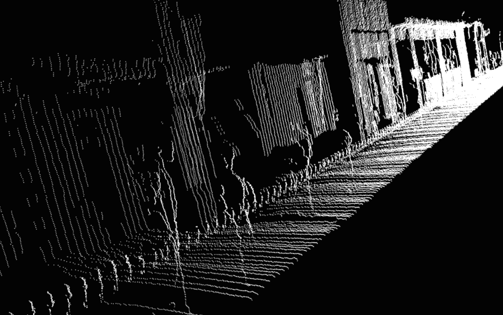
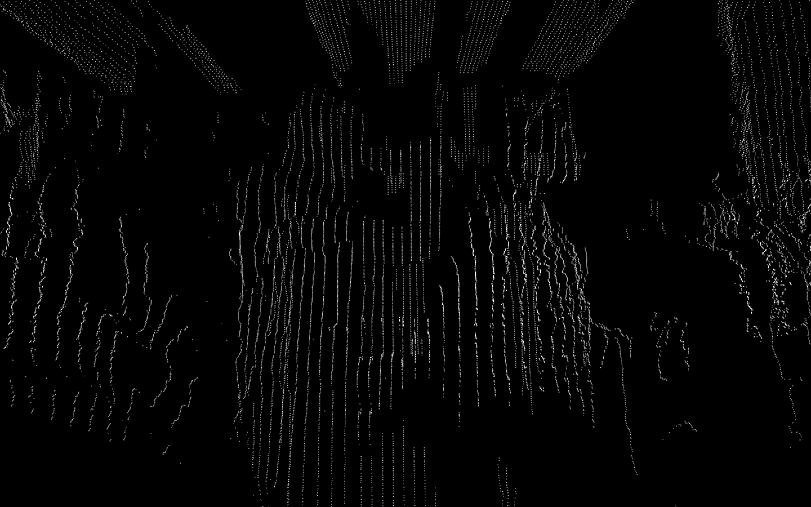
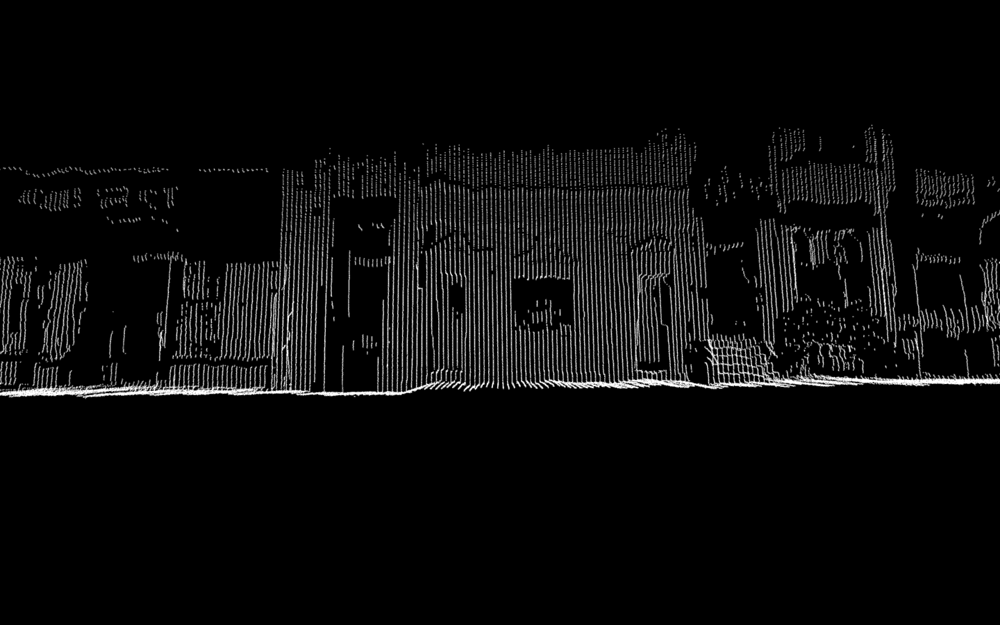
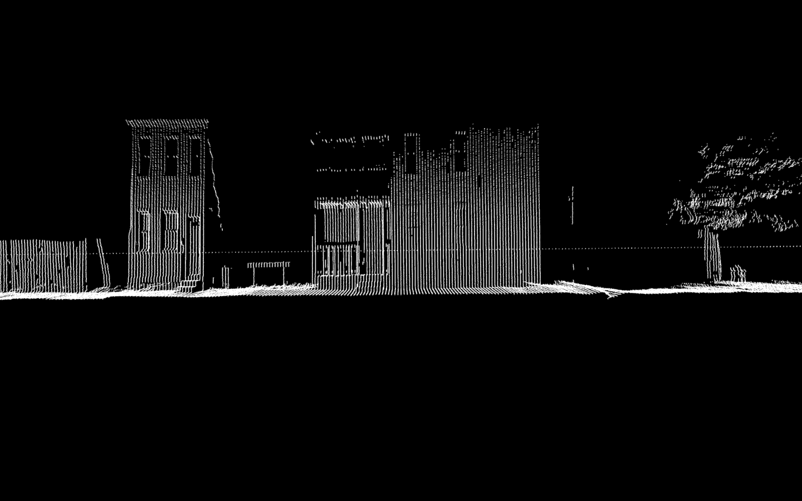
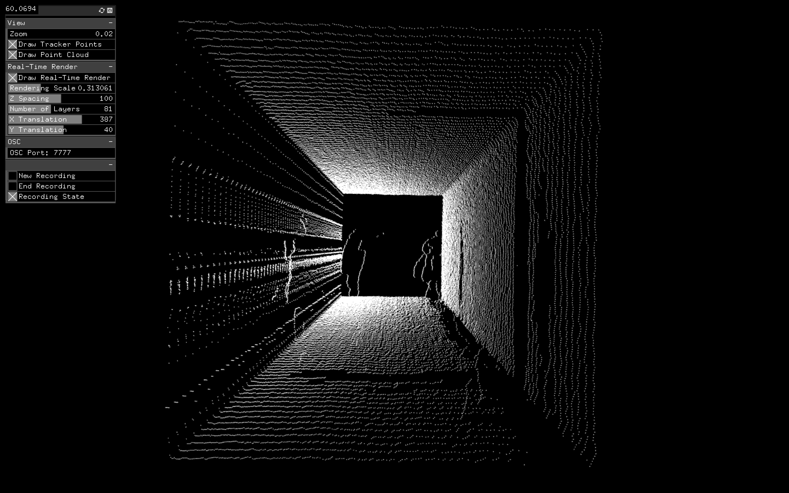

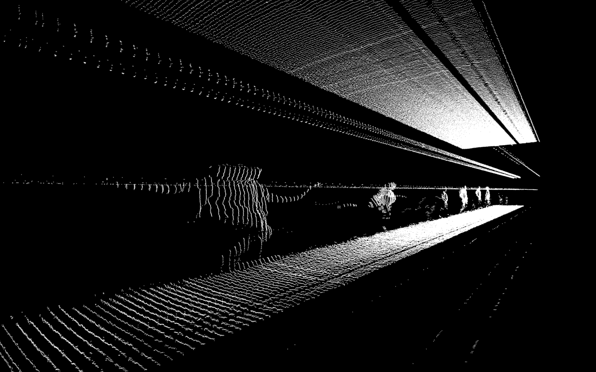
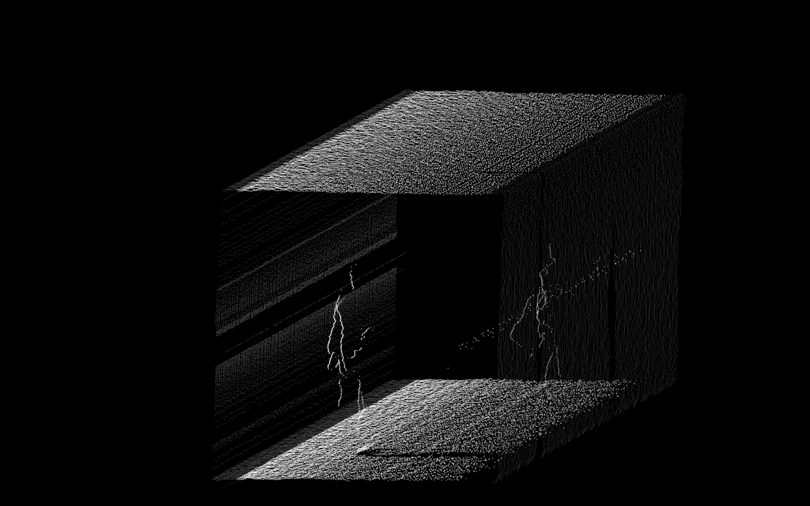

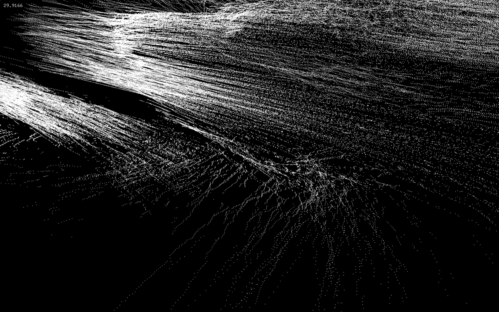
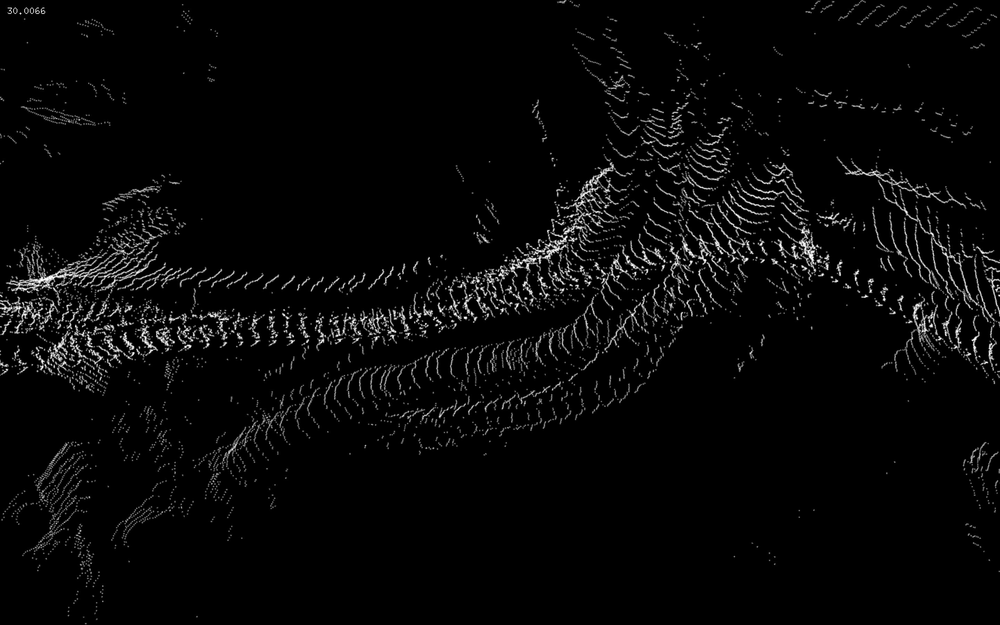
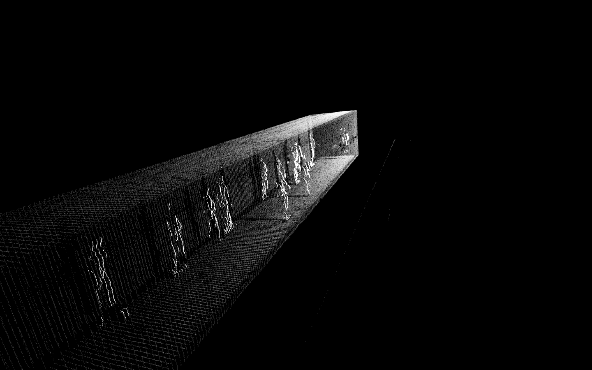
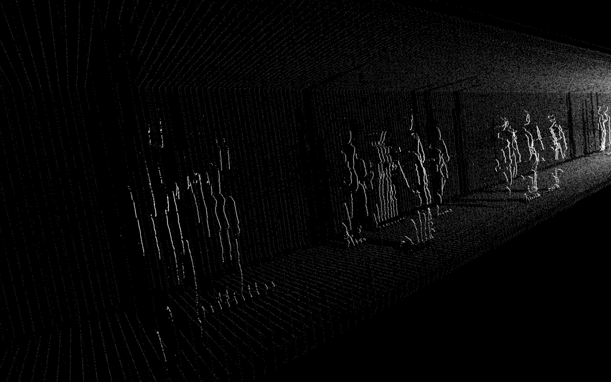

