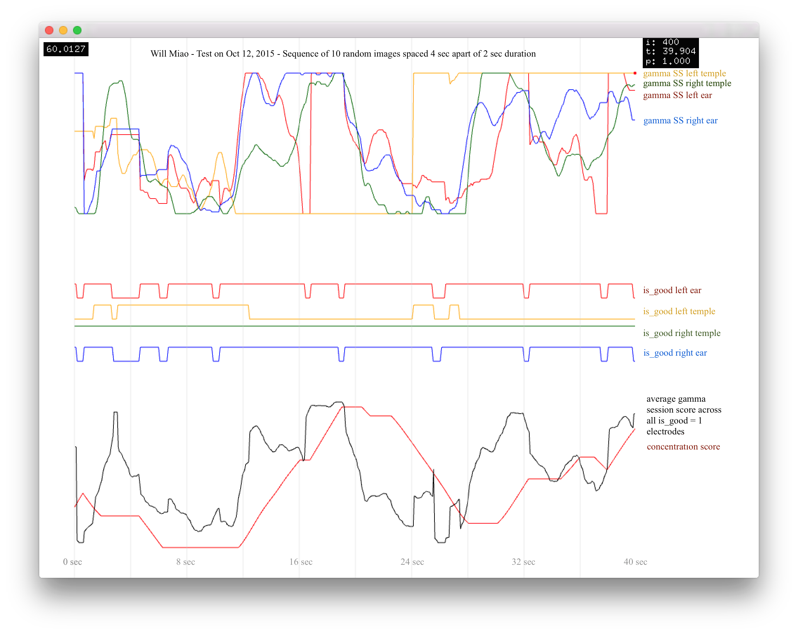

# Self-Selective Portraiture
Will Miao & Ben Snell - October 21, 2015

...

Our thoughts are the artifacts of our individual, selective sensory experiences. Through language, we mold these artifacts into understandable, recognizable, simplified forms. But this simplification process inherently introduces information loss. Is there undiscovered value in the rawest form of our thought data, before it encounters our expectations, societal norms, and rational thought? Does this raw data capture a richer, more complex portrait of ourselves than we can personally express? 

###Method

Using an EyeTribe Eye Tracker and Muse Headset, we simultaneously track eye gaze and brainwaves while reading a piece of text to know where an individual is looking and their corresponding level of attentiveness. Precisely aligning and combining these streams of data allows us to link textual content to level of interest and thus create a model of cognitive awareness. From this model, we use Markov chains to generate new bodies of text -- portraits of an individual -- that weight words by our level of awareness. 

These portraits are expressions of text that are selected entirely by the volition of the subconscious self and, arguably, represent a more authentic expression than that which can otherwise be explicitly communicated or recalled.

Attempting what is essentially telepathy using consumer grade sensing toolkits begs the question be asked: Given the state of brain-sensing technologies, can we know what someone is thinking? How far can we peek into the brain? Will we ever be able to image thoughts and find a "blueprint" for the aesthetic experience?

###Output

*^ Will's Text*

*^ Ben's Text*

###Process

*^ Will in the eye-brain rig.*

*^ EEG Readings of Will Miao watching a sequence of 10 random images. Lower graphs of gamma wave analysis indicate near-immediate average relative gamma reponse and delayed "concentration" repsonse (an indicator we did not end up using).*

*^ Aligning eye data with text for Ben's reading of random text. Red dots are word centers and black dots are the closest points on eye path. This process allows temporal textual tagging.*

*^ Snippet of probability tree holding the level of interest of word pairs from Will's reading of This is Water. This data set represents the combined textual, visual and mental data sets into one overarching cognitive network. Is it from this data set that we generate the output text.*