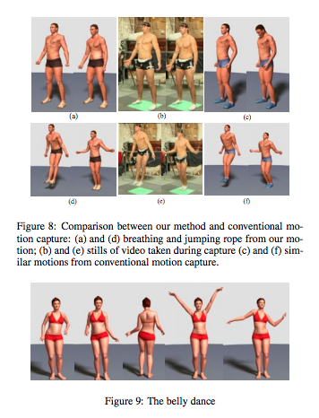

#Looking Outwards 2

## Capturing and Animating Skin Deformation in Human Motion

[This paper] (http://delivery.acm.org/10.1145/1150000/1141970/p881-park.pdf?ip=128.237.139.100&id=1141970&acc=ACTIVE%20SERVICE&key=A792924B58C015C1%2E5A12BE0369099858%2E4D4702B0C3E38B35%2E4D4702B0C3E38B35&CFID=717267308&CFTOKEN=89365257&__acm__=1444665808_330a232fd38c61325c1b31f2606d9d8b) by CMU's Jessica Hodgins and Sang Park gets is a very data driven approach to captureing and animating surface of a human character’s skin. There are formulas and tactics to deal with data loss. The data is captured by placing several hundred small markers on an actor (350). Although the number of markers is large, the motion of the markers does not fully capture
the motion of the skin. They used their own studio so this can directly apply to your own projects made here. For the animation they used Maya, which is avalible to us too. 
 
Data cleaning was where the formulas come in. For filling the holes, smoothing the movements, putting different weights on different areas of the body, ect.  

In the conclusion, they draw that although other methods of capturing and animating skin, like quadratic deformation, ridged deformation would give a smoother deformation and follows the trackers better, this method was able to get subtle movements like breathing better than other methods. 