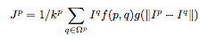

#Looking Outwards 4

## Hole Filling Strategy for Kinect Depth Maps

[Link to article](http://proceedings.spiedigitallibrary.org/proceeding.aspx?articleid=1345471)

***"This approach has been used for depth map denoising by considering visual information; in it has been employed to reduce the noise of depth images that is generated by an upsampling procedure; in a trilateral
filter is used to filter depth maps generated by stereo pairs, considering also a confidence measure of the stereo matching
algorithm in the filter weights selection, thus this approach can not be applied in our case where the depth map has been
obtained with an active device."***

The technique used here includes using two video inputs to patch up the gaps on edges. The two disparity maps are used to recover the missing information (aka ndm- no depth measured pixles). 

The bilateral filter is an edge-preserving filtering technique where [the kernel filter](https://en.wikipedia.org/wiki/Kernel_adaptive_filter) weights are modified as a function of the [photometric similarity between pixels](http://homepages.inf.ed.ac.uk/rbf/CVonline/LOCAL_COPIES/MANDUCHI1/Bilateral_Filtering.html), thus giving higher weights to pixels belonging to similar regions, and reducing the blurring effect in the edges, where photometric discontinuities are present.

So its like the threshhold filter you put on in photoshop. it does its best to categorize the missing data without blending its neighbors like other algorithms do. 

This is the core of the formula they used:

The intensity of the pixel J^p is calculated from the summation of its neighboring pixels & f(p, q) which is a 2D smoothing kernel also known as domain term, that measures the closeness of the pixels; g(|I^p − I^q|)
is the range term that measures the intensity (or color in case of 3-channels images) similarity of the pixels. 

Close to Gaussian function.

How this could apply to what I could use it is if I was working with raw kinect input that was super noisey & full of holes I could find all the places in the matrix that was missing depth data and translate the function to whatever language Im working in and run the data through to get some smooth replacement. There are more functions in the article that Im not sure I would need for my purposes, unless I needed some perfect data.
